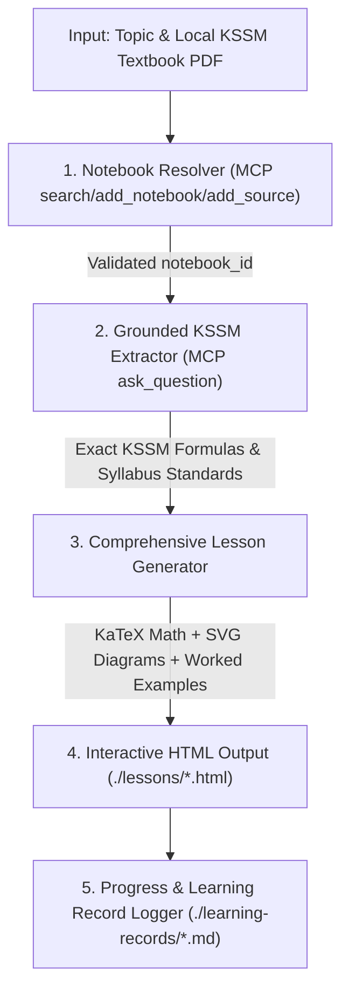

# 🚀 Grounded KSSM Math Teach Skill: System Architecture & Workflow

An adapted, stateful **Math Teaching Architecture** derived from Matt Pocock's `/teach` skill, enhanced with **NotebookLM MCP grounded textbook retrieval** and tailored specifically for **1-on-1 secondary school mathematics (KSSM Form 3 / SPM)**.

---

## 🏗️ Core Philosophy & Adaptations

### 1. Stripped Unnecessary Community Focus
Pocock's original `/teach` skill emphasizes acquiring "Wisdom through community interaction and practitioner networks." In a 1-on-1 student tutoring environment, this is unnecessary noise. 

The philosophy is streamlined into two core pillars:
* 📖 **Grounded Knowledge**: Extracted directly from the official KSSM Textbook via NotebookLM MCP (zero hallucinations, exact syllabus alignment).
* ✍️ **Scaffolded Skills & Long-Term Storage**: Built through high-quality, comprehensive interactive HTML lessons with desirable difficulty, retrieval practice, and spaced repetition.

### 2. Grounded NotebookLM MCP Engine
* **Automated Checking & Ingestion**: When given a local textbook PDF path, the skill checks NotebookLM (`search_notebooks`). If missing, it creates the notebook (`add_notebook`) and ingests the PDF (`add_source`) automatically.
* **Zero Math Corruption**: Uses NotebookLM's multimodal vision RAG (`ask_question` / `query_notebook`) to pull exact KSSM definitions, formulas, and learning standards (*Standard Kandungan / Standard Pembelajaran*).

### 3. Comprehensive, In-Depth HTML Lessons (No Length Limits)
* Mathematics cannot be explained effectively in ultra-short snippets.
* The constraint on short lesson length is removed, permitting **long, deep, and fully developed HTML lessons** saved to `./lessons/0001-<name>.html`.
* Lessons feature:
  - **KaTeX Integration**: Pristine rendering of LaTeX math ($...$ and $$...$$).
  - **Visual Geometry/Diagrams**: Embedded SVG/HTML Canvas visual aids (for Circle Tangents, Trigonometry, Loci, Plans & Elevations, etc.).
  - **4-Part Structure**: Intuition & Motivation $\rightarrow$ Formal Formula Box $\rightarrow$ Step-by-Step Worked Examples $\rightarrow$ Interactive Retrieval Quizzes.

---

## 📁 Teaching Workspace Structure

When initiating a teaching topic, the skill maintains a stateful workspace in the designated vault directory (e.g. `d:\Math Vault\Form3_KSSM_Math_Tutor\`):

```
d:\Math Vault\Form3_KSSM_Math_Tutor\
├── MISSION.md               # Student learning goals, target grade/level, and motivation
├── RESOURCES.md             # Grounded textbook records & NotebookLM notebook_id
├── NOTES.md                 # Scratchpad for tracking learning pace, misconceptions & preferences
├── ./reference/*.html       # Printable formula cheat sheets, key theorems & visual reference cards
├── ./learning-records/*.md  # Logs capturing specific misconceptions, breakthroughs & spaced review schedules
└── ./lessons/*.html         # Comprehensive, self-contained HTML lessons with KaTeX & interactive quizzes
```

---

## 🤖 Workflow Pipeline Execution



---

## 📝 Stage-by-Stage Breakdown

### 🟢 Stage 1: Notebook Resolver & Automated Ingestion
1. Checks local library via `search_notebooks(query)`.
2. If textbook is found, reuses its `notebook_id`.
3. If missing, creates a notebook via `add_notebook` and ingests the PDF file via `add_source`.

### 🟢 Stage 2: Grounded Syllabus Extraction
1. Queries NotebookLM via `ask_question` / `query_notebook` for the target chapter (e.g. *Tingkatan 3 Bab 5: Nisbah Trigonometri*).
2. Extracts exact KSSM definitions, formulas, and official textbook figures with 100% LaTeX fidelity.

### 🟢 Stage 3: Comprehensive HTML Lesson Construction
Generates a complete, beautifully styled HTML file in `./lessons/0001-<topic>.html` with:
- **Tufte/Modern Typography** & responsive layout.
- **KaTeX CDN** auto-rendering math blocks.
- **Intuition & Visual Diagrams**: Explaining *why* the rule works.
- **Step-by-Step Worked Examples**: Complete walkthroughs showing calculation mechanics.
- **Scaffolded Practice**: 3–5 check-yourself questions ranging from basic application (TP1-TP3) to HOTS/KBAT problem-solving (TP4-TP6).

### 🟢 Stage 4: Stateful Learning Record & Spaced Retrieval
- Logs any student misconceptions or breakthrough insights in `./learning-records/0001-<topic>.md`.
- Schedules spaced retrieval practice reminders in `MISSION.md` to move knowledge from *Fluency Strength* into long-term *Storage Strength*.
