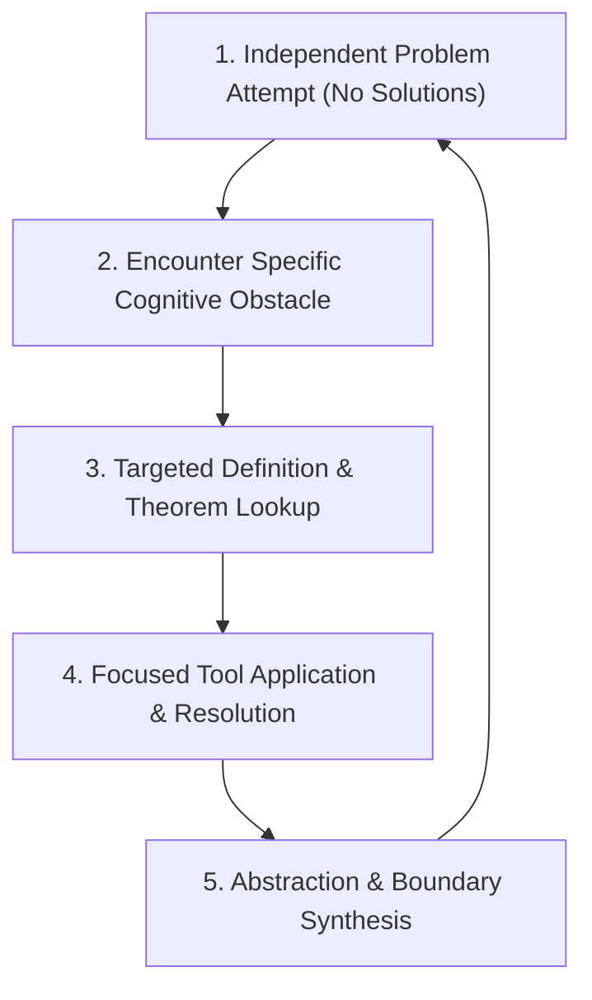

# 🧠 First-Principles Mathematical Problem-Solving & Boundary Learning Loop

This note documents the core operational learning loop for mastering mathematical structures, definitions, and theorems.

---

## 🎯 The Core Philosophy

Mathematics is not a collection of recipes to memorize; it is a **Toolbox of Abstractions**:
- **Definitions** are tools invented to overcome specific structural obstacles.
- **Theorems** are boundary guarantees that state when a tool is valid.
- **Routine Computation** creates an *Illusion of Competence*. True mastery requires **Structural Motivation & Boundary Stress-Testing**.

---

## 🔄 The 5-Step Operational Deliberate Practice Loop

### 1️⃣ Step 1: Independent Attempt (Deliberate Struggle)
- Engage in a rigorous, independent attempt on high-caliber, multi-theorem synthesis problems without looking at solutions.
- **Goal**: Trigger neural plasticity by forcing your brain to expose its exact breaking point.

### 2️⃣ Step 2: Identify the Specific Obstacle
- Pinpoint the exact line or concept where the logic stalls (e.g., *"I cannot show why $0 \in U$"* or *"I don't see why the intersection must be $\{0\}$"*).
- Convert a vague failure (*"I don't get this"*) into a technical inquiry (*"Which condition of a subspace fails when $U_1 \cup U_2$ is taken?"*).

### 3️⃣ Step 3: Targeted Definition & Theorem Retrieval
- Use the chapter's **Quick Tool Index** to look up the precise definitions, axioms, or theorems related to the obstacle.
- Analyze **why** the definition was constructed with those exact constraints.

### 4️⃣ Step 4: Focused Application & Solution
- Apply the retrieved tool to bridge the cognitive gap and complete the proof or boundary test.

### 5️⃣ Step 5: Boundary Synthesis & Encapsulation
- Summarize both sides of the result:
  1. **Why it worked**: The core mathematical mechanism.
  2. **Why it failed / What breaks**: The boundary trap (what happens if an axiom is removed or a condition is violated).
- Encapsulate the insight using the **Abstraction Trilogy**:
  - *Name* the tool/pattern.
  - State the *Core Concept*.
  - Identify *Cross-Domain Examples*.

---

## 🔗 Related Meta Notes
- [[How to learn mathematic]]
- [[5 step of trainning]]
- [[The Mathematical Training Operating System]]
- [[认知封装：减少认知负荷并优化专业决策的方法论框架]]
