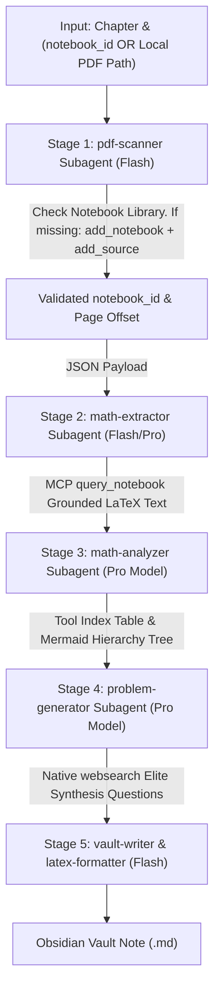

# 🚀 The Math Deconstructor: System Architecture & Workflow

An automated **First-Principles Multi-Agent Pipeline** powered by **NotebookLM via MCP** designed to transform thick mathematical textbooks (1000+ pages) into **N-Level Hierarchical Tool Locators** and **Elite Undergraduate Synthesis Question Sets**.

---

## 🏗️ System Overview & Core Philosophy

Instead of copying passive definitions, solving routine computational exercises, or risking OCR corruption via raw text scrapers, the system uses **NotebookLM via MCP** as a grounded context engine to achieve **100% LaTeX rendering accuracy, zero local context bloat, and zero character corruption**.

The system enforces **3 Strict Directives**:
1. 🎯 **Zero Skipping Rule**: 100% coverage of every definition, axiom, lemma, and theorem in the chapter/subchapter.
2. 🚫 **Zero Computational Noise**: No routine arithmetic or plug-and-chug formulas. Every problem is an undergraduate exam-level synthesis proof or boundary trap.
3. 🔒 **Strict No Solutions Rule**: Output contains **zero solutions or hints**, forcing active deliberate struggle.

---

## 🤖 The 5-Stage Multi-Agent Workflow Pipeline

---

## 🛠️ Stage-by-Stage Execution Blueprint

### 🟢 Stage 1: Scope, Offset & Notebook Resolver (`pdf-scanner` Subagent)
- **Model**: `Flash`
- **Execution**:
  1. Accepts user input for target Chapter / Subchapter and Page Range, along with either a `notebook_id` or a local PDF file path.
  2. **Automated Notebook Check & Ingestion**:
     - Queries local library (`search_notebooks` / `list_notebooks`).
     - If the notebook already exists, extracts its `notebook_id`.
     - If missing and a local PDF path is provided, creates a new notebook via `add_notebook` and ingests the PDF via `add_source`.
  3. Verifies the **Page Offset Parameter**:
     $$\text{Page Offset} = \text{Source PDF Index} - \text{Book Page Number}$$
  4. Outputs a clean JSON payload with validated `book_page_start`, `book_page_end`, `page_offset`, and `notebook_id`.

---

### 🟢 Stage 2: Grounded Math Extractor (`math-extractor` Subagent)
- **Model**: `Flash` / `Pro`
- **Replaces**: `pypdf` and `markitdown` text extraction
- **Execution**:
  1. Issues targeted MCP queries (`query_notebook` / `ask_question`) directly against the uploaded textbook notebook:
     > *"Extract every formal Definition, Axiom, Lemma, and Theorem in [Target Subchapter] (Pages [Y] to [Z]). Output them with 100% literal fidelity, standard LaTeX math blocks ($...$ and $$...$$), exact theorem numbering, and exact book page citations."*
  2. NotebookLM's visual multimodal backend parses complex equations, spatial diagrams, and proof structures into pristine LaTeX strings.
  3. Passes clean, zero-noise Markdown/LaTeX text to Stage 3.

---

### 🟢 Stage 3: Tool Index & Hierarchy Builder (`math-analyzer` Subagent)
- **Model**: `Pro`
- **Execution**:
  1. Consumes pristine LaTeX math blocks from Stage 2.
  2. Enforces **Directive 1 (Zero Skipping Rule)**: Catalogs all definitions, tools, and theorems without omission.
  3. Constructs:
     - **Level 0 Teleological Core**: The overarching goal of the subchapter.
     - **Quick Tool Index Table**: Name, Type (Axiom/Def/Theorem), Book Page Number, core expression in LaTeX.
     - **Mermaid Dependency Tree**: Visual graph showing which definitions/lemmas feed into flagship theorems.

---

### 🟢 Stage 4: Synthesis Problem Generator (`problem-generator` Subagent)
- **Model**: `Pro`
- **Execution**:
  1. Synthesizes 2–3 textbook tools together to form boundary probes and undergraduate synthesis questions.
  2. Calls native **`websearch`** (bypassing legacy `duckduckgo_search` scripts) to query top university archives for canonical counterexamples and proof traps:
     - 🏛️ **MIT OpenCourseWare** (*18.701 Algebra I / 18.100 Real Analysis*)
     - 🏛️ **Cambridge Mathematical Tripos** (*Part IA / IB Past Papers*)
     - 🏛️ **UC Berkeley Preliminary Exams** (*Linear Algebra & Analysis Archives*)
     - 🏛️ **Harvard Math 55 / Math 21b Archives**
     - 🏛️ **MathStackExchange / MathOverflow** (*Canonical Counterexample Threads*)
  3. Enforces **Directive 2 (Zero Computational Noise)** and **Directive 3 (Strict No Solutions Rule)**.

---

### 🟢 Stage 5: Vault Note Formatter (`vault-writer & latex-formatter`)
- **Model**: `Flash`
- **Execution**:
  1. Assembles the note following the standard blueprint format.
  2. Enforces Markdown table safety (escaping `\lvert` pipes) and standard LaTeX delimiters (`$...$` and `$$...$$`).
  3. Saves the final file directly into the target Obsidian Vault path (`d:\Math Vault\Mathematic learning\`).

---

## 📚 Complete Technology Stack

### 🔌 1. MCP Integration
- **`notebooklm-mcp`**: Grounded context engine. Automatic library search (`search_notebooks`), automated notebook creation (`add_notebook`), PDF ingestion (`add_source`), and grounded extraction (`ask_question` / `query_notebook`).

### 🌐 2. Native Search & Web Fetch
- **`websearch`**: Native tool for querying live university exam archives without local Python scraping dependencies.
- **`defuddle`**: Skill/tool for clean markdown extraction from online math articles/webpages.

### 🤖 3. Subagent Pipeline Architecture (Google Antigravity)
- **`pdf-scanner`** *(Flash)*: Resolves NotebookLM existence, ingests PDF if missing, and calculates page offsets.
- **`math-extractor`** *(Flash/Pro)*: Queries NotebookLM MCP for literal LaTeX extraction.
- **`math-analyzer`** *(Pro)*: Synthesizes tool taxonomy and builds Mermaid logical trees.
- **`problem-generator`** *(Pro)*: Slices 2–3 theorems into synthesis problems and searches university archives.
- **`vault-writer` & `latex-formatter`** *(Flash)*: Validates GFM formatting and writes Obsidian Vault notes.

---

## 🎯 Key Advantages of This Architecture
1. **Fully Automated Ingestion**: Accepts local PDF paths directly; checks NotebookLM and uploads automatically if missing.
2. **Zero Math Corruption**: Multimodal visual extraction guarantees matrices, fractions, and integrals don't turn into scrambled ASCII text.
3. **Extreme Token Efficiency**: The agent queries only what it needs via MCP rather than dragging 1,000 pages of text into local model context windows.
