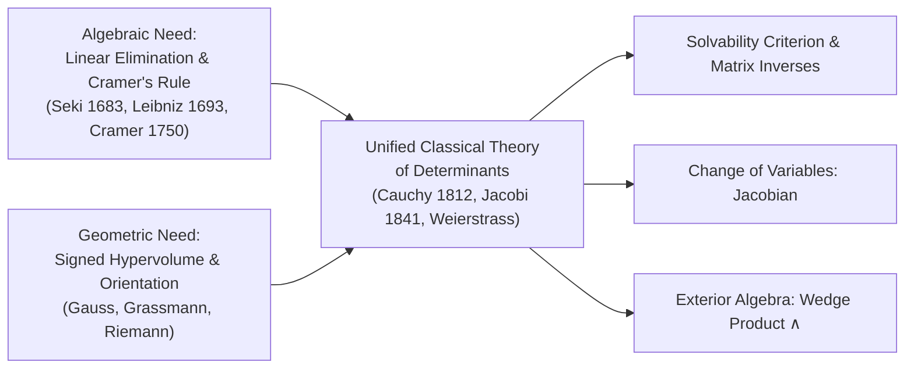
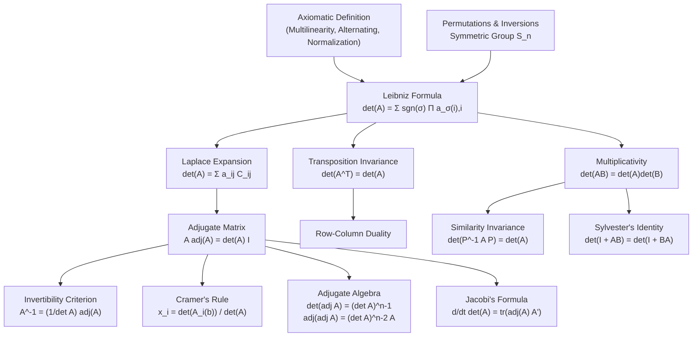

# 📐 Classical Theory of Determinants

> [!ABSTRACT] Executive Essence
> The **determinant** is the unique scalar-valued invariant associated with an $n \times n$ matrix that simultaneously measures **geometric volume distortion** and characterizes **algebraic solvability**. Axiomatically defined as the unique normalized alternating multilinear $n$-form on $(\mathbb{F}^n)^n$, it bridges combinatorial permutations ($S_n$), exterior algebra, differential geometry (the Jacobian), and linear systems.

---

## 🧭 Table of Contents

- [[#1. Historical Discovery and Core Motivation|1. Historical Discovery and Core Motivation]]
  - [[#1.1 The Algebraic Route: Elimination & Solvability|1.1 The Algebraic Route: Elimination & Solvability]]
  - [[#1.2 The Geometric Route: Signed Hypervolume & Orientation|1.2 The Geometric Route: Signed Hypervolume & Orientation]]
  - [[#1.3 Conceptual Synthesis: The Dual Nature|1.3 Conceptual Synthesis: The Dual Nature]]
- [[#2. Axiomatic Definition of the Determinant|2. Axiomatic Definition of the Determinant]]
  - [[#2.1 The Multilinear Alternating Form Perspective|2.1 The Multilinear Alternating Form Perspective]]
  - [[#2.2 The Three Defining Axioms|2.2 The Three Defining Axioms]]
  - [[#2.3 Direct Algebraic Corollaries from the Axioms|2.3 Direct Algebraic Corollaries from the Axioms]]
  - [[#2.4 Uniqueness and Existence Statement|2.4 Uniqueness and Existence Statement]]
- [[#3. Combinatorial Foundations: Permutations, Inversions, and Parity|3. Combinatorial Foundations: Permutations, Inversions, and Parity]]
  - [[#3.1 The Symmetric Group $S_n$|3.1 The Symmetric Group $S_n$]]
  - [[#3.2 Inversions and the Inversion Number|3.2 Inversions and the Inversion Number]]
  - [[#3.3 The Sign Function $\operatorname{sgn}(\sigma)$|3.3 The Sign Function $\operatorname{sgn}(\sigma)$]]
  - [[#3.4 Transpositions and the Parity Invariance Theorem|3.4 Transpositions and the Parity Invariance Theorem]]
  - [[#3.5 The Alternating Group $A_n$|3.5 The Alternating Group $A_n$]]
- [[#4. The Leibniz Formula: From Axioms to $n \times n$|4. The Leibniz Formula: From Axioms to $n \times n$]]
  - [[#4.1 Rigorous Constructive Derivation|4.1 Rigorous Constructive Derivation]]
  - [[#4.2 Row vs. Column Leibniz Expressions|4.2 Row vs. Column Leibniz Expressions]]
  - [[#4.3 Low-Dimensional Expansions ($n = 1, 2, 3$)|4.3 Low-Dimensional Expansions ($n = 1, 2, 3$)]]
  - [[#4.4 The Sarrus Scheme and Its Failure for $n \ge 4$|4.4 The Sarrus Scheme and Its Failure for $n \ge 4$]]
- [[#5. Fundamental Theorems and Rigorous Proofs|5. Fundamental Theorems and Rigorous Proofs]]
  - [[#5.1 Theorem 1: Transposition Invariance ($\det(A^T) = \det(A)$)|5.1 Theorem 1: Transposition Invariance ($\det(A^T) = \det(A)$)]]
  - [[#5.2 Theorem 2: Multiplicativity ($\det(AB) = \det(A)\det(B)$)|5.2 Theorem 2: Multiplicativity ($\det(AB) = \det(A)\det(B)$)]]
  - [[#5.3 Theorem 3: Laplace Expansion & Minors/Cofactors|5.3 Theorem 3: Laplace Expansion & Minors/Cofactors]]
  - [[#5.4 Off-Diagonal Orthogonality ("Alien Cofactors")|5.4 Off-Diagonal Orthogonality ("Alien Cofactors")]]
  - [[#5.5 Theorem 4: The Invertibility Criterion, Adjugate Algebra & Explicit Inverse|5.5 Theorem 4: The Invertibility Criterion, Adjugate Algebra & Explicit Inverse]]
  - [[#5.6 Cramer's Rule: Algebraic Derivation & Volume Interpretation|5.6 Cramer's Rule: Algebraic Derivation & Volume Interpretation]]
- [[#6. Summary of Operational Properties & Computational Complexity|6. Summary of Operational Properties & Computational Complexity]]
  - [[#6.1 Master Taxonomy of Determinant Operations|6.1 Master Taxonomy of Determinant Operations]]
  - [[#6.2 Triangular and Block Triangular Matrices|6.2 Triangular and Block Triangular Matrices]]
  - [[#6.3 Schur Complement Formula for Block Matrices|6.3 Schur Complement Formula for Block Matrices]]
  - [[#6.4 Computational Complexity: Leibniz vs. Laplace vs. Gaussian Elimination|6.4 Computational Complexity: Leibniz vs. Laplace vs. Gaussian Elimination]]
- [[#7. Comprehensive Problem Set with Worked Solutions|7. Comprehensive Problem Set with Worked Solutions]]
  - [[#Problem 1: Inversions and Permutation Parity|Problem 1: Inversions and Permutation Parity (Level 1)]]
  - [[#Problem 2: Determinant Under Rank-One Perturbation|Problem 2: Determinant Under Rank-One Perturbation (Level 2)]]
  - [[#Problem 3: Tridiagonal Toeplitz Matrices and Recurrence Relations|Problem 3: Tridiagonal Toeplitz Matrices and Recurrence Relations (Level 2)]]
  - [[#Problem 4: The Vandermonde Determinant|Problem 4: The Vandermonde Determinant (Level 2)]]
  - [[#Problem 5: Circulant Matrices via Roots of Unity|Problem 5: Circulant Matrices via Roots of Unity (Level 3)]]
  - [[#Problem 6: Skew-Symmetric Matrices and Odd Dimensions|Problem 6: Skew-Symmetric Matrices and Odd Dimensions (Level 3)]]
  - [[#Problem 7: Sylvester's Determinant Identity|Problem 7: Sylvester's Determinant Identity (Level 3)]]
  - [[#Problem 8: Cauchy Double Alternant Determinant|Problem 8: Cauchy Double Alternant Determinant (Level 4)]]
  - [[#Problem 9: The Adjugate Matrix: Determinant, Rank Trichotomy, and Double Adjugate|Problem 9: The Adjugate Matrix: Determinant, Rank Trichotomy, and Double Adjugate (Level 3)]]
  - [[#Problem 10: Jacobi's Formula and the Derivative of the Determinant|Problem 10: Jacobi's Formula and the Derivative of the Determinant (Level 4)]]
- [[#8. Vault Connections & Conceptual Map|8. Vault Connections & Conceptual Map]]

---

## 1. Historical Discovery and Core Motivation

Determinants were discovered **more than a century before matrices** were formally recognized as standalone mathematical objects. Historically, the theory emerged along two independent paths:
1. **The Algebraic Route:** Eliminating variables from simultaneous linear systems to determine conditions for non-trivial or unique solvability.
2. **The Geometric Route:** Measuring oriented areas, volumes, and dilation factors under linear coordinate transformations.



### 1.1 The Algebraic Route: Elimination & Solvability

In 1683 in Japan, **Seki Takakazu** (關孝和), and in 1693 in Germany, **Gottfried Wilhelm Leibniz**, independently discovered determinant expressions while formulating systematic elimination techniques.

Consider a system of two linear equations in two unknowns $x, y \in \mathbb{R}$:

$$
\begin{aligned}
a_1 x + b_1 y &= k_1 \\
a_2 x + b_2 y &= k_2
\end{aligned}
$$

To eliminate $y$, multiply the first equation by $b_2$ and the second equation by $b_1$, then subtract:

$$
\begin{aligned}
(a_1 b_2) x + (b_1 b_2) y &= k_1 b_2 \\
(a_2 b_1) x + (b_1 b_2) y &= k_2 b_1 \\
\hline
(a_1 b_2 - a_2 b_1) x &= k_1 b_2 - k_2 b_1
\end{aligned}
$$

Similarly, eliminating $x$ yields:

$$
(a_1 b_2 - a_2 b_1) y = a_1 k_2 - a_2 k_1
$$

The scalar quantity:

$$
\Delta = a_1 b_2 - a_2 b_1
$$

is the **eliminant** (later termed the *determinant* by Cauchy). It dictates the solvability behavior:
- If $\Delta \ne 0$, the system possesses a **unique** solution:
  $$
  x = \frac{k_1 b_2 - k_2 b_1}{a_1 b_2 - a_2 b_1}, \quad y = \frac{a_1 k_2 - a_2 k_1}{a_1 b_2 - a_2 b_1}
  $$
- If $\Delta = 0$ and the numerators are non-zero, the system is **inconsistent** (no solution).
- If $\Delta = 0$ and the numerators vanish, the system possesses **infinitely many** solutions.

Notice that the numerator of  $x$ is the $\det A_{1}(b)$ which is replacing the first column of $A$ by $b$ (the target vector) while the numerator of $y$ is $\det A_{2}(b)$. 
[[3.3 Cramer's Rule]]

Colin Maclaurin (in a posthumous treatise published in 1748) and Gabriel Cramer (1750) generalized this elimination rule to $n$ equations in $n$ unknowns, yielding what is now celebrated as **Cramer's Rule**.

### 1.2 The Geometric Route: Signed Hypervolume & Orientation

**Augustin-Louis Cauchy** (1812) systematized the algebraic apparatus and fixed the name *determinant*. Concurrently, **Carl Friedrich Gauss** (in the context of ternary quadratic forms) and later **Hermann Grassmann** recognized that determinants quantify geometric volume distortion under linear mappings.

#### 1. In $\mathbb{R}^2$: Parallelogram Signed Area
Let $v_1 = \begin{pmatrix} a \\ c \end{pmatrix}$ and $v_2 = \begin{pmatrix} b \\ d \end{pmatrix}$. The area of the parallelogram spanned by $v_1$ and $v_2$ is:

$$
\operatorname{Area}(P(v_1, v_2)) = \lvert a d - b c \rvert = \lvert \det \begin{pmatrix} a & b \\ c & d \end{pmatrix} \rvert
$$

The sign of $a d - b c$ encodes the **orientation**:
- $\det [v_1 \quad v_2] > 0$: Sweeping from $v_1$ to $v_2$ follows a **counterclockwise** direction (preserves the standard orientation of $\mathbb{R}^2$).
- $\det [v_1 \quad v_2] < 0$: Sweeping from $v_1$ to $v_2$ follows a **clockwise** direction (involves a reflection / orientation reversal).
- $\det [v_1 \quad v_2] = 0$: $v_1$ and $v_2$ are collinear; the parallelogram degenerates into a 1-dimensional line segment of area zero.

```
       ^ y
       |          v1 + v2
       |         /------/
       |        /      /
       |    v2 /      /
       |      /      /
       |     /      /
       |    +------/---> x
       |   O   v1
       +------------------->
```

#### 2. In $\mathbb{R}^3$: Parallelepiped Signed Volume
For three vectors $v_1, v_2, v_3 \in \mathbb{R}^3$, the signed volume is given by the scalar triple product:

$$
\operatorname{Vol}(P(v_1, v_2, v_3)) = v_1 \cdot (v_2 \times v_3) = \det \begin{pmatrix} v_1 & v_2 & v_3 \end{pmatrix}
$$
[[Cross product of vector]]

The sign is positive if $\{v_1, v_2, v_3\}$ obeys the **right-hand rule**, and negative if it obeys a left-handed configuration.

#### 3. In $\mathbb{R}^n$: $n$-Dimensional Parallelotope
Let $T: \mathbb{R}^n \to \mathbb{R}^n$ be a linear transformation represented by matrix $A \in \mathcal{M}_{n \times n}(\mathbb{R})$. Let $\Omega \subset \mathbb{R}^n$ be a measurable region with Lebesgue measure $\operatorname{Vol}(\Omega)$. The image $T(\Omega)$ satisfies:

$$
\operatorname{Vol}(T(\Omega)) = \lvert \det(A) \rvert \cdot \operatorname{Vol}(\Omega)
$$

In multivariable calculus, this dilation principle produces the **Jacobian determinant** for changes of variables:

$$
d x_1 d x_2 \cdots d x_n = \lvert \det J_\Phi(u) \rvert \, d u_1 d u_2 \cdots d u_n
$$

### 1.3 Conceptual Synthesis: The Dual Nature

| Perspective       | Role of $\det(A) \ne 0$                                                         | Meaning of $\det(A) = 0$                                                                 |
| :---------------- | :------------------------------------------------------------------------------ | :--------------------------------------------------------------------------------------- |
| **Algebraic**     | $A x = b$ has a unique solution; $A$ has trivial nullspace $\ker(A) = \{0\}$.   | Equations are redundant or contradictory; non-trivial kernel $\ker(A) \ne \{0\}$.        |
| **Geometric**     | $T$ maps $n$-dimensional bodies to non-degenerate $n$-dimensional bodies.       | $T$ collapses space into a subspace of dimension $\le n-1$ (hypervolume collapses to 0). |
| **Orientational** | $\operatorname{sgn}(\det(A)) = +1$ preserves chirality; $-1$ inverts chirality. | Orientation is annihilated; dimensional collapse destroys handedness.                    |

---

## 2. Axiomatic Definition of the Determinant

Rather than starting with an ad-hoc formula, modern mathematics characterizes the determinant **axiomatically**. Karl Weierstrass and Leopold Kronecker demonstrated that the determinant is the **unique** function satisfying three simple geometric and algebraic conditions.

### 2.1 The Multilinear Alternating Form Perspective

Let $\mathbb{F}$ be an arbitrary field (e.g., $\mathbb{R}$ or $\mathbb{C}$). An $n \times n$ matrix $A \in \mathcal{M}_{n \times n}(\mathbb{F})$ is viewed as an ordered $n$-tuple of its column vectors:

$$
A = \begin{pmatrix} v_1 & v_2 & \dots & v_n \end{pmatrix}, \quad \text{where } v_j \in \mathbb{F}^n \text{ for each } j \in \{1, 2, \dots, n\}
$$

The determinant is a function:

$$
D: \underbrace{\mathbb{F}^n \times \mathbb{F}^n \times \dots \times \mathbb{F}^n}_{n \text{ times}} \to \mathbb{F}
$$

### 2.2 The Three Defining Axioms

> [!DEFINITION] Axiomatic Characterization of the Determinant
> A function $D: (\mathbb{F}^n)^n \to \mathbb{F}$ is called a **determinant function** if it satisfies:
>
> 1. **Multilinearity:** $D$ is linear in each column vector independently. For every column index $j \in \{1, \dots, n\}$, all vectors $u, w \in \mathbb{F}^n$, and all scalars $c, d \in \mathbb{F}$:
>    $$
>    D(v_1, \dots, c u + d w, \dots, v_n) = c D(v_1, \dots, u, \dots, v_n) + d D(v_1, \dots, w, \dots, v_n)
>    $$
> 
> 2. **Alternating Property:** If any two **adjacent** columns are identical, the function evaluates to zero:
>    $$
>    v_i = v_{i+1} \implies D(v_1, \dots, v_i, v_{i+1}, \dots, v_n) = 0
>    $$
> 
> 3. **Normalization:** Evaluated on the standard identity matrix $I_n = \begin{pmatrix} e_1 & e_2 & \dots & e_n \end{pmatrix}$, $D$ yields the multiplicative unit:
>    $$
>    D(e_1, e_2, \dots, e_n) = 1
>    $$

### 2.3 Direct Algebraic Corollaries from the Axioms

From these three lean axioms, all familiar elementary properties follow deductively:

#### Proposition 2.1: Column Swap Reverses Sign (Skew-Symmetry)
For any adjacent columns $v_i, v_{i+1}$:

$$
D(\dots, v_i, v_{i+1}, \dots) = - D(\dots, v_{i+1}, v_i, \dots)
$$

> [!NOTE]- Proof
> Consider the input with vector $v_i + v_{i+1}$ placed in both positions $i$ and $i+1$. By Axiom 2:
> $$
> D(\dots, v_i + v_{i+1}, v_i + v_{i+1}, \dots) = 0
> $$
> Expand the left side using multilinearity (Axiom 1) in column $i$, then in column $i+1$:
> $$
> \begin{aligned}
> 0 &= D(\dots, v_i, v_i + v_{i+1}, \dots) + D(\dots, v_{i+1}, v_i + v_{i+1}, \dots) \\
> &= D(\dots, v_i, v_i, \dots) + D(\dots, v_i, v_{i+1}, \dots) + D(\dots, v_{i+1}, v_i, \dots) + D(\dots, v_{i+1}, v_{i+1}, \dots)
> \end{aligned}
> $$
> By Axiom 2, $D(\dots, v_i, v_i, \dots) = 0$ and $D(\dots, v_{i+1}, v_{i+1}, \dots) = 0$. Hence:
> $$
> 0 = D(\dots, v_i, v_{i+1}, \dots) + D(\dots, v_{i+1}, v_i, \dots) \implies D(\dots, v_i, v_{i+1}, \dots) = - D(\dots, v_{i+1}, v_i, \dots)
> $$
> By decomposing any arbitrary transposition $(j \ k)$ into an odd number of adjacent swaps, swapping *any* two columns negates the value. $\blacksquare$

#### Proposition 2.2: General Identical Columns
If $v_j = v_k$ for any distinct $j \ne k$, then $D(v_1, \dots, v_n) = 0$.

> [!NOTE]- Proof
> We can move column $k$ to become adjacent to column $j$ via a sequence of adjacent transpositions. Each swap introduces a sign factor of $(-1)$. When adjacent, the value is 0 by Axiom 2. Multiplying by $(-1)^m$ still leaves 0. $\blacksquare$

#### Proposition 2.3: Invariance Under Shear (Column Addition)
Adding a scalar multiple of column $k$ to column $j$ ($j \ne k$) does not alter the determinant:

$$
D(\dots, v_j + c v_k, \dots, v_k, \dots) = D(\dots, v_j, \dots, v_k, \dots)
$$

> [!NOTE]- Proof
> By multilinearity:
> $$
> D(\dots, v_j + c v_k, \dots, v_k, \dots) = D(\dots, v_j, \dots, v_k, \dots) + c D(\dots, v_k, \dots, v_k, \dots)
> $$
> The second term has identical columns at positions $j$ and $k$, hence vanishes by Proposition 2.2:
> $$
> = D(\dots, v_j, \dots, v_k, \dots) + c \cdot 0 = D(\dots, v_j, \dots, v_k, \dots) \quad \blacksquare
> $$

#### Proposition 2.4: Zero Column Implies Zero Determinant
If any column is the zero vector $\mathbf{0}$, $D(v_1, \dots, \mathbf{0}, \dots, v_n) = 0$.
*(Proof: $D(\dots, 0 \cdot \mathbf{0}, \dots) = 0 \cdot D(\dots, \mathbf{0}, \dots) = 0$ by linearity).*

#### Proposition 2.5: Linear Dependence Criterion
If the set of vectors $\{v_1, \dots, v_n\}$ is linearly dependent, then $D(v_1, \dots, v_n) = 0$.

> [!NOTE]- Proof
> If the set is linearly dependent, there exists an index $k$ such that $v_k = \sum_{j \ne k} c_j v_j$. Substituting this into argument $k$ and using multilinearity yields a linear combination of determinants, each containing two identical columns ($v_j$ at column $j$ and at column $k$). Each term is 0, so the total sum is 0. $\blacksquare$

### 2.4 Uniqueness and Existence Statement

> [!THEOREM] Fundamental Theorem of Determinants
> For any positive integer $n \ge 1$, there exists **exactly one** function $D: (\mathbb{F}^n)^n \to \mathbb{F}$ satisfying Axioms 1, 2, and 3. This unique function is the **determinant**, denoted $\det(A)$.

The proof of this theorem is constructive and provides the famous **Leibniz Formula**, developed in [[#4. The Leibniz Formula: From Axioms to $n \times n$|Section 4]]. To execute the derivation, we first establish the combinatorial machinery of permutations.

---

## 3. Combinatorial Foundations: Permutations, Inversions, and Parity

### 3.1 The Symmetric Group $S_n$

> [!DEFINITION] Permutation
> A **permutation** of degree $n$ is a bijection $\sigma: \{1, 2, \dots, n\} \to \{1, 2, \dots, n\}$.
> The set of all permutations of $\{1, 2, \dots, n\}$ under the operation of function composition $\circ$ forms the **symmetric group**, denoted $S_n$.

- The order (cardinality) of the group is:
  $$
  \lvert S_n \rvert = n! = n \times (n-1) \times \dots \times 2 \times 1
  $$
- In **Cauchy one-line notation**, a permutation $\sigma$ is specified by the ordered list of its values:
  $$
  \sigma = (\sigma(1), \sigma(2), \dots, \sigma(n))
  $$
- In **cycle notation**, a permutation is partitioned into disjoint cyclical orbits. For example, in $S_4$:
  $$
  \sigma = \begin{pmatrix} 1 & 2 & 3 & 4 \\ 2 & 3 & 1 & 4 \end{pmatrix} = (1 \ 2 \ 3)(4) = (1 \ 2 \ 3)
  $$

### 3.2 Inversions and the Inversion Number

> [!DEFINITION] Inversion
> Let $\sigma \in S_n$. An **inversion** of $\sigma$ is an ordered pair of indices $(i, j)$ such that:
> $$
> 1 \le i < j \le n \quad \text{and} \quad \sigma(i) > \sigma(j)
> $$
> The **inversion number** $\operatorname{inv}(\sigma)$ is the total number of inversions:
> $$
> \operatorname{inv}(\sigma) = \lvert \{ (i, j) \in \{1, \dots, n\}^2 : i < j \text{ and } \sigma(i) > \sigma(j) \} \rvert
> $$

- $\operatorname{inv}(\sigma)$ measures the disorder of the sequence $(\sigma(1), \dots, \sigma(n))$ relative to the natural sorted order $(1, 2, \dots, n)$.
- Minimum inversions: $\operatorname{inv}(\operatorname{id}) = 0$ for $\operatorname{id} = (1, 2, \dots, n)$.
- Maximum inversions: $\operatorname{inv}(\sigma_{\mathrm{rev}}) = \binom{n}{2} = \frac{n(n-1)}{2}$ for the completely reversed permutation $(n, n-1, \dots, 2, 1)$.

### 3.3 The Sign Function $\operatorname{sgn}(\sigma)$

> [!DEFINITION] Sign (Signature / Parity) of a Permutation
> The **sign** of a permutation $\sigma \in S_n$, denoted $\operatorname{sgn}(\sigma)$ or $\varepsilon(\sigma)$, is defined by:
> $$
> \operatorname{sgn}(\sigma) = (-1)^{\operatorname{inv}(\sigma)} \in \{+1, -1\}
> $$
> - If $\operatorname{inv}(\sigma)$ is even, $\sigma$ is an **even permutation** ($\operatorname{sgn}(\sigma) = +1$).
> - If $\operatorname{inv}(\sigma)$ is odd, $\sigma$ is an **odd permutation** ($\operatorname{sgn}(\sigma) = -1$).

#### Polynomial Characterization of Sign
Consider the **Vandermonde polynomial** in $n$ variables:

$$
\Delta(x_1, \dots, x_n) = \prod_{1 \le i < j \le n} (x_j - x_i)
$$

For any permutation $\sigma \in S_n$, define the action of $\sigma$ on $\Delta$ by permuting variables:

$$
\sigma(\Delta) = \prod_{1 \le i < j \le n} (x_{\sigma(j)} - x_{\sigma(i)})
$$

Every factor $(x_{\sigma(j)} - x_{\sigma(i)})$ equals $\pm (x_b - x_a)$ for a unique pair $a < b$. The factor picks up a minus sign if and only if $\sigma(i) > \sigma(j)$ (an inversion). Therefore:

$$
\sigma(\Delta) = (-1)^{\operatorname{inv}(\sigma)} \Delta = \operatorname{sgn}(\sigma) \Delta \implies \operatorname{sgn}(\sigma) = \prod_{1 \le i < j \le n} \frac{x_{\sigma(j)} - x_{\sigma(i)}}{x_j - x_i}
$$

### 3.4 Transpositions and the Parity Invariance Theorem

> [!DEFINITION] Transposition
> A **transposition** $\tau = (a \ b) \in S_n$ ($a < b$) is a permutation that swaps entries at positions $a$ and $b$ and leaves all other elements fixed:
> $$
> \tau(a) = b, \quad \tau(b) = a, \quad \text{and} \quad \tau(k) = k \quad \forall k \notin \{a, b\}
> $$

#### Lemma 3.1: Every Transposition is Odd
For any transposition $\tau = (a \ b)$ with $1 \le a < b \le n$:

$$
\operatorname{sgn}(\tau) = -1
$$

> [!NOTE]- Rigorous Proof
> We establish this fundamental result via two complementary perspectives:
> 
> **Method 1: Direct Inversion Count on the Natural Ordering**
> The transposition $\tau = (a \ b)$ maps the natural identity tuple $(1, 2, \dots, n)$ to:
> $$
> (1, \dots, a-1, \, \mathbf{b}, \, a+1, \dots, b-1, \, \mathbf{a}, \, b+1, \dots, n)
> $$
> Let us enumerate all inversions $(i, j)$ with $i < j$ and $\tau(i) > \tau(j)$:
> 1. **The swapped pair $(a, b)$:** Since $a < b$ and $\tau(a) = b > a = \tau(b)$, the pair $(a, b)$ is an inversion. (Contributes **$1$** inversion).
> 2. **Intermediate indices $k$ with $a < k < b$:** There are $m = b - a - 1$ elements situated strictly between positions $a$ and $b$. For each such $k$, its entry is $\tau(k) = k$.
>    - Because $a < k$ and $\tau(a) = b > k = \tau(k)$, $(a, k)$ is an inversion.
>    - Because $k < b$ and $\tau(k) = k > a = \tau(b)$, $(k, b)$ is an inversion.
>    - Each intermediate index $k$ creates exactly **$2$** inversions: $(a, k)$ and $(k, b)$. Across all $m$ intermediate positions, this contributes **$2m$** inversions.
> 3. **All other pairs:** Any index $i < a$ satisfies $\tau(i) = i < a < \tau(j)$ for all $j > i$. Any index $j > b$ satisfies $\tau(j) = j > b > \tau(i)$ for all $i < j$. Intermediate pairs $a < i < j < b$ have $\tau(i) = i < j = \tau(j)$. None of these form inversions.
> 
> Summing these contributions gives the **exact closed-form inversion count**:
> $$
> \operatorname{inv}(\tau) = 1 + 2m = 1 + 2(b - a - 1) = 2(b - a) - 1
> $$
> Because $2(b - a)$ is an even integer, $2(b - a) - 1$ is **strictly odd** for any integers $b > a$.
> Therefore:
> $$
> \operatorname{sgn}(\tau) = (-1)^{\operatorname{inv}(\tau)} = (-1)^{2(b-a)-1} = -1 \quad \blacksquare
> $$
> 
> **Method 2: Parity Change on an Arbitrary Permutation**
> Let $\sigma \in S_n$ be an arbitrary permutation, and let $\tau = (a \ b)$ with $a < b$. The product $\sigma' = \sigma \circ \tau$ is obtained by swapping the values at positions $a$ and $b$ in the one-line representation:
> $$
> (\dots, \sigma(a), \dots, \sigma(k), \dots, \sigma(b), \dots) \xrightarrow{\tau} (\dots, \sigma(b), \dots, \sigma(k), \dots, \sigma(a), \dots)
> $$
> - The relative order of the pair $(\sigma(a), \sigma(b))$ flips, changing the inversion count by $\pm 1$.
> - For each intermediate element $\sigma(k)$ ($a < k < b$), the order of the pairs $(\sigma(a), \sigma(k))$ and $(\sigma(k), \sigma(b))$ is examined. If $\sigma(k)$ lies outside the interval between $\sigma(a)$ and $\sigma(b)$, one pair gains an inversion while the other loses one (net change $0$). If $\sigma(k)$ lies between $\sigma(a)$ and $\sigma(b)$, both pairs gain or both lose an inversion (net change $\pm 2$).
> - All other pairs are untouched.
> 
> Hence, multiplying by any transposition alters the inversion count by an odd integer:
> $$
> \operatorname{inv}(\sigma \circ \tau) \equiv \operatorname{inv}(\sigma) + 1 \pmod 2 \implies \operatorname{sgn}(\sigma \circ \tau) = -\operatorname{sgn}(\sigma)
> $$

#### Theorem 3.2: Sign is a Group Homomorphism
For any two permutations $\sigma, \pi \in S_n$:

$$
\operatorname{sgn}(\sigma \circ \pi) = \operatorname{sgn}(\sigma) \operatorname{sgn}(\pi)
$$

> [!NOTE]- Proof via Vandermonde Polynomial
> Using the polynomial representation:
> $$
> (\sigma \circ \pi)(\Delta) = \sigma(\pi(\Delta)) = \sigma(\operatorname{sgn}(\pi) \Delta) = \operatorname{sgn}(\pi) \sigma(\Delta) = \operatorname{sgn}(\pi) \operatorname{sgn}(\sigma) \Delta
> $$
> But by definition, $(\sigma \circ \pi)(\Delta) = \operatorname{sgn}(\sigma \circ \pi) \Delta$. Comparing scalars gives:
> $$
> \operatorname{sgn}(\sigma \circ \pi) = \operatorname{sgn}(\sigma) \operatorname{sgn}(\pi) \quad \blacksquare
> $$

#### Corollary 3.3: Parity Invariance Under Decomposition
Every permutation $\sigma \in S_n$ can be factored into a product of transpositions:

$$
\sigma = \tau_1 \circ \tau_2 \circ \dots \circ \tau_k
$$

While the decomposition into transpositions is **not unique**, the parity of the number of transpositions $k$ is an **absolute invariant**:

$$
\operatorname{sgn}(\sigma) = \prod_{j=1}^k \operatorname{sgn}(\tau_j) = (-1)^k \implies k \equiv \operatorname{inv}(\sigma) \pmod 2
$$

A permutation cannot be written simultaneously as the product of an even number of transpositions and an odd number of transpositions.

### 3.5 The Alternating Group $A_n$

The map $\operatorname{sgn}: S_n \to (\{+1, -1\}, \times)$ is a group homomorphism. Its kernel consists of all even permutations:

$$
\ker(\operatorname{sgn}) = A_n = \{ \sigma \in S_n : \operatorname{sgn}(\sigma) = +1 \}
$$

By the First Isomorphism Theorem:
- $A_n$ is a normal subgroup of $S_n$: $A_n \triangleleft S_n$.
- The index is $[S_n : A_n] = 2$.
- The order of $A_n$ is:
  $$
  \lvert A_n \rvert = \frac{n!}{2} \quad (\text{for } n \ge 2)
  $$

Exactly half of the permutations in $S_n$ are even, and half are odd.

---

## 4. The Leibniz Formula: From Axioms to $n \times n$

### 4.1 Rigorous Constructive Derivation

We now fulfill the promise of Section 2: proving existence and uniqueness of the determinant function $D$ satisfying Axioms 1, 2, and 3.

Let $A = [a_{ij}] \in \mathcal{M}_{n \times n}(\mathbb{F})$. The column vectors of $A$ can be decomposed into the standard basis $\{e_1, e_2, \dots, e_n\}$ of $\mathbb{F}^n$:

$$
v_j = \sum_{i=1}^n a_{ij} e_i \quad \text{for } j \in \{1, 2, \dots, n\}
$$

Substitute these into $D(v_1, v_2, \dots, v_n)$:

$$
D(v_1, \dots, v_n) = D\left( \sum_{i_1=1}^n a_{i_1, 1} e_{i_1}, \, \sum_{i_2=1}^n a_{i_2, 2} e_{i_2}, \, \dots, \, \sum_{i_n=1}^n a_{i_n, n} e_{i_n} \right)
$$

#### Step 1: Multilinear Expansion
Applying Axiom 1 (multilinearity) across all $n$ arguments independently, we extract all summations and coefficients:

$$
D(v_1, \dots, v_n) = \sum_{i_1=1}^n \sum_{i_2=1}^n \dots \sum_{i_n=1}^n a_{i_1, 1} a_{i_2, 2} \cdots a_{i_n, n} \, D(e_{i_1}, e_{i_2}, \dots, e_{i_n})
$$

This sum contains precisely $n^n$ terms.

#### Step 2: Elimination of Non-Permutations via Alternating Property
The term $D(e_{i_1}, e_{i_2}, \dots, e_{i_n})$ evaluates $D$ on standard basis vectors.
- If any two indices are equal (i.e., $i_p = i_q$ for some $p \ne q$), then the inputs contain identical columns $e_{i_p} = e_{i_q}$.
- By Proposition 2.2 (derived from Axiom 2), $D(e_{i_1}, \dots, e_{i_n}) = 0$.

Therefore, the only surviving terms are those where the sequence of row indices $(i_1, i_2, \dots, i_n)$ contains **no duplicates**. This means $(i_1, \dots, i_n)$ is a bijection of $\{1, \dots, n\}$—a permutation $\sigma \in S_n$, where $i_j = \sigma(j)$.

This collapses the sum from $n^n$ terms to exactly $n!$ non-zero candidate terms:

$$
D(v_1, \dots, v_n) = \sum_{\sigma \in S_n} a_{\sigma(1), 1} a_{\sigma(2), 2} \cdots a_{\sigma(n), n} \, D(e_{\sigma(1)}, e_{\sigma(2)}, \dots, e_{\sigma(n)})
$$

#### Step 3: Evaluation of Basis Permutations via Normalization
To compute $D(e_{\sigma(1)}, \dots, e_{\sigma(n)})$, we must rearrange the vectors back to the standard ordering $(e_1, e_2, \dots, e_n)$.
- By Proposition 2.1, each swap of adjacent vectors negates the value.
- Re-sorting the list $(\sigma(1), \dots, \sigma(n))$ into natural ascending order $(1, \dots, n)$ requires exactly $\operatorname{inv}(\sigma)$ adjacent swaps.
- Therefore:
  $$
  D(e_{\sigma(1)}, e_{\sigma(2)}, \dots, e_{\sigma(n)}) = (-1)^{\operatorname{inv}(\sigma)} D(e_1, e_2, \dots, e_n) = \operatorname{sgn}(\sigma) \cdot 1
  $$
  (where the final step uses Axiom 3, $D(I_n) = 1$).

#### Conclusion: The Explicit Formula
Substituting this back yields the celebrated formula:

> [!THEOREM] The Leibniz Formula for the Determinant
> For any $n \times n$ matrix $A = [a_{ij}]$:
> $$
> \det(A) = \sum_{\sigma \in S_n} \operatorname{sgn}(\sigma) \prod_{j=1}^n a_{\sigma(j), j}
> $$

Because this formula was derived solely from Axioms 1, 2, and 3, any function satisfying the axioms **must** be given by this formula (**Uniqueness**).

Conversely, we verify that this formula satisfies all three characterizing axioms (**Existence**):

> [!NOTE]- Rigorous Verification of Axioms for the Leibniz Formula
> Let $F(v_1, \dots, v_n) = \sum_{\sigma \in S_n} \operatorname{sgn}(\sigma) \prod_{j=1}^n a_{\sigma(j), j}$.
> 
> 1. **Multilinearity (Axiom 1):** Fix column $k \in \{1, \dots, n\}$ and let $v_k = c u + d w$. In each summand, the only factor depending on column $k$ is $a_{\sigma(k), k} = c u_{\sigma(k)} + d w_{\sigma(k)}$. Factoring this scalar combination out of each term and distributing the sum demonstrates that $F$ is linear in each column independently.
> 
> 2. **Alternating Property (Axiom 2):** Suppose column $k$ and column $k+1$ are identical: $a_{i, k} = a_{i, k+1}$ for all $i \in \{1, \dots, n\}$.
>    Let $\tau = (k \ k+1) \in S_n$ be the adjacent transposition swapping $k$ and $k+1$.
>    The symmetric group $S_n$ can be partitioned into disjoint pairs of the form $\{\sigma, \sigma \circ \tau\}$.
>    By Theorem 3.2 and Lemma 3.1:
>    $$
>    \operatorname{sgn}(\sigma \circ \tau) = \operatorname{sgn}(\sigma) \operatorname{sgn}(\tau) = -\operatorname{sgn}(\sigma)
>    $$
>    Now compare the elementary products for $\sigma$ and $\sigma' = \sigma \circ \tau$:
>    - For $j \notin \{k, k+1\}$, $\sigma'(j) = \sigma(j)$, so $a_{\sigma'(j), j} = a_{\sigma(j), j}$.
>    - For $j = k$, $\sigma'(k) = \sigma(k+1)$, and since column $k$ equals column $k+1$, $a_{\sigma'(k), k} = a_{\sigma(k+1), k} = a_{\sigma(k+1), k+1}$.
>    - For $j = k+1$, $\sigma'(k+1) = \sigma(k)$, so $a_{\sigma'(k+1), k+1} = a_{\sigma(k), k+1} = a_{\sigma(k), k}$.
>    
>    Therefore, the product of entries is identical:
>    $$
>    \prod_{j=1}^n a_{\sigma'(j), j} = \prod_{j=1}^n a_{\sigma(j), j}
>    $$
>    The pair of terms cancels completely in the sum:
>    $$
>    \operatorname{sgn}(\sigma) \prod_{j=1}^n a_{\sigma(j), j} + \operatorname{sgn}(\sigma \circ \tau) \prod_{j=1}^n a_{(\sigma \circ \tau)(j), j} = \left( \operatorname{sgn}(\sigma) - \operatorname{sgn}(\sigma) \right) \prod_{j=1}^n a_{\sigma(j), j} = 0
>    $$
>    Summing over all disjoint pairs $\{\sigma, \sigma \circ \tau\}$ yields $F = 0$.
> 
> 3. **Normalization (Axiom 3):** For $A = I_n$, $a_{ij} = \delta_{ij}$. The product $\prod_{j=1}^n \delta_{\sigma(j), j}$ is non-zero if and only if $\sigma(j) = j$ for every $j \in \{1, \dots, n\}$, which uniquely isolates the identity permutation $\sigma = \operatorname{id}$. Thus:
>    $$
>    F(I_n) = \operatorname{sgn}(\operatorname{id}) \prod_{j=1}^n \delta_{jj} = (+1)(1) = 1
>    $$
> 
> This completely establishes both the **existence and uniqueness** of the determinant function. $\blacksquare$

### 4.2 Row vs. Column Leibniz Expressions

Because multiplication in $\mathbb{F}$ is commutative, we can rearrange the product of entries. In the term $\prod_{j=1}^n a_{\sigma(j), j}$, let $i = \sigma(j)$, which implies $j = \sigma^{-1}(i)$.
As $j$ traverses $1, \dots, n$, the index $i$ also traverses $1, \dots, n$. Furthermore, $\operatorname{sgn}(\sigma^{-1}) = \operatorname{sgn}(\sigma)$.
Summing over $\tau = \sigma^{-1} \in S_n$ yields the equivalent **row-oriented formula**:

$$
\det(A) = \sum_{\sigma \in S_n} \operatorname{sgn}(\sigma) \prod_{i=1}^n a_{i, \sigma(i)}
$$

In every term of the Leibniz expansion:
- Exactly **one entry is chosen from each row**.
- Exactly **one entry is chosen from each column**.
- The term is weighted by the parity $\operatorname{sgn}(\sigma)$ of the selection pattern.

### 4.3 Low-Dimensional Expansions ($n = 1, 2, 3$)

#### Case $n = 1$:
$S_1 = \{\operatorname{id}\}$. $1! = 1$ term:
$$
\det \begin{pmatrix} a_{11} \end{pmatrix} = a_{11}
$$

#### Case $n = 2$:
$S_2$ contains $2! = 2$ permutations:
- $\sigma_1 = (1, 2)$: $\operatorname{inv} = 0 \implies \operatorname{sgn} = +1 \implies + a_{11} a_{22}$
- $\sigma_2 = (2, 1)$: $\operatorname{inv} = 1 \implies \operatorname{sgn} = -1 \implies - a_{21} a_{12}$

$$
\det \begin{pmatrix} a_{11} & a_{12} \\ a_{21} & a_{22} \end{pmatrix} = a_{11} a_{22} - a_{12} a_{21}
$$

#### Case $n = 3$:
$S_3$ contains $3! = 6$ permutations out of $3^3 = 27$ multilinear combinations.

| Permutation $\sigma$ | Inversion Set $\operatorname{Inv}(\sigma)$ | $\operatorname{inv}(\sigma)$ | $\operatorname{sgn}(\sigma)$ | Elementary Product |
| :--- | :--- | :---: | :---: | :--- |
| $(1, 2, 3)$ | $\emptyset$ | $0$ | $+1$ | $+ a_{11} a_{22} a_{33}$ |
| $(2, 3, 1)$ | $\{(2, 1), (3, 1)\}$ | $2$ | $+1$ | $+ a_{21} a_{32} a_{13} = + a_{13} a_{21} a_{32}$ |
| $(3, 1, 2)$ | $\{(3, 1), (3, 2)\}$ | $2$ | $+1$ | $+ a_{31} a_{12} a_{23} = + a_{12} a_{23} a_{31}$ |
| $(1, 3, 2)$ | $\{(3, 2)\}$ | $1$ | $-1$ | $- a_{11} a_{32} a_{23} = - a_{11} a_{23} a_{32}$ |
| $(2, 1, 3)$ | $\{(2, 1)\}$ | $1$ | $-1$ | $- a_{21} a_{12} a_{33} = - a_{12} a_{21} a_{33}$ |
| $(3, 2, 1)$ | $\{(3, 2), (3, 1), (2, 1)\}$ | $3$ | $-1$ | $- a_{31} a_{22} a_{13} = - a_{13} a_{22} a_{31}$ |

Collecting the positive and negative terms yields the classical expression:

$$
\det(A) = a_{11} a_{22} a_{33} + a_{12} a_{23} a_{31} + a_{13} a_{21} a_{32} - a_{13} a_{22} a_{31} - a_{11} a_{23} a_{32} - a_{12} a_{21} a_{33}
$$

### 4.4 The Sarrus Scheme and Its Failure for $n \ge 4$

For $n = 3$, the terms can be recalled by duplicating the first two columns to the right and taking diagonals:
- 3 downward-sloping diagonals (with positive signs).
- 3 upward-sloping diagonals (with negative signs).

```
   a11   a12   a13 | a11   a12
      \     \     \
   a21   a22   a23 | a21   a22
      \     \     \
   a31   a32   a33 | a31   a32
      /     /     /
```

> [!DANGER] Sarrus' Rule Fails For $n \ge 4$
> **The Sarrus diagonal shortcut is strictly limited to $3 \times 3$ matrices.**
> For $n = 4$:
> - The Leibniz expansion requires $4! = 24$ terms.
> - A naive diagonal scheme produces only $4 + 4 = 8$ terms.
> Attempting to compute a $4 \times 4$ determinant by wrapping diagonals omits $16$ terms ($66.7\%$ of the expansion) and leads to completely incorrect results.

---

## 5. Fundamental Theorems and Rigorous Proofs

### 5.1 Theorem 1: Transposition Invariance ($\det(A^T) = \det(A)$)

> [!THEOREM] Transposition Invariance
> For any square matrix $A \in \mathcal{M}_{n \times n}(\mathbb{F})$:
> $$
> \det(A^T) = \det(A)
> $$

> [!NOTE]- Rigorous Proof
> Let $B = A^T$, so that the entries satisfy $b_{ij} = a_{ji}$.
> Applying the Leibniz formula to $B$:
> $$
> \det(A^T) = \det(B) = \sum_{\sigma \in S_n} \operatorname{sgn}(\sigma) \prod_{i=1}^n b_{i, \sigma(i)} = \sum_{\sigma \in S_n} \operatorname{sgn}(\sigma) \prod_{i=1}^n a_{\sigma(i), i}
> $$
> Define $\tau = \sigma^{-1}$. As $\sigma$ ranges over the entire symmetric group $S_n$, the inverse permutation $\tau$ also traverses $S_n$ bijectively.
> By Theorem 3.2:
> $$
> \operatorname{sgn}(\tau) = \operatorname{sgn}(\sigma^{-1}) = \frac{1}{\operatorname{sgn}(\sigma)} = \operatorname{sgn}(\sigma)
> $$
> Next, change index in the product: let $j = \sigma(i)$, which is equivalent to $i = \tau(j)$. As $i$ ranges from $1$ to $n$, $j$ ranges from $1$ to $n$ in permuted order. Since multiplication in $\mathbb{F}$ is commutative:
> $$
> \prod_{i=1}^n a_{\sigma(i), i} = \prod_{j=1}^n a_{j, \tau(j)}
> $$
> Substituting this back into the sum:
> $$
> \det(A^T) = \sum_{\tau \in S_n} \operatorname{sgn}(\tau) \prod_{j=1}^n a_{j, \tau(j)} = \det(A) \quad \blacksquare
> $$

#### The Principle of Row-Column Duality
**Crucial Corollary:** Because transpose maps rows to columns and preserves the determinant:
> **Every algebraic property, theorem, or operational rule proven for columns holds identically for rows.**
- Determinant is multilinear in its rows.
- Swapping two rows negates the determinant.
- Adding a multiple of one row to another preserves the determinant.
- If two rows are identical or linearly dependent, the determinant is zero.

---

### 5.2 Theorem 2: Multiplicativity ($\det(AB) = \det(A)\det(B)$)

> [!THEOREM] Multiplicativity (Cauchy's Theorem)
> For any two matrices $A, B \in \mathcal{M}_{n \times n}(\mathbb{F})$:
> $$
> \det(AB) = \det(A)\det(B)
> $$

We present two distinct proofs: an elegant **axiomatic characterization proof**, and an **elementary matrix proof**.

#### Proof 1: Via Axiomatic Characterization

> [!NOTE]- Proof 1
> Fix matrix $A$.
> **Case 1: $\det(A) = 0$.**
> By Proposition 2.5, $\det(A) = 0$ implies the columns of $A$ are linearly dependent, so $\operatorname{rank}(A) < n$.
> By Sylvester's rank inequality:
> $$
> \operatorname{rank}(AB) \le \min(\operatorname{rank}(A), \operatorname{rank}(B)) \le \operatorname{rank}(A) < n
> $$
> Hence the columns of $AB$ are linearly dependent, which implies:
> $$
> \det(AB) = 0 = 0 \cdot \det(B) = \det(A) \det(B)
> $$
>
> **Case 2: $\det(A) \ne 0$.**
> Define an auxiliary function $f: \mathcal{M}_{n \times n}(\mathbb{F}) \to \mathbb{F}$ by:
> $$
> f(B) = \frac{\det(AB)}{\det(A)}
> $$
> Let $B = \begin{pmatrix} w_1 & w_2 & \dots & w_n \end{pmatrix}$, where $w_j$ are the columns of $B$.
> By definition of matrix multiplication, the columns of $AB$ are $(A w_1, A w_2, \dots, A w_n)$.
> We verify that $f$ satisfies Axioms 1, 2, and 3 with respect to the columns of $B$:
> 1. **Multilinearity:** For column $j$, $A(c u + d v) = c A u + d A v$. Because $\det$ is multilinear in the $j$-th column, $f$ is multilinear in $w_j$.
> 2. **Alternating Property:** If $w_i = w_{i+1}$, then column $i$ and column $i+1$ of $AB$ are identical ($A w_i = A w_{i+1}$). Thus $\det(AB) = 0$, so $f(B) = 0$.
> 3. **Normalization:** For $B = I_n$:
>    $$
>    f(I_n) = \frac{\det(A I_n)}{\det(A)} = \frac{\det(A)}{\det(A)} = 1
>    $$
> By the uniqueness part of the Fundamental Theorem of Determinants (Section 2.4), $f(B)$ must be the unique determinant function on $B$:
> $$
> f(B) = \det(B) \implies \frac{\det(AB)}{\det(A)} = \det(B) \implies \det(AB) = \det(A)\det(B) \quad \blacksquare
> $$

#### Proof 2: Via Elementary Matrices

> [!NOTE]- Proof 2 (Elementary Matrix Factorization)
> Recall the three types of elementary matrices representing row operations:
> 1. $E_{i \leftrightarrow j}$ (Row swap): $\det(E_{i \leftrightarrow j}) = -1$.
> 2. $E_{i}(c)$ (Row scaling by $c \ne 0$): $\det(E_{i}(c)) = c$.
> 3. $E_{i \leftarrow i + c j}$ (Row addition): $\det(E_{i \leftarrow i + c j}) = 1$.
>
> By the elementary row properties of determinants, for any elementary matrix $E$ and arbitrary matrix $M$:
> $$
> \det(E M) = \det(E)\det(M)
> $$
> If $A$ is singular, row reduction yields a row of zeros, so $\det(A) = 0$ and $\det(AB) = 0$.
> If $A$ is invertible, $A$ factors into a finite product of elementary matrices:
> $$
> A = E_1 E_2 \dots E_k
> $$
> Applying the relation repeatedly:
> $$
> \det(A) = \det(E_1) \det(E_2 \dots E_k) = \prod_{m=1}^k \det(E_m)
> $$
> Then:
> $$
> \det(AB) = \det(E_1 E_2 \dots E_k B) = \left( \prod_{m=1}^k \det(E_m) \right) \det(B) = \det(A) \det(B) \quad \blacksquare
> $$

---

### 5.3 Theorem 3: Laplace Expansion & The Adjugate Matrix

> [!DEFINITION] Minors and Cofactors
> Let $A \in \mathcal{M}_{n \times n}(\mathbb{F})$.
> - The **$(i, j)$-minor**, denoted $M_{ij}$, is the determinant of the $(n-1) \times (n-1)$ submatrix obtained by deleting row $i$ and column $j$ of $A$.
> - The **$(i, j)$-cofactor**, denoted $C_{ij}$, is the signed minor:
>   $$
>   C_{ij} = (-1)^{i+j} M_{ij}
>   $$

> [!THEOREM] Laplace Expansion Theorem
> For any $n \times n$ matrix $A$, the determinant can be evaluated by expanding along **any chosen row $i$**:
> $$
> \det(A) = \sum_{j=1}^n a_{ij} C_{ij} = \sum_{j=1}^n (-1)^{i+j} a_{ij} M_{ij}
> $$
> or along **any chosen column $j$**:
> $$
> \det(A) = \sum_{i=1}^n a_{ij} C_{ij} = \sum_{i=1}^n (-1)^{i+j} a_{ij} M_{ij}
> $$

> [!NOTE]- Proof of Laplace Expansion
> We prove expansion along the $i$-th row. Decompose the $i$-th row vector $r_i = \sum_{j=1}^n a_{ij} e_j^T$.
> By multilinearity in row $i$:
> $$
> \det(A) = \sum_{j=1}^n a_{ij} \det(A^{(i, j)})
> $$
> where $A^{(i, j)}$ is the matrix identical to $A$ except that row $i$ is replaced by the standard unit row vector $e_j^T = (0, \dots, 0, 1, 0, \dots, 0)$ with the 1 at position $j$.
>
> Now shift row $i$ to row 1 using $i - 1$ adjacent row swaps.
> Next shift column $j$ to column 1 using $j - 1$ adjacent column swaps.
> Total sign change:
> $$
> (-1)^{(i - 1) + (j - 1)} = (-1)^{i + j - 2} = (-1)^{i+j}
> $$
> The resulting matrix has block upper triangular structure:
> $$
> \begin{pmatrix} 1 & \mathbf{0}^T \\ * & A_{ij} \end{pmatrix} = \begin{pmatrix} 1 & 0 & \dots & 0 \\ * & & & \\ \vdots & & A_{ij} & \\ * & & & \end{pmatrix}
> $$
> where $\mathbf{0}^T = (0, \dots, 0) \in \mathbb{F}^{n-1}$ and $A_{ij}$ is the $(n-1) \times (n-1)$ submatrix deleting row $i$ and column $j$.
> Expanding down the first row or applying the block triangular determinant formula yields:
> $$
> \det \begin{pmatrix} 1 & \mathbf{0}^T \\ * & A_{ij} \end{pmatrix} = 1 \cdot \det(A_{ij}) = M_{ij}
> $$
> Thus:
> $$
> \det(A^{(i, j)}) = (-1)^{i+j} M_{ij} = C_{ij}
> $$
> Substituting this back gives $\det(A) = \sum_{j=1}^n a_{ij} C_{ij}$. Column expansion follows immediately by transposition invariance. $\blacksquare$

### 5.4 Off-Diagonal Orthogonality ("Alien Cofactors")

What occurs when the entries of row $i$ are multiplied by the cofactors of a **different row $k$** ($k \ne i$)?

> [!THEOREM] Alien Cofactor Cancellation
> For any indices $i, k \in \{1, \dots, n\}$:
> $$
> \sum_{j=1}^n a_{ij} C_{kj} = \det(A) \, \delta_{ik}
> $$
> where $\delta_{ik}$ is the Kronecker delta ($\delta_{ik} = 1$ if $i = k$, and $0$ if $i \ne k$).

> [!NOTE]- Proof
> When $i = k$, this is the standard Laplace expansion: $\sum_{j=1}^n a_{ij} C_{ij} = \det(A)$.
> When $i \ne k$, consider an auxiliary matrix $\widetilde{A}$ constructed by replacing row $k$ of $A$ with a duplicate copy of row $i$.
> - Because $\widetilde{A}$ has two identical rows (row $i$ and row $k$), its determinant vanishes: $\det(\widetilde{A}) = 0$.
> - Expanding $\det(\widetilde{A})$ along row $k$:
>   The entries in row $k$ of $\widetilde{A}$ are $a_{ij}$.
>   The cofactors of row $k$ in $\widetilde{A}$ do not involve the entries of row $k$, so they are identical to the cofactors $C_{kj}$ of original matrix $A$.
>
> Therefore:
> $$
> 0 = \det(\widetilde{A}) = \sum_{j=1}^n a_{ij} C_{kj} \quad (\text{for } i \ne k) \quad \blacksquare
> $$

### 5.5 Theorem 4: The Invertibility Criterion, Adjugate Algebra & Explicit Inverse

> [!DEFINITION] Adjugate Matrix (Classical Adjoint)
> The **adjugate** of $A \in \mathcal{M}_{n \times n}(\mathbb{F})$, denoted $\operatorname{adj}(A)$, is the **transpose of the cofactor matrix**:
> $$
> \operatorname{adj}(A) = [C_{ij}]^T \implies [\operatorname{adj}(A)]_{ij} = C_{ji}
> $$

#### The Master Adjugate Identity
Using the Alien Cofactor Theorem, compute the $(i, k)$-entry of the matrix product $A \cdot \operatorname{adj}(A)$:

$$
[A \cdot \operatorname{adj}(A)]_{ik} = \sum_{j=1}^n a_{ij} [\operatorname{adj}(A)]_{jk} = \sum_{j=1}^n a_{ij} C_{kj} = \det(A) \, \delta_{ik}
$$

Because $[\det(A) I_n]_{ik} = \det(A) \delta_{ik}$, this proves:

$$
A \cdot \operatorname{adj}(A) = \det(A) \, I_n
$$

A parallel computation on $\operatorname{adj}(A) \cdot A$ yields:

$$
\operatorname{adj}(A) \cdot A = \det(A) \, I_n
$$

> [!THEOREM] The Invertibility Criterion
> A square matrix $A \in \mathcal{M}_{n \times n}(\mathbb{F})$ is invertible if and only if $\det(A) \ne 0$.
> When $\det(A) \ne 0$, the inverse is given explicitly by:
> $$
> A^{-1} = \frac{1}{\det(A)} \operatorname{adj}(A)
> $$

> [!NOTE]- Proof
> - **$(\implies)$ Forward direction:**
>   If $A$ is invertible, there exists $A^{-1}$ such that $A A^{-1} = I_n$.
>   Taking determinants and applying multiplicativity (Theorem 2):
>   $$
>   \det(A A^{-1}) = \det(A)\det(A^{-1}) = \det(I_n) = 1
>   $$
>   Because the product is 1, neither scalar can be zero:
>   $$
>   \det(A) \ne 0 \quad \text{and} \quad \det(A^{-1}) = \frac{1}{\det(A)}
>   $$
> - **$(\impliedby)$ Backward direction:**
>   If $\det(A) \ne 0$, we can divide the Master Adjugate Identity by the non-zero scalar $\det(A)$:
>   $$
>   A \left( \frac{1}{\det(A)} \operatorname{adj}(A) \right) = \left( \frac{1}{\det(A)} \operatorname{adj}(A) \right) A = I_n
>   $$
>   Hence $A$ is invertible with two-sided inverse $A^{-1} = \frac{1}{\det(A)} \operatorname{adj}(A)$. $\blacksquare$

#### Fundamental Theorems on the Adjugate Matrix

Beyond matrix inversion, the adjugate satisfies several deep structural theorems in multilinear algebra:

> [!THEOREM] Determinant of the Adjugate
> For any $n \times n$ matrix $A$ ($n \ge 2$):
> $$
> \det(\operatorname{adj}(A)) = (\det(A))^{n-1}
> $$

> [!NOTE]- Proof
> Apply the determinant to both sides of the Master Adjugate Identity $A \operatorname{adj}(A) = \det(A) I_n$:
> $$
> \det(A \cdot \operatorname{adj}(A)) = \det(\det(A) I_n)
> $$
> By multiplicativity (Theorem 2) on the left side and full-matrix scaling on the right side:
> $$
> \det(A) \det(\operatorname{adj}(A)) = (\det(A))^n
> $$
> - If $\det(A) \ne 0$, divide both sides by $\det(A)$ to immediately obtain $\det(\operatorname{adj}(A)) = (\det(A))^{n-1}$.
> - If $\det(A) = 0$, the identity still holds ($0 = 0^{n-1}$ for $n \ge 2$). To see this rigorously, note that if $\operatorname{rank}(A) \le n-2$, every $(n-1) \times (n-1)$ minor vanishes, so $\operatorname{adj}(A) = O$ and $\det(\operatorname{adj}(A)) = 0$. If $\operatorname{rank}(A) = n-1$, $A \operatorname{adj}(A) = 0 \implies \operatorname{col}(\operatorname{adj}(A)) \subseteq \ker(A)$. Since $\dim \ker(A) = 1$, $\operatorname{rank}(\operatorname{adj}(A)) \le 1 < n$, which implies $\det(\operatorname{adj}(A)) = 0$. Alternatively, both sides are polynomials in the entries $a_{ij}$; because they agree on the dense set $\{\det(A) \ne 0\}$, they agree everywhere by Zariski density. $\blacksquare$

> [!THEOREM] Multiplicativity of the Adjugate
> For any two $n \times n$ matrices $A, B$:
> $$
> \operatorname{adj}(AB) = \operatorname{adj}(B) \operatorname{adj}(A)
> $$

> [!NOTE]- Proof
> When $A$ and $B$ are invertible:
> $$
> \operatorname{adj}(AB) = \det(AB) (AB)^{-1} = \det(A)\det(B) B^{-1} A^{-1} = \left( \det(B) B^{-1} \right) \left( \det(A) A^{-1} \right) = \operatorname{adj}(B) \operatorname{adj}(A)
> $$
> Because this is a polynomial identity in the $2n^2$ variable entries of $A$ and $B$, it extends to all singular matrices over any field. $\blacksquare$

> [!THEOREM] Rank Trichotomy of the Adjugate
> The rank of $\operatorname{adj}(A)$ is completely characterized by the rank of $A$:
> $$
> \operatorname{rank}(\operatorname{adj}(A)) = \begin{cases}
> n & \text{if } \operatorname{rank}(A) = n \\
> 1 & \text{if } \operatorname{rank}(A) = n - 1 \\
> 0 & \text{if } \operatorname{rank}(A) \le n - 2
> \end{cases}
> $$

> [!THEOREM] The Double Adjugate Identity
> For any $n \times n$ matrix $A$ with $n \ge 3$:
> $$
> \operatorname{adj}(\operatorname{adj}(A)) = (\det(A))^{n-2} A
> $$

> [!NOTE]- Proof
> Set $B = \operatorname{adj}(A)$. The Master Adjugate Identity applied to $B$ gives:
> $$
> \operatorname{adj}(A) \operatorname{adj}(\operatorname{adj}(A)) = \det(\operatorname{adj}(A)) I_n = (\det(A))^{n-1} I_n
> $$
> Multiplying on the left by $A$:
> $$
> A \operatorname{adj}(A) \operatorname{adj}(\operatorname{adj}(A)) = (\det(A))^{n-1} A \implies \det(A) I_n \operatorname{adj}(\operatorname{adj}(A)) = (\det(A))^{n-1} A
> $$
> Canceling $\det(A)$ (or using polynomial density when $\det(A) = 0$ and $n \ge 3$) yields $\operatorname{adj}(\operatorname{adj}(A)) = (\det(A))^{n-2} A$. $\blacksquare$

---

### 5.6 Cramer's Rule: Algebraic Derivation & Volume Interpretation

> [!THEOREM] Cramer's Rule
> Let $A \in \mathcal{M}_{n \times n}(\mathbb{F})$ be invertible ($\det(A) \ne 0$). For any vector $b \in \mathbb{F}^n$, the linear system:
> $$
> A x = b
> $$
> has a unique solution $x = (x_1, x_2, \dots, x_n)^T$ whose coordinates are given by:
> $$
> x_i = \frac{\det(A_i(b))}{\det(A)} \quad \text{for } i \in \{1, 2, \dots, n\}
> $$
> where $A_i(b)$ is the matrix formed by replacing the $i$-th column of $A$ with the target vector $b$.

#### Algebraic Proof

> [!NOTE]- Proof
> Using the adjugate inverse formula:
> $$
> x = A^{-1} b = \frac{1}{\det(A)} \operatorname{adj}(A) b
> $$
> The $i$-th component of this vector product is:
> $$
> x_i = \frac{1}{\det(A)} \sum_{k=1}^n [\operatorname{adj}(A)]_{ik} b_k = \frac{1}{\det(A)} \sum_{k=1}^n C_{ki} b_k
> $$
> The sum $\sum_{k=1}^n b_k C_{ki}$ is precisely the Laplace expansion along column $i$ of the matrix obtained by replacing column $i$ of $A$ with $b$. Thus:
> $$
> \sum_{k=1}^n b_k C_{ki} = \det(A_i(b)) \implies x_i = \frac{\det(A_i(b))}{\det(A)} \quad \blacksquare
> $$

#### Geometric Volume Interpretation
Geometrically, consider the identity matrix $I_n$ with column $i$ replaced by the unknown vector $x$:

$$
X_i = \begin{pmatrix} e_1 & \dots & x & \dots & e_n \end{pmatrix}
$$

Expanding $\det(X_i)$ down column $i$ gives $\det(X_i) = x_i \cdot 1 = x_i$.
Now multiply by $A$:

$$
A X_i = \begin{pmatrix} A e_1 & \dots & A x & \dots & A e_n \end{pmatrix} = \begin{pmatrix} v_1 & \dots & b & \dots & v_n \end{pmatrix} = A_i(b)
$$

Taking the determinant of both sides using multiplicativity:

$$
\det(A X_i) = \det(A) \det(X_i) = \det(A) \cdot x_i = \det(A_i(b))
$$

Solving for $x_i$ recovers Cramer's formula directly! The ratio $\frac{\det(A_i(b))}{\det(A)}$ represents the **relative hypervolume dilation** when swapping basis vector $v_i$ with the target vector $b$.

---

## 6. Summary of Operational Properties & Computational Complexity

### 6.1 Master Taxonomy of Determinant Operations

| Operation / Property | Matrix Formulation | Mechanism / Proof Anchor |
| :--- | :--- | :--- |
| **Row / Column Swap** | $\det(\dots, v_j, \dots, v_i, \dots) = -\det(\dots, v_i, \dots, v_j, \dots)$ | Permutation parity multiplied by transposition sign ($-1$) |
| **Single Line Scaling** | $\det(\dots, c v_i, \dots) = c \det(\dots, v_i, \dots)$ | 1-linearity in argument $i$ |
| **Full Matrix Scaling** | $\det(c A) = c^n \det(A)$ | Scalar $c$ factored out of each of the $n$ lines independently |
| **Row / Column Addition (Shear)** | $\det(\dots, v_i + c v_j, \dots, v_j, \dots) = \det(A)$ | Linearity splits into $\det(A) + c(0)$ by alternating property |
| **Zero Line** | $\det(\dots, \mathbf{0}, \dots) = 0$ | $D(\dots, 0 \cdot \mathbf{0}, \dots) = 0 \cdot D = 0$ |
| **Linear Dependence** | $\det(A) = 0 \iff \operatorname{rank}(A) < n$ | Columns span a subspace of dimension $\le n-1$; volume collapses |
| **Transpose** | $\det(A^T) = \det(A)$ | Bounded bijection on $S_n$ via inverse permutation $\sigma^{-1}$ |
| **Matrix Product** | $\det(AB) = \det(A)\det(B)$ | Uniqueness of normalized alternating multilinear $n$-forms |
| **Matrix Power** | $\det(A^k) = (\det(A))^k$ | Induction via multiplicativity |
| **Inverse** | $\det(A^{-1}) = \frac{1}{\det(A)}$ | $\det(A A^{-1}) = \det(I) = 1$ |
| **Similar Matrices** | $\det(P^{-1} A P) = \det(A)$ | $\det(P^{-1})\det(A)\det(P) = \frac{1}{\det(P)}\det(A)\det(P) = \det(A)$ |
| **Orthogonal / Unitary Matrix** | $Q^T Q = I \implies \det(Q) = \pm 1$ | $(\det(Q))^2 = 1$; for unitary $U^* U = I \implies \lvert \det(U) \rvert = 1$ |

### 6.2 Triangular and Block Triangular Matrices

#### 1. Triangular Matrices
If $T = [t_{ij}]$ is upper triangular ($t_{ij} = 0$ for $i > j$) or lower triangular ($t_{ij} = 0$ for $i < j$):

$$
\det(T) = \prod_{i=1}^n t_{ii}
$$

> [!NOTE]- Proof
> In the Leibniz expansion $\det(T) = \sum_{\sigma \in S_n} \operatorname{sgn}(\sigma) \prod_{i=1}^n t_{i, \sigma(i)}$:
> For upper triangular matrices, $t_{i, \sigma(i)} = 0$ whenever $i > \sigma(i)$.
> To have a non-zero product, we must have $i \le \sigma(i)$ for all $i \in \{1, \dots, n\}$.
> For $i = n$, $n \le \sigma(n) \implies \sigma(n) = n$.
> By descending induction, $\sigma(k) = k$ for all $k$.
> Hence, the **only** permutation contributing a non-zero product is the identity permutation $\sigma = \operatorname{id}$.
> Thus $\det(T) = \operatorname{sgn}(\operatorname{id}) \prod_{i=1}^n t_{ii} = \prod_{i=1}^n t_{ii}$. $\blacksquare$

#### 2. Block Triangular Matrices
Let $A \in \mathcal{M}_{p \times p}(\mathbb{F})$ and $D \in \mathcal{M}_{q \times q}(\mathbb{F})$. Then:

$$
\det \begin{pmatrix} A & B \\ 0 & D \end{pmatrix} = \det(A) \det(D)
$$

The zero submatrix in the lower-left forces any permutation $\sigma \in S_{p+q}$ with a non-zero product to map $\{1, \dots, p\}$ into $\{1, \dots, p\}$. Thus $\sigma$ decomposes into a product of disjoint permutations $\sigma_A \in S_p$ and $\sigma_D \in S_q$, decoupling the Leibniz sum into the product of two independent sums.

### 6.3 Schur Complement Formula for Block Matrices

When the off-diagonal block is not zero, how do we compute the determinant of a $2 \times 2$ block matrix?

> [!THEOREM] Determinant via Schur Complement
> Let $M = \begin{pmatrix} A & B \\ C & D \end{pmatrix}$ where $A$ is an invertible $p \times p$ matrix, $B \in \mathcal{M}_{p \times q}$, $C \in \mathcal{M}_{q \times p}$, and $D \in \mathcal{M}_{q \times q}$.
> Then:
> $$
> \det \begin{pmatrix} A & B \\ C & D \end{pmatrix} = \det(A) \det(D - C A^{-1} B)
> $$
> The matrix $S = D - C A^{-1} B$ is called the **Schur complement** of $A$ in $M$.

> [!NOTE]- Proof
> Perform block Gaussian elimination (block LU decomposition):
> $$
> \begin{pmatrix} A & B \\ C & D \end{pmatrix} = \begin{pmatrix} I_p & 0 \\ C A^{-1} & I_q \end{pmatrix} \begin{pmatrix} A & 0 \\ 0 & D - C A^{-1} B \end{pmatrix} \begin{pmatrix} I_p & A^{-1} B \\ 0 & I_q \end{pmatrix}
> $$
> Both the left lower-block unitriangular matrix and the right upper-block unitriangular matrix have determinant 1.
> Applying multiplicativity:
> $$
> \det(M) = 1 \cdot \det \begin{pmatrix} A & 0 \\ 0 & D - C A^{-1} B \end{pmatrix} \cdot 1 = \det(A) \det(D - C A^{-1} B) \quad \blacksquare
> $$
> If $D$ is invertible instead of $A$, block elimination yields:
> $$
> \det \begin{pmatrix} A & B \\ C & D \end{pmatrix} = \det(D) \det(A - B D^{-1} C)
> $$

### 6.4 Computational Complexity: Leibniz vs. Laplace vs. Gaussian Elimination

Why is the practical computation of determinants completely decoupled from its theoretical formulas?

| Algorithm | Asymptotic Time Complexity | Practical Runtime for $n = 30$ | Practical Runtime for $n = 100$ |
| :--- | :--- | :--- | :--- |
| **Leibniz Formula** | $\mathcal{O}(n \cdot n!)$ | $2.65 \times 10^{32}$ operations ($\sim 10^{13}$ years) | $\sim 9.3 \times 10^{157}$ operations |
| **Laplace Expansion** | $\mathcal{O}(n!)$ | $8.84 \times 10^{30}$ operations | $\sim 9.3 \times 10^{155}$ operations |
| **Gaussian Elimination (LU)** | $\mathcal{O}(n^3)$ | $\approx 27,000$ operations ($< 1$ microsecond) | $\approx 10^6$ operations ($< 1$ millisecond) |

- **Theoretical Value:** Leibniz and Laplace are indispensable for proofs, derivatives (Jacobi's formula), symbolic calculations, and structural algebraic identities.
- **Numerical Reality:** For numerical computation where $n \ge 4$, matrices are reduced to triangular form using **Gaussian elimination with partial pivoting** ($P A = L U$). The determinant is then computed as the product of the diagonal elements of $U$, adjusted by the sign of the permutation matrix $P$:
  $$
  \det(A) = (-1)^{\text{swaps}} \prod_{i=1}^n u_{ii}
  $$

---

## 7. Comprehensive Problem Set with Worked Solutions

---

### Problem 1: Inversions and Permutation Parity
*(Difficulty: Level 1 — Conceptual & Foundational)*

#### Question
1. Consider the permutation in $S_6$ given in one-line notation by:
   $$
   \sigma = (4, 6, 1, 3, 2, 5)
   $$
   (a) List all inversions of $\sigma$ explicitly and compute $\operatorname{inv}(\sigma)$.
   (b) Compute $\operatorname{sgn}(\sigma)$.
   (c) Express $\sigma$ as a product of disjoint cycles and determine its parity from the cycle structure.
2. For an arbitrary integer $n \ge 2$, compute the sign of the full reversal permutation:
   $$
   \rho_n = (n, n-1, \dots, 2, 1)
   $$

#### Worked Solution

**Part 1(a): Listing Inversions**
An inversion is a pair $(i, j)$ with $i < j$ such that $\sigma(i) > \sigma(j)$. Let us check each element against all elements to its right:
- For $\sigma(1) = 4$: Elements to the right smaller than 4 are $\{1, 3, 2\}$. $\implies 3$ inversions: $(1, 3), (1, 4), (1, 5)$.
- For $\sigma(2) = 6$: Elements to the right smaller than 6 are $\{1, 3, 2, 5\}$. $\implies 4$ inversions: $(2, 3), (2, 4), (2, 5), (2, 6)$.
- For $\sigma(3) = 1$: No elements to the right are smaller than 1. $\implies 0$ inversions.
- For $\sigma(4) = 3$: Smaller element to the right is $\{2\}$. $\implies 1$ inversion: $(4, 5)$.
- For $\sigma(5) = 2$: No elements to the right are smaller than 2. $\implies 0$ inversions.
- For $\sigma(6) = 5$: Last element. $\implies 0$ inversions.

Total inversion count:
$$
\operatorname{inv}(\sigma) = 3 + 4 + 0 + 1 + 0 + 0 = 8
$$

**Part 1(b): Sign Computation**
$$
\operatorname{sgn}(\sigma) = (-1)^{\operatorname{inv}(\sigma)} = (-1)^8 = +1 \quad (\sigma \text{ is an even permutation})
$$

**Part 1(c): Cycle Structure and Cycle Parity Rule**
Trace the orbits:
- $1 \mapsto 4 \mapsto 3 \mapsto 1 \implies (1 \ 4 \ 3)$ (a 3-cycle).
- $2 \mapsto 6 \mapsto 5 \mapsto 2 \implies (2 \ 6 \ 5)$ (a 3-cycle).

In cycle notation:
$$
\sigma = (1 \ 4 \ 3)(2 \ 6 \ 5)
$$
A cycle of length $L$ can be written as the product of $L - 1$ transpositions:
$$
(c_1 \ c_2 \ \dots \ c_L) = (c_1 \ c_L)(c_1 \ c_{L-1})\dots(c_1 \ c_2)
$$
Thus, a cycle of length $L$ has sign $(-1)^{L-1}$.
Here, both cycles have length $3$:
$$
\operatorname{sgn}(\sigma) = (-1)^{3-1} \times (-1)^{3-1} = (-1)^2 \times (-1)^2 = (+1) \times (+1) = +1
$$
This completely corroborates the inversion count.

**Part 2: Full Reversal Permutation $\rho_n$**
In $\rho_n = (n, n-1, \dots, 2, 1)$, every single pair of indices $(i, j)$ with $1 \le i < j \le n$ has $\rho_n(i) > \rho_n(j)$.
The total number of pairs is:
$$
\operatorname{inv}(\rho_n) = \binom{n}{2} = \frac{n(n-1)}{2}
$$
Thus:
$$
\operatorname{sgn}(\rho_n) = (-1)^{\frac{n(n-1)}{2}} = \begin{cases} 
+1 & \text{if } n \equiv 0 \text{ or } 1 \pmod 4 \\
-1 & \text{if } n \equiv 2 \text{ or } 3 \pmod 4
\end{cases}
$$

---

### Problem 2: Determinant Under Rank-One Perturbation
*(Difficulty: Level 2 — Computational Mastery)*

#### Question
Let $u, v \in \mathbb{R}^n$ be column vectors, and let $I_n$ be the $n \times n$ identity matrix.
1. Prove the **Matrix Determinant Lemma**:
   $$
   \det(I_n + u v^T) = 1 + v^T u
   $$
2. Let $A$ be an $n \times n$ matrix with all diagonal entries equal to $a$ and all off-diagonal entries equal to $b$:
   $$
   A = \begin{pmatrix}
   a & b & \dots & b \\
   b & a & \dots & b \\
   \vdots & \vdots & \ddots & \vdots \\
   b & b & \dots & a
   \end{pmatrix}
   $$
   Compute $\det(A)$ in terms of $a, b,$ and $n$.

#### Worked Solution

**Part 1: Proof of $\det(I_n + u v^T) = 1 + v^T u$**
Consider the $(n+1) \times (n+1)$ block matrix:
$$
M = \begin{pmatrix} 1 & v^T \\ -u & I_n \end{pmatrix}
$$
We compute $\det(M)$ using the Schur complement formula in two different ways:

*Method A (Eliminate top-left scalar 1):*
The top-left block is the scalar 1 (invertible). The Schur complement of 1 is:
$$
S_1 = I_n - (-u)(1)^{-1} v^T = I_n + u v^T
$$
By the Schur complement determinant formula:
$$
\det(M) = \det(1) \cdot \det(I_n + u v^T) = \det(I_n + u v^T)
$$

*Method B (Eliminate bottom-right block $I_n$):*
The bottom-right block is $I_n$ (invertible). The Schur complement of $I_n$ is:
$$
S_2 = 1 - v^T (I_n)^{-1} (-u) = 1 + v^T u
$$
By the Schur complement determinant formula:
$$
\det(M) = \det(I_n) \cdot \det(1 + v^T u) = 1 \cdot (1 + v^T u) = 1 + v^T u
$$

Equating Method A and Method B gives:
$$
\det(I_n + u v^T) = 1 + v^T u \quad \blacksquare
$$

**Part 2: Computing $\det(A)$**
Notice that matrix $A$ can be written as:
$$
A = (a - b) I_n + b \mathbf{1} \mathbf{1}^T
$$
where $\mathbf{1} = (1, 1, \dots, 1)^T$ is the all-ones vector.
If $a = b$, the rows of $A$ are all identical, so $\det(A) = 0$ for $n \ge 2$, which matches our formula below.
Assuming $a \ne b$, factor out the scalar $(a - b)$:
$$
A = (a - b) \left( I_n + \frac{b}{a - b} \mathbf{1} \mathbf{1}^T \right)
$$
Apply the full-matrix scaling property $\det(c M) = c^n \det(M)$ and the Matrix Determinant Lemma with $u = \frac{b}{a - b}\mathbf{1}$ and $v = \mathbf{1}$:
$$
\det(A) = (a - b)^n \det\left( I_n + \frac{b}{a - b} \mathbf{1} \mathbf{1}^T \right) = (a - b)^n \left( 1 + \mathbf{1}^T \left( \frac{b}{a - b} \mathbf{1} \right) \right)
$$
Since $\mathbf{1}^T \mathbf{1} = n$:
$$
1 + \frac{b}{a - b} (\mathbf{1}^T \mathbf{1}) = 1 + \frac{n b}{a - b} = \frac{a - b + n b}{a - b} = \frac{a + (n-1)b}{a - b}
$$
Multiplying by $(a - b)^n$:
$$
\det(A) = (a - b)^n \left( \frac{a + (n-1)b}{a - b} \right) = (a - b)^{n-1} \big( a + (n-1)b \big)
$$

---

### Problem 3: Tridiagonal Toeplitz Matrices and Recurrence Relations
*(Difficulty: Level 2 — Computational Mastery)*

#### Question
Let $D_n$ be the $n \times n$ tridiagonal determinant:
$$
D_n = \det \begin{pmatrix}
2 & 1 & 0 & \dots & 0 \\
1 & 2 & 1 & \dots & 0 \\
0 & 1 & 2 & \dots & 0 \\
\vdots & \vdots & \ddots & \ddots & \vdots \\
0 & 0 & \dots & 1 & 2
\end{pmatrix}
$$
1. Establish a second-order linear recurrence relation for $D_n$ using Laplace expansion.
2. Solve the recurrence to find an explicit closed-form expression for $D_n$.

#### Worked Solution

**Part 1: Deriving the Recurrence Relation**
Expand $D_n$ along its first row:
$$
D_n = 2 \cdot C_{11} + 1 \cdot C_{12} + 0 + \dots + 0
$$
- The $(1, 1)$-minor is obtained by deleting row 1 and column 1. The remaining matrix is precisely the $(n-1) \times (n-1)$ tridiagonal matrix of the same form. Thus:
  $$
  C_{11} = (-1)^{1+1} D_{n-1} = D_{n-1}
  $$
- The $(1, 2)$-minor is obtained by deleting row 1 and column 2:
  $$
  M_{12} = \det \begin{pmatrix}
  1 & 1 & 0 & \dots & 0 \\
  0 & 2 & 1 & \dots & 0 \\
  0 & 1 & 2 & \dots & 0 \\
  \vdots & \vdots & \ddots & \ddots & \vdots \\
  0 & 0 & \dots & 1 & 2
  \end{pmatrix}
  $$
  Expand this $(n-1) \times (n-1)$ matrix along its first column. The only non-zero entry is the top-left 1. Deleting its row and column leaves the $(n-2) \times (n-2)$ matrix of the original form. Hence:
  $$
  M_{12} = 1 \cdot D_{n-2} \implies C_{12} = (-1)^{1+2} M_{12} = - D_{n-2}
  $$

Substituting both cofactors back:
$$
D_n = 2 D_{n-1} - D_{n-2} \quad \text{for } n \ge 3
$$

**Part 2: Solving the Recurrence**
Rewrite the recurrence:
$$
D_n - D_{n-1} = D_{n-1} - D_{n-2}
$$
This demonstrates that the sequence of first differences is constant: $D_n$ is an **arithmetic progression**!
Compute initial boundary values:
- For $n = 1$: $D_1 = \det(2) = 2$.
- For $n = 2$: $D_2 = \det \begin{pmatrix} 2 & 1 \\ 1 & 2 \end{pmatrix} = 4 - 1 = 3$.

The common difference is $d = D_2 - D_1 = 3 - 2 = 1$.
By induction:
$$
D_n = D_1 + (n - 1) d = 2 + (n - 1)(1) = n + 1
$$
Thus, for all $n \ge 1$:
$$
D_n = n + 1
$$

---

### Problem 4: The Vandermonde Determinant
*(Difficulty: Level 2 — Structural Theory)*

#### Question
Let $x_1, x_2, \dots, x_n \in \mathbb{F}$. The $n \times n$ **Vandermonde matrix** is:
$$
V_n = \begin{pmatrix}
1 & x_1 & x_1^2 & \dots & x_1^{n-1} \\
1 & x_2 & x_2^2 & \dots & x_2^{n-1} \\
\vdots & \vdots & \vdots & \ddots & \vdots \\
1 & x_n & x_n^2 & \dots & x_n^{n-1}
\end{pmatrix}
$$
Prove by column operations that:
$$
\det(V_n) = \prod_{1 \le i < j \le n} (x_j - x_i)
$$

#### Worked Solution

We proceed by mathematical induction on $n$.
**Base case ($n = 2$):**
$$
\det(V_2) = \det \begin{pmatrix} 1 & x_1 \\ 1 & x_2 \end{pmatrix} = x_2 - x_1
$$
The formula holds.

**Inductive Step:**
Assume the formula holds for any $(n-1) \times (n-1)$ Vandermonde matrix.
To eliminate higher powers of $x_1$ from the first row, apply column operations from right to left:
$$
C_k \leftarrow C_k - x_1 C_{k-1} \quad \text{for } k = n, n-1, \dots, 2
$$
Because column addition operations do not change the determinant:
$$
\det(V_n) = \det \begin{pmatrix}
1 & 0 & 0 & \dots & 0 \\
1 & x_2 - x_1 & x_2(x_2 - x_1) & \dots & x_2^{n-2}(x_2 - x_1) \\
1 & x_3 - x_1 & x_3(x_3 - x_1) & \dots & x_3^{n-2}(x_3 - x_1) \\
\vdots & \vdots & \vdots & \ddots & \vdots \\
1 & x_n - x_1 & x_n(x_n - x_1) & \dots & x_n^{n-2}(x_n - x_1)
\end{pmatrix}
$$
Now expand Laplace along the first row:
$$
\det(V_n) = 1 \cdot \det \begin{pmatrix}
x_2 - x_1 & x_2(x_2 - x_1) & \dots & x_2^{n-2}(x_2 - x_1) \\
x_3 - x_1 & x_3(x_3 - x_1) & \dots & x_3^{n-2}(x_3 - x_1) \\
\vdots & \vdots & \ddots & \vdots \\
x_n - x_1 & x_n(x_n - x_1) & \dots & x_n^{n-2}(x_n - x_1)
\end{pmatrix}
$$
Notice that row $i$ in this $(n-1) \times (n-1)$ matrix contains the common factor $(x_{i+1} - x_1)$.
By 1-linearity in each row, factor out $(x_i - x_1)$ for every $i \in \{2, 3, \dots, n\}$:
$$
\det(V_n) = \left( \prod_{i=2}^n (x_i - x_1) \right) \det \begin{pmatrix}
1 & x_2 & \dots & x_2^{n-2} \\
1 & x_3 & \dots & x_3^{n-2} \\
\vdots & \vdots & \ddots & \vdots \\
1 & x_n & \dots & x_n^{n-2}
\end{pmatrix}
$$
The remaining matrix is precisely $V_{n-1}$ in the variables $x_2, \dots, x_n$.
By the induction hypothesis:
$$
\det(V_{n-1}) = \prod_{2 \le i < j \le n} (x_j - x_i)
$$
Combining the product factors gives:
$$
\det(V_n) = \left( \prod_{i=2}^n (x_i - x_1) \right) \left( \prod_{2 \le i < j \le n} (x_j - x_i) \right) = \prod_{1 \le i < j \le n} (x_j - x_i) \quad \blacksquare
$$

---

### Problem 5: Circulant Matrices via Roots of Unity
*(Difficulty: Level 3 — Structural & Theoretical)*

#### Question
Let $C \in \mathcal{M}_{n \times n}(\mathbb{C})$ be the **circulant matrix** defined by the tuple $(c_0, c_1, \dots, c_{n-1})$:
$$
C = \begin{pmatrix}
c_0 & c_1 & c_2 & \dots & c_{n-1} \\
c_{n-1} & c_0 & c_1 & \dots & c_{n-2} \\
c_{n-2} & c_{n-1} & c_0 & \dots & c_{n-3} \\
\vdots & \vdots & \vdots & \ddots & \vdots \\
c_1 & c_2 & c_3 & \dots & c_0
\end{pmatrix}
$$
1. Express $C$ as a polynomial in the basic cyclic permutation matrix $P$.
2. Prove that the eigenvalues of $C$ are given by evaluating the polynomial $p(x) = \sum_{j=0}^{n-1} c_j x^j$ at the $n$-th roots of unity $\omega_k = e^{2\pi i k / n}$.
3. Deduce the explicit determinant formula:
   $$
   \det(C) = \prod_{k=0}^{n-1} \left( \sum_{j=0}^{n-1} c_j \omega_k^j \right)
   $$

#### Worked Solution

**Part 1: Decomposition via Cyclic Shift Operator**
Let $P$ be the cyclic permutation matrix:
$$
P = \begin{pmatrix}
0 & 1 & 0 & \dots & 0 \\
0 & 0 & 1 & \dots & 0 \\
\vdots & \vdots & \vdots & \ddots & \vdots \\
0 & 0 & 0 & \dots & 1 \\
1 & 0 & 0 & \dots & 0
\end{pmatrix}
$$
Observe that $P^2$ shifts entries by 2 positions, and in general $P^n = I_n$.
The circulant matrix $C$ can be written directly as:
$$
C = c_0 I_n + c_1 P + c_2 P^2 + \dots + c_{n-1} P^{n-1} = p(P)
$$
where $p(t) = \sum_{j=0}^{n-1} c_j t^j$.

**Part 2: Eigenvalues and Diagonalization**
Because $P^n - I_n = 0$, the minimal polynomial of $P$ divides $t^n - 1$.
The roots of $t^n - 1 = 0$ are the $n$ distinct complex roots of unity:
$$
\omega_k = e^{\frac{2\pi i k}{n}} = \omega^k \quad \text{for } k \in \{0, 1, \dots, n-1\}, \quad \text{where } \omega = e^{\frac{2\pi i}{n}}
$$
For each $k$, define the Fourier vector:
$$
v_k = \begin{pmatrix} 1 \\ \omega_k \\ \omega_k^2 \\ \vdots \\ \omega_k^{n-1} \end{pmatrix}
$$
Multiplying by $P$:
$$
P v_k = \begin{pmatrix} \omega_k \\ \omega_k^2 \\ \vdots \\ \omega_k^{n-1} \\ 1 \end{pmatrix} = \omega_k \begin{pmatrix} 1 \\ \omega_k \\ \vdots \\ \omega_k^{n-2} \\ \omega_k^{-1} \end{pmatrix} = \omega_k v_k
$$
(using $\omega_k^n = 1 \implies 1 = \omega_k \cdot \omega_k^{n-1}$).
Thus, each $v_k$ is an eigenvector of $P$ with eigenvalue $\omega_k$.
By the Spectral Mapping Theorem, for any polynomial $p(t)$:
$$
C v_k = p(P) v_k = p(\omega_k) v_k
$$
Therefore, the $n$ eigenvalues of $C$ are:
$$
\lambda_k = p(\omega_k) = \sum_{j=0}^{n-1} c_j \omega_k^j \quad \text{for } k \in \{0, 1, \dots, n-1\}
$$

**Part 3: Determinant Expression**
The determinant of any diagonalizable matrix equals the product of its eigenvalues:
$$
\det(C) = \prod_{k=0}^{n-1} \lambda_k = \prod_{k=0}^{n-1} \left( \sum_{j=0}^{n-1} c_j e^{\frac{2\pi i j k}{n}} \right) \quad \blacksquare
$$

---

### Problem 6: Skew-Symmetric Matrices and Odd Dimensions
*(Difficulty: Level 3 — Structural Theory)*

#### Question
An $n \times n$ matrix $A$ is called **skew-symmetric** (or antisymmetric) if:
$$
A^T = -A
$$
1. Prove that if $n$ is **odd**, then $\det(A) = 0$ (assuming $\operatorname{char}(\mathbb{F}) \ne 2$).
2. Show by counterexample that this does not hold for even $n$, and explain why the determinant of a real even skew-symmetric matrix is always non-negative: $\det(A) \ge 0$.

#### Worked Solution

**Part 1: Proof for Odd $n$**
Using Transposition Invariance (Theorem 1) and Full Matrix Scaling:
$$
\det(A) = \det(A^T)
$$
Substitute the skew-symmetry condition $A^T = -A$:
$$
\det(A) = \det(-A) = \det((-1) \cdot A)
$$
By the full matrix scaling rule, pulling out the scalar $-1$ from all $n$ rows yields $(-1)^n$:
$$
\det(A) = (-1)^n \det(A)
$$
If $n$ is odd, $(-1)^n = -1$. Therefore:
$$
\det(A) = - \det(A) \implies 2 \det(A) = 0
$$
Since $\operatorname{char}(\mathbb{F}) \ne 2$, we can divide by 2:
$$
\det(A) = 0 \quad \blacksquare
$$

**Part 2: Even $n$ Case and Non-Negativity**
For $n = 2$, consider:
$$
A = \begin{pmatrix} 0 & b \\ -b & 0 \end{pmatrix} \implies A^T = \begin{pmatrix} 0 & -b \\ b & 0 \end{pmatrix} = -A
$$
Computing the determinant:
$$
\det(A) = (0)(0) - (b)(-b) = b^2
$$
For any $b \ne 0$, $\det(A) = b^2 > 0 \ne 0$.

*General Proof that $\det(A) \ge 0$ for real even skew-symmetric matrices:*
Let $A \in \mathcal{M}_{2m \times 2m}(\mathbb{R})$ with $A^T = -A$.
Because $A$ is real skew-symmetric:
- All eigenvalues of $A$ are **purely imaginary**: $\lambda \in i \mathbb{R}$.
- If $\lambda = i \beta$ ($\beta \in \mathbb{R}$) is an eigenvalue, its complex conjugate $\bar{\lambda} = -i \beta$ is also an eigenvalue with the same multiplicity.
- Thus, the non-zero eigenvalues pair up as complex conjugate pairs: $\{\pm i \beta_1, \pm i \beta_2, \dots, \pm i \beta_m\}$.

The determinant is the product of all eigenvalues:
$$
\det(A) = \prod_{k=1}^m (i \beta_k)(-i \beta_k) = \prod_{k=1}^m \beta_k^2 = \left( \prod_{k=1}^m \beta_k \right)^2 \ge 0
$$
*(Remark: In algebraic geometry and multilinear algebra, this non-negative value is the square of a polynomial in the matrix entries called the **Pfaffian**: $\det(A) = (\operatorname{Pf}(A))^2$).*

---

### Problem 7: Sylvester's Determinant Identity
*(Difficulty: Level 3 — Structural Theory)*

#### Question
Let $A \in \mathcal{M}_{m \times n}(\mathbb{F})$ and $B \in \mathcal{M}_{n \times m}(\mathbb{F})$ be rectangular matrices.
Prove **Sylvester's Determinant Identity**:
$$
\det(I_m + A B) = \det(I_n + B A)
$$

#### Worked Solution

Consider the $(m + n) \times (m + n)$ block matrix:
$$
M = \begin{pmatrix} I_m & -A \\ B & I_n \end{pmatrix}
$$
We will multiply $M$ by two different block unitriangular matrices (each having determinant 1) and compare the determinants.

**Transformation 1:**
Multiply $M$ on the right by $\begin{pmatrix} I_m & A \\ 0 & I_n \end{pmatrix}$:
$$
\begin{pmatrix} I_m & -A \\ B & I_n \end{pmatrix} \begin{pmatrix} I_m & A \\ 0 & I_n \end{pmatrix} = \begin{pmatrix} I_m & 0 \\ B & B A + I_n \end{pmatrix}
$$
The right-hand side is a lower block triangular matrix. Its determinant is:
$$
\det \begin{pmatrix} I_m & 0 \\ B & I_n + B A \end{pmatrix} = \det(I_m) \det(I_n + B A) = \det(I_n + B A)
$$
Since $\det \begin{pmatrix} I_m & A \\ 0 & I_n \end{pmatrix} = 1$, by multiplicativity:
$$
\det(M) \cdot 1 = \det(I_n + B A) \implies \det(M) = \det(I_n + B A)
$$

**Transformation 2:**
Multiply $M$ on the left by $\begin{pmatrix} I_m & A \\ 0 & I_n \end{pmatrix}$:
$$
\begin{pmatrix} I_m & A \\ 0 & I_n \end{pmatrix} \begin{pmatrix} I_m & -A \\ B & I_n \end{pmatrix} = \begin{pmatrix} I_m + A B & 0 \\ B & I_n \end{pmatrix}
$$
The right-hand side is again a lower block triangular matrix. Its determinant is:
$$
\det \begin{pmatrix} I_m + A B & 0 \\ B & I_n \end{pmatrix} = \det(I_m + A B) \det(I_n) = \det(I_m + A B)
$$
Since $\det \begin{pmatrix} I_m & A \\ 0 & I_n \end{pmatrix} = 1$, by multiplicativity:
$$
1 \cdot \det(M) = \det(I_m + A B) \implies \det(M) = \det(I_m + A B)
$$

Equating the two expressions for $\det(M)$:
$$
\det(I_m + A B) = \det(I_n + B A) \quad \blacksquare
$$

---

### Problem 8: Cauchy Double Alternant Determinant
*(Difficulty: Level 4 — Elite Challenge)*

#### Question
Let $x_1, \dots, x_n$ and $y_1, \dots, y_n$ be complex numbers such that $x_i + y_j \ne 0$ for all $i, j$.
The **Cauchy matrix** is defined by:
$$
C_n = \left[ \frac{1}{x_i + y_j} \right]_{1 \le i, j \le n}
$$
Prove that:
$$
\det(C_n) = \frac{\prod_{1 \le i < j \le n} (x_j - x_i)(y_j - y_i)}{\prod_{i=1}^n \prod_{j=1}^n (x_i + y_j)}
$$

#### Worked Solution

We apply elementary row and column operations to factor out common binomial terms and establish a recurrence relation.

**Step 1: Row Operations**
Subtract the last row $R_n$ from each preceding row $R_i$ for $i \in \{1, 2, \dots, n-1\}$:
$$
R_i \leftarrow R_i - R_n
$$
The entry at row $i$ and column $j$ transforms into:
$$
\frac{1}{x_i + y_j} - \frac{1}{x_n + y_j} = \frac{(x_n + y_j) - (x_i + y_j)}{(x_i + y_j)(x_n + y_j)} = \frac{x_n - x_i}{(x_i + y_j)(x_n + y_j)}
$$
Notice that the numerator $(x_n - x_i)$ depends only on the row index $i$ and is **completely independent of $j$**.
By multilinearity in each of the first $n-1$ rows, factor out $(x_n - x_i)$ for each $i \in \{1, \dots, n-1\}$. This extracts the factor:
$$
\prod_{i=1}^{n-1} (x_n - x_i)
$$
The resulting determinant is:
$$
\det(C_n) = \left( \prod_{i=1}^{n-1} (x_n - x_i) \right) \det \begin{pmatrix}
\frac{1}{(x_1 + y_1)(x_n + y_1)} & \frac{1}{(x_1 + y_2)(x_n + y_2)} & \dots & \frac{1}{(x_1 + y_n)(x_n + y_n)} \\
\frac{1}{(x_2 + y_1)(x_n + y_1)} & \frac{1}{(x_2 + y_2)(x_n + y_2)} & \dots & \frac{1}{(x_2 + y_n)(x_n + y_n)} \\
\vdots & \vdots & \ddots & \vdots \\
\frac{1}{(x_{n-1} + y_1)(x_n + y_1)} & \frac{1}{(x_{n-1} + y_2)(x_n + y_2)} & \dots & \frac{1}{(x_{n-1} + y_n)(x_n + y_n)} \\
\frac{1}{x_n + y_1} & \frac{1}{x_n + y_2} & \dots & \frac{1}{x_n + y_n}
\end{pmatrix}
$$

**Step 2: Factoring Column Denominators**
Notice that in this matrix, **every single entry in column $j$** shares the common factor $\frac{1}{x_n + y_j}$ (for every row $i = 1, \dots, n-1$, the denominator contains $(x_n + y_j)$, and row $n$ has $\frac{1}{x_n + y_j} \cdot 1$).
By multilinearity in each column, factor out $\frac{1}{x_n + y_j}$ from column $j$ for every $j \in \{1, 2, \dots, n\}$:
$$
\det(C_n) = \frac{\prod_{i=1}^{n-1} (x_n - x_i)}{\prod_{j=1}^n (x_n + y_j)} \det \begin{pmatrix}
\frac{1}{x_1 + y_1} & \frac{1}{x_1 + y_2} & \dots & \frac{1}{x_1 + y_n} \\
\frac{1}{x_2 + y_1} & \frac{1}{x_2 + y_2} & \dots & \frac{1}{x_2 + y_n} \\
\vdots & \vdots & \ddots & \vdots \\
\frac{1}{x_{n-1} + y_1} & \frac{1}{x_{n-1} + y_2} & \dots & \frac{1}{x_{n-1} + y_n} \\
1 & 1 & \dots & 1
\end{pmatrix}
$$
Row $n$ now consists entirely of ones: $(1, 1, \dots, 1)$.

**Step 3: Column Operations to Annihilate the Last Row**
Subtract the last column $C_n$ from each preceding column $C_j$ for $j \in \{1, 2, \dots, n-1\}$:
$$
C_j \leftarrow C_j - C_n
$$
- In the last row (row $n$), each entry for $j < n$ becomes $1 - 1 = 0$, while the $(n, n)$-entry remains $1$.
- In row $i$ ($1 \le i \le n-1$), the entry at column $j$ transforms into:
  $$
  \frac{1}{x_i + y_j} - \frac{1}{x_i + y_n} = \frac{(x_i + y_n) - (x_i + y_j)}{(x_i + y_j)(x_i + y_n)} = \frac{y_n - y_j}{(x_i + y_j)(x_i + y_n)}
  $$

**Step 4: Factoring Differences and Expanding**
Notice two crucial independence properties:
- The numerator $(y_n - y_j)$ depends only on column $j$ and is **independent of row $i$**. Factor out $(y_n - y_j)$ from each column $j \in \{1, \dots, n-1\}$.
- In the denominator, the factor $(x_i + y_n)$ depends only on row $i$ and is **independent of column $j$**. Factor out $\frac{1}{x_i + y_n}$ from each row $i \in \{1, \dots, n-1\}$.

Factoring these out leaves:
$$
\det(C_n) = \frac{\prod_{i=1}^{n-1} (x_n - x_i) \prod_{j=1}^{n-1} (y_n - y_j)}{\left( \prod_{j=1}^n (x_n + y_j) \right) \left( \prod_{i=1}^{n-1} (x_i + y_n) \right)} \det \begin{pmatrix}
\frac{1}{x_1 + y_1} & \dots & \frac{1}{x_1 + y_{n-1}} & \frac{1}{x_1 + y_n} \\
\vdots & \ddots & \vdots & \vdots \\
\frac{1}{x_{n-1} + y_1} & \dots & \frac{1}{x_{n-1} + y_{n-1}} & \frac{1}{x_{n-1} + y_n} \\
0 & \dots & 0 & 1
\end{pmatrix}
$$
Expanding this determinant along the last row:
$$
\det \begin{pmatrix} C_{n-1} & * \\ \mathbf{0}^T & 1 \end{pmatrix} = (-1)^{n+n} \cdot 1 \cdot \det(C_{n-1}) = \det(C_{n-1})
$$
where $C_{n-1} = \left[ \frac{1}{x_i + y_j} \right]_{1 \le i, j \le n-1}$ is precisely the $(n-1) \times (n-1)$ Cauchy matrix!

**Step 5: Inductive Telescoping**
We obtain the exact reduction recurrence:
$$
\det(C_n) = \frac{\prod_{i=1}^{n-1}(x_n - x_i) \prod_{j=1}^{n-1}(y_n - y_j)}{\prod_{i=1}^n (x_i + y_n) \prod_{j=1}^{n-1}(x_n + y_j)} \det(C_{n-1})
$$
For the base case $n = 1$:
$$
\det(C_1) = \frac{1}{x_1 + y_1}
$$
Telescoping this recurrence over $n$ steps collects:
- In the numerator: all pairwise differences $(x_j - x_i)$ and $(y_j - y_i)$ for $1 \le i < j \le n$.
- In the denominator: the full product of all $(x_i + y_j)$ for $1 \le i, j \le n$.

This establishes the closed form:
$$
\det(C_n) = \frac{\prod_{1 \le i < j \le n} (x_j - x_i)(y_j - y_i)}{\prod_{i=1}^n \prod_{j=1}^n (x_i + y_j)} \quad \blacksquare
$$

*(Remark: The Hilbert matrix $H_n = \left[ \frac{1}{i + j - 1} \right]$ is a special case with $x_i = i - \frac{1}{2}$ and $y_j = j - \frac{1}{2}$, explaining why its determinant is non-zero but decays astronomically fast, causing severe numerical ill-conditioning).*

---

### Problem 9: The Adjugate Matrix: Determinant, Rank Trichotomy, and Double Adjugate
*(Difficulty: Level 3 — Structural Theory & Algebraic Invariants)*

#### Question
Let $A \in \mathcal{M}_{n \times n}(\mathbb{F})$ with $n \ge 2$, and let $\operatorname{adj}(A)$ be its adjugate matrix.
1. Prove that $\det(\operatorname{adj}(A)) = (\det(A))^{n-1}$. Prove this holds universally, including when $\det(A) = 0$.
2. Prove the complete **Rank Trichotomy** for the adjugate matrix:
   $$
   \operatorname{rank}(\operatorname{adj}(A)) = \begin{cases}
   n & \text{if } \operatorname{rank}(A) = n \\
   1 & \text{if } \operatorname{rank}(A) = n - 1 \\
   0 & \text{if } \operatorname{rank}(A) \le n - 2
   \end{cases}
   $$
3. For $n \ge 3$, prove that the iterated adjugate satisfies:
   $$
   \operatorname{adj}(\operatorname{adj}(A)) = (\det(A))^{n-2} A
   $$

#### Worked Solution

**Part 1: Universal Determinant of the Adjugate**
Recall the Master Adjugate Identity:
$$
A \cdot \operatorname{adj}(A) = \det(A) \, I_n
$$
Apply the determinant function to both sides. By Multiplicativity (Theorem 2) on the left and Full Matrix Scaling ($\det(c I_n) = c^n$) on the right:
$$
\det(A \cdot \operatorname{adj}(A)) = \det(A) \det(\operatorname{adj}(A)) = \det(\det(A) I_n) = (\det(A))^n
$$
- **Case 1 ($\det(A) \ne 0$):** We can divide both sides by the non-zero scalar $\det(A)$:
  $$
  \det(\operatorname{adj}(A)) = \frac{(\det(A))^n}{\det(A)} = (\det(A))^{n-1}
  $$
- **Case 2 ($\det(A) = 0$):** The equation gives $0 \cdot \det(\operatorname{adj}(A)) = 0^n = 0$, which does not directly determine $\det(\operatorname{adj}(A))$. However:
  - If $\operatorname{rank}(A) \le n - 2$, every $(n-1) \times (n-1)$ submatrix of $A$ has linearly dependent columns, so all $(n-1) \times (n-1)$ minors vanish ($M_{ij} = 0$). Hence $\operatorname{adj}(A) = O$, so $\det(\operatorname{adj}(A)) = 0 = 0^{n-1}$.
  - If $\operatorname{rank}(A) = n - 1$, from $A \operatorname{adj}(A) = 0$, every column of $\operatorname{adj}(A)$ belongs to $\ker(A)$. Since $\dim \ker(A) = n - (n - 1) = 1$, the column rank of $\operatorname{adj}(A)$ satisfies $\operatorname{rank}(\operatorname{adj}(A)) \le 1$. Because $n \ge 2$, $\operatorname{rank}(\operatorname{adj}(A)) < n$, so $\operatorname{adj}(A)$ is singular, meaning $\det(\operatorname{adj}(A)) = 0 = 0^{n-1}$.
  
Thus, $\det(\operatorname{adj}(A)) = (\det(A))^{n-1}$ holds unconditionally for all $A \in \mathcal{M}_{n \times n}(\mathbb{F})$. $\blacksquare$

**Part 2: The Rank Trichotomy**
- **Case 1 ($\operatorname{rank}(A) = n$):**
  $A$ is invertible, so $\det(A) \ne 0$. Then $\operatorname{adj}(A) = \det(A) A^{-1}$ is the product of a non-zero scalar and an invertible matrix, hence is invertible. Thus $\operatorname{rank}(\operatorname{adj}(A)) = n$.
- **Case 2 ($\operatorname{rank}(A) = n - 1$):**
  Because the rank of $A$ is $n - 1$, by the determinantal rank characterization, there exists at least one $(n-1) \times (n-1)$ submatrix with non-zero determinant. Thus, at least one minor $M_{ij} \ne 0 \implies C_{ij} \ne 0$. Therefore, $\operatorname{adj}(A) \ne O$, so:
  $$
  \operatorname{rank}(\operatorname{adj}(A)) \ge 1
  $$
  On the other hand, since $\operatorname{rank}(A) < n$, $\det(A) = 0$. The master identity gives:
  $$
  A \cdot \operatorname{adj}(A) = O \implies \operatorname{col}(\operatorname{adj}(A)) \subseteq \ker(A)
  $$
  By the Rank-Nullity Theorem:
  $$
  \dim \ker(A) = n - \operatorname{rank}(A) = n - (n - 1) = 1
  $$
  Since the column space of $\operatorname{adj}(A)$ is a linear subspace of the 1-dimensional nullspace $\ker(A)$:
  $$
  \operatorname{rank}(\operatorname{adj}(A)) = \dim \operatorname{col}(\operatorname{adj}(A)) \le \dim \ker(A) = 1
  $$
  Combining $\operatorname{rank}(\operatorname{adj}(A)) \ge 1$ and $\le 1$ establishes $\operatorname{rank}(\operatorname{adj}(A)) = 1$.
- **Case 3 ($\operatorname{rank}(A) \le n - 2$):**
  Every $(n-1) \times (n-1)$ submatrix of $A$ has row/column rank at most $\operatorname{rank}(A) \le n - 2 < n - 1$.
  Therefore, every submatrix of size $n - 1$ has linearly dependent lines, so all minors vanish identically:
  $$
  M_{ij} = 0 \quad \forall i, j \implies C_{ij} = 0 \quad \forall i, j \implies \operatorname{adj}(A) = O \implies \operatorname{rank}(\operatorname{adj}(A)) = 0 \quad \blacksquare
  $$

**Part 3: The Double Adjugate Identity**
Let $B = \operatorname{adj}(A)$. Applying the Master Adjugate Identity to $B$:
$$
B \cdot \operatorname{adj}(B) = \det(B) I_n \implies \operatorname{adj}(A) \cdot \operatorname{adj}(\operatorname{adj}(A)) = \det(\operatorname{adj}(A)) I_n
$$
Using Part 1, substitute $\det(\operatorname{adj}(A)) = (\det(A))^{n-1}$:
$$
\operatorname{adj}(A) \cdot \operatorname{adj}(\operatorname{adj}(A)) = (\det(A))^{n-1} I_n
$$
Multiply both sides on the left by $A$:
$$
A \cdot \operatorname{adj}(A) \cdot \operatorname{adj}(\operatorname{adj}(A)) = A \cdot (\det(A))^{n-1} I_n = (\det(A))^{n-1} A
$$
Since $A \cdot \operatorname{adj}(A) = \det(A) I_n$, the left side becomes:
$$
\det(A) I_n \cdot \operatorname{adj}(\operatorname{adj}(A)) = \det(A) \operatorname{adj}(\operatorname{adj}(A))
$$
Therefore:
$$
\det(A) \operatorname{adj}(\operatorname{adj}(A)) = (\det(A))^{n-1} A
$$
- If $\det(A) \ne 0$, dividing by the non-zero scalar $\det(A)$ yields:
  $$
  \operatorname{adj}(\operatorname{adj}(A)) = (\det(A))^{n-2} A
  $$
- If $\det(A) = 0$:
  - If $\operatorname{rank}(A) \le n - 2$, then $\operatorname{adj}(A) = O$, so $\operatorname{adj}(\operatorname{adj}(A)) = \operatorname{adj}(O) = O$. Because $n \ge 3 \implies n - 2 \ge 1$, the right-hand side is $0^{n-2} A = O$.
  - If $\operatorname{rank}(A) = n - 1$, by Part 2, $\operatorname{rank}(\operatorname{adj}(A)) = 1$. Since $n \ge 3$, $1 \le n - 2$. By Case 3 applied to $\operatorname{adj}(A)$, its adjugate vanishes: $\operatorname{adj}(\operatorname{adj}(A)) = O$. Again, the right-hand side is $0^{n-2} A = O$.
  
Thus, the double adjugate identity holds unconditionally for all $n \ge 3$. $\blacksquare$

---

### Problem 10: Jacobi's Formula and the Derivative of the Determinant
*(Difficulty: Level 4 — Multilinear Analysis & Differential Applications)*

#### Question
Let $A(t) = [a_{ij}(t)] \in \mathcal{M}_{n \times n}(\mathbb{R})$ be an $n \times n$ matrix whose entries are continuously differentiable functions of a real parameter $t$.
1. Using the multilinearity of the determinant, prove **Jacobi's Formula**:
   $$
   \frac{d}{dt} \det(A(t)) = \operatorname{tr}\left( \operatorname{adj}(A(t)) \frac{dA}{dt} \right)
   $$
2. For an invertible matrix $A(t)$, deduce the logarithmic derivative formula:
   $$
   \frac{d}{dt} \det(A(t)) = \det(A(t)) \operatorname{tr}\left( A(t)^{-1} \frac{dA}{dt} \right) \iff \frac{d}{dt} \ln \lvert \det(A(t)) \rvert = \operatorname{tr}\left( A(t)^{-1} \frac{dA}{dt} \right)
   $$
3. In continuum fluid dynamics, let $F(t) = \nabla_{\mathbf{X}} \mathbf{x}(t)$ be the deformation gradient tensor with Jacobian $J(t) = \det(F(t)) > 0$. Using Jacobi's formula, prove **Euler's Expansion Formula**:
   $$
   \frac{d J}{dt} = J(t) \operatorname{div}(\mathbf{v})
   $$
   where $\operatorname{div}(\mathbf{v}) = \operatorname{tr}(\dot{F} F^{-1})$ is the divergence of the spatial velocity field.

#### Worked Solution

**Part 1: Proof of Jacobi's Formula**
View the determinant as a multilinear function of the $n$ row vectors of $A(t) = \begin{pmatrix} r_1(t) \\ r_2(t) \\ \vdots \\ r_n(t) \end{pmatrix}$:
$$
\det(A(t)) = D(r_1(t), r_2(t), \dots, r_n(t))
$$
By the multilinear product rule (the Leibniz rule for multilinear maps):
$$
\frac{d}{dt} \det(A(t)) = \sum_{i=1}^n D\big( r_1(t), \dots, r_{i-1}(t), \, r_i'(t), \, r_{i+1}(t), \dots, r_n(t) \big)
$$
In the $i$-th term, only row $i$ is differentiated: $r_i'(t) = \left( a_{i1}'(t), a_{i2}'(t), \dots, a_{in}'(t) \right) = \left( \frac{da_{i1}}{dt}, \dots, \frac{da_{in}}{dt} \right)$.
All other rows are the original rows of $A(t)$.
Evaluating this determinant by Laplace expansion along row $i$:
The cofactors of row $i$ depend exclusively on the other $n-1$ rows, which are the unchanged rows of $A(t)$.
Therefore, the cofactors of this modified matrix are identically the standard cofactors $C_{ij}(t)$ of $A(t)$:
$$
D(r_1, \dots, r_i', \dots, r_n) = \sum_{j=1}^n a_{ij}'(t) C_{ij}(t)
$$
Summing over all rows $i \in \{1, 2, \dots, n\}$:
$$
\frac{d}{dt} \det(A(t)) = \sum_{i=1}^n \sum_{j=1}^n a_{ij}'(t) C_{ij}(t)
$$
Now recall the definition of the adjugate matrix: $[\operatorname{adj}(A)]_{ji} = C_{ij}$.
Substituting this entry relation:
$$
\sum_{j=1}^n C_{ij}(t) a_{ij}'(t) = \sum_{j=1}^n [\operatorname{adj}(A(t))]_{ji} \left[ \frac{dA}{dt} \right]_{ij} = \left[ \operatorname{adj}(A(t)) \frac{dA}{dt} \right]_{ii}
$$
The double sum is precisely the sum of the diagonal entries of the matrix product $\operatorname{adj}(A(t)) \frac{dA}{dt}$, which is its trace:
$$
\frac{d}{dt} \det(A(t)) = \sum_{i=1}^n \left[ \operatorname{adj}(A(t)) \frac{dA}{dt} \right]_{ii} = \operatorname{tr}\left( \operatorname{adj}(A(t)) \frac{dA}{dt} \right) \quad \blacksquare
$$

**Part 2: Logarithmic Derivative for Invertible Matrices**
When $A(t)$ is invertible, $\det(A(t)) \ne 0$ and:
$$
\operatorname{adj}(A(t)) = \det(A(t)) A(t)^{-1}
$$
Substitute this directly into Jacobi's formula:
$$
\frac{d}{dt} \det(A(t)) = \operatorname{tr}\left( \det(A(t)) A(t)^{-1} \frac{dA}{dt} \right) = \det(A(t)) \operatorname{tr}\left( A(t)^{-1} \frac{dA}{dt} \right)
$$
Dividing both sides by $\det(A(t))$:
$$
\frac{\frac{d}{dt} \det(A(t))}{\det(A(t))} = \frac{d}{dt} \ln \lvert \det(A(t)) \rvert = \operatorname{tr}\left( A(t)^{-1} \frac{dA}{dt} \right) \quad \blacksquare
$$

**Part 3: Euler's Expansion Formula in Continuum Mechanics**
Let $J(t) = \det(F(t))$. Since physical deformation preserves orientation, $J(t) > 0$, so $F(t)$ is invertible.
Applying Part 2 to $F(t)$:
$$
\frac{d J}{dt} = J(t) \operatorname{tr}\left( F(t)^{-1} \dot{F}(t) \right)
$$
By the cyclic invariance of the trace ($\operatorname{tr}(M N) = \operatorname{tr}(N M)$):
$$
\operatorname{tr}\left( F(t)^{-1} \dot{F}(t) \right) = \operatorname{tr}\left( \dot{F}(t) F(t)^{-1} \right)
$$
In continuum kinematics:
- $\dot{F} = \frac{\partial \mathbf{v}}{\partial \mathbf{X}}$ is the material derivative of deformation.
- $F^{-1} = \frac{\partial \mathbf{X}}{\partial \mathbf{x}}$ maps spatial gradients back to reference coordinates.
- By the chain rule, $L = \dot{F} F^{-1} = \frac{\partial \mathbf{v}}{\partial \mathbf{x}} = \nabla_{\mathbf{x}} \mathbf{v}$ is the **spatial velocity gradient tensor**.

The trace of the spatial velocity gradient is the divergence of the velocity field:
$$
\operatorname{tr}(L) = \operatorname{tr}(\nabla_{\mathbf{x}} \mathbf{v}) = \sum_{i=1}^n \frac{\partial v_i}{\partial x_i} = \operatorname{div}(\mathbf{v})
$$
Substituting this into the derivative yields Euler's formula:
$$
\frac{d J}{dt} = J(t) \operatorname{div}(\mathbf{v}) \quad \blacksquare
$$
*(Significance: A fluid or solid flow is volume-preserving / incompressible ($J(t) \equiv 1$) if and only if the velocity field is solenoidal / divergence-free: $\operatorname{div}(\mathbf{v}) = 0$).*

---

## 8. Vault Connections & Conceptual Map



### Internal Vault Links
- [[3.1 Introduction to determinant]] — Elementary reduction and cofactor basics.
- [[3.2 Properties of determinant]] — Step-by-step row operation examples.
- [[3.3 Cramer's Rule]] — Application to $2 \times 2$ and $3 \times 3$ engineering systems.
- [[The relation between det and hypervolume]] — Intuitive visual explanations of shearing and hypervolume.
- [[4.3 Linearly Independent Sets, Bases]] — Dimensional collapse when $\det(A) = 0$.
- [[5.2 The Characteristic Equation]] — Characteristic polynomials defined by $p(\lambda) = \det(A - \lambda I) = 0$.
