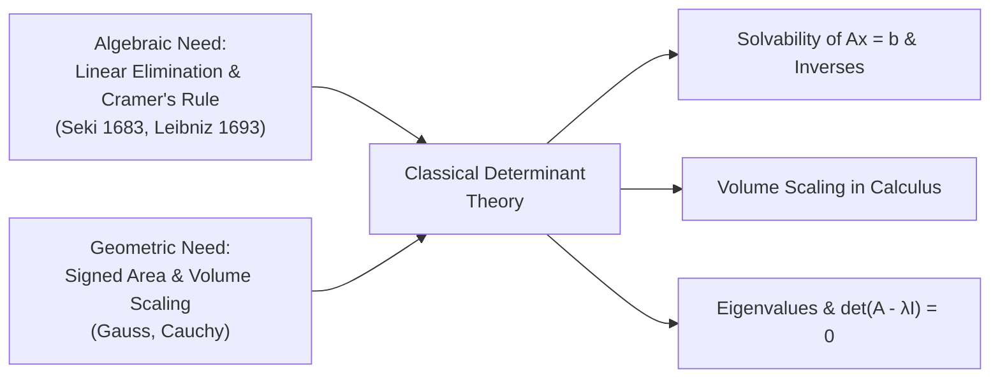

# 📐 Classical Theory of Determinants

> [!ABSTRACT] Executive Essence
> The **determinant** is a single scalar associated with every square $n \times n$ matrix. 
> - **Geometrically**, it measures how much a linear transformation scales $n$-dimensional volume (and whether it flips orientation/handedness).
> - **Algebraically**, it tells us whether a system of linear equations $Ax = b$ has a **unique solution** (which is true if and only if $\det(A) \ne 0$).
> - The **Leibniz formula** gives the exact general formula to calculate $\det(A)$ for any size $n \times n$ using permutations.

---

## 🧭 Table of Contents

- [[#1. Historical Discovery and Core Motivation|1. Historical Discovery and Core Motivation]]
  - [[#1.1 The Algebraic Route: Elimination & Solvability|1.1 The Algebraic Route: Elimination & Solvability]]
  - [[#1.2 The Geometric Route: Signed Area, Volume, and Orientation|1.2 The Geometric Route: Signed Area, Volume, and Orientation]]
  - [[#1.3 Intuitive Summary: The Dual Nature of Determinants|1.3 Intuitive Summary: The Dual Nature of Determinants]]
- [[#2. The Three Defining Rules (Axiomatic Definition)|2. The Three Defining Rules (Axiomatic Definition)]]
  - [[#2.1 A Matrix as a Collection of Column Vectors|2.1 A Matrix as a Collection of Column Vectors]]
  - [[#2.2 The Three Characterizing Rules|2.2 The Three Characterizing Rules]]
  - [[#2.3 Why Swapping Columns Flips the Sign|2.3 Why Swapping Columns Flips the Sign]]
- [[#3. Combinatorial Foundations: Permutations, Inversions, and Parity|3. Combinatorial Foundations: Permutations, Inversions, and Parity]]
  - [[#3.1 What is a Permutation $\sigma$?|3.1 What is a Permutation $\sigma$?]]
  - [[#3.2 What is an Inversion? (Counting "Out of Order" Pairs)|3.2 What is an Inversion? (Counting "Out of Order" Pairs)]]
  - [[#3.3 The Sign Function: $\operatorname{sgn}(\sigma)$|3.3 The Sign Function: $\operatorname{sgn}(\sigma)$]]
  - [[#3.4 Transpositions (Swaps) Always Flip the Sign|3.4 Transpositions (Swaps) Always Flip the Sign]]
- [[#4. The Leibniz Formula: Step-by-Step Derivation|4. The Leibniz Formula: Step-by-Step Derivation]]
  - [[#4.1 Seeing the Mechanism Clearly: $n = 2$ and $n = 3$|4.1 Seeing the Mechanism Clearly: $n = 2$ and $n = 3$]]
  - [[#4.2 The General $n \times n$ Derivation|4.2 The General $n \times n$ Derivation]]
  - [[#4.3 The "Rook Rule" Intuition|4.3 The "Rook Rule" Intuition]]
- [[#5. Concrete Expansions: $2 \times 2$, $3 \times 3$, and Why $4 \times 4$ is Different|5. Concrete Expansions: $2 \times 2$, $3 \times 3$, and Why $4 \times 4$ is Different]]
  - [[#5.1 The $2 \times 2$ Case ($2! = 2$ terms)|5.1 The $2 \times 2$ Case ($2! = 2$ terms)]]
  - [[#5.2 The $3 \times 3$ Case ($3! = 6$ terms — Sarrus Rule)|5.2 The $3 \times 3$ Case ($3! = 6$ terms — Sarrus Rule)]]
  - [[#5.3 Why the Sarrus Diagonal Rule Fails for $n \ge 4$ ($4! = 24$ terms)|5.3 Why the Sarrus Diagonal Rule Fails for $n \ge 4$ ($4! = 24$ terms)]]
- [[#6. Essential Operational Properties for Computation|6. Essential Operational Properties for Computation]]
  - [[#6.1 Triangular Matrices: Just Multiply the Diagonal!|6.1 Triangular Matrices: Just Multiply the Diagonal!]]
  - [[#6.2 The Three Elementary Row Operations|6.2 The Three Elementary Row Operations]]
  - [[#6.3 Key Determinant Theorems|6.3 Key Determinant Theorems]]
  - [[#6.4 Laplace (Cofactor) Expansion|6.4 Laplace (Cofactor) Expansion]]
- [[#7. Practice Problems with Full Step-by-Step Solutions|7. Practice Problems with Full Step-by-Step Solutions]]
  - [[#Problem 1: Counting Inversions and Finding Signs of Permutations|Problem 1: Counting Inversions and Finding Signs of Permutations]]
  - [[#Problem 2: Using the Leibniz Formula Directly on a Sparse Matrix|Problem 2: Using the Leibniz Formula Directly on a Sparse Matrix]]
  - [[#Problem 3: Evaluating a $4 \times 4$ Determinant via Row Operations|Problem 3: Evaluating a $4 \times 4$ Determinant via Row Operations]]
  - [[#Problem 4: Finding Invertibility for a Matrix with a Variable|Problem 4: Finding Invertibility for a Matrix with a Variable]]
  - [[#Problem 5: Calculating Determinants Using Matrix Properties|Problem 5: Calculating Determinants Using Matrix Properties]]
  - [[#Problem 6: Laplace Cofactor Expansion with Smart Choices|Problem 6: Laplace Cofactor Expansion with Smart Choices]]
- [[#8. Summary Checklist: What to Remember for Exams|8. Summary Checklist: What to Remember for Exams]]

---

## 1. Historical Discovery and Core Motivation

Determinants were discovered **more than a century before matrices** were formally recognized as standalone mathematical objects. Historically, the theory emerged from two distinct needs:

1. **The Algebraic Need:** Finding conditions under which a system of simultaneous linear equations has a unique solution.
2. **The Geometric Need:** Calculating signed areas and volumes under linear transformations.



### 1.1 The Algebraic Route: Elimination & Solvability

In 1683 (Japan), **Seki Takakazu**, and in 1693 (Germany), **Gottfried Wilhelm Leibniz**, independently discovered determinant expressions while trying to eliminate variables from linear systems.

Consider a simple system of two linear equations in two unknowns $x, y \in \mathbb{R}$:
$$
\begin{aligned}
a_1 x + b_1 y &= k_1 \\
a_2 x + b_2 y &= k_2
\end{aligned}
$$

To eliminate $y$, multiply the first equation by $b_2$, multiply the second by $b_1$, and subtract:
$$
\begin{aligned}
(a_1 b_2) x + (b_1 b_2) y &= k_1 b_2 \\
(a_2 b_1) x + (b_1 b_2) y &= k_2 b_1 \\
\hline
(a_1 b_2 - a_2 b_1) x &= k_1 b_2 - k_2 b_1
\end{aligned}
$$

The coefficient in front of $x$ is:
$$
\Delta = a_1 b_2 - a_2 b_1
$$

This single number tells us the entire fate of the system:
- **If $\Delta \ne 0$:** We can divide by $\Delta$ to get a **unique solution** for $x$ and $y$.
- **If $\Delta = 0$:** We cannot divide by 0! The system has either **no solution** (parallel lines) or **infinitely many solutions** (identical lines).

This quantity $\Delta = a_1 b_2 - a_2 b_1$ is called the **determinant** of the $2 \times 2$ coefficient matrix:
$$
\det \begin{pmatrix} a_1 & b_1 \\ a_2 & b_2 \end{pmatrix} = a_1 b_2 - a_2 b_1
$$

---

### 1.2 The Geometric Route: Signed Area, Volume, and Orientation

Concurrently, mathematicians noticed that this exact same formula measures the **geometric area** of shapes stretched by vectors.

#### 1. In $\mathbb{R}^2$: Parallelogram Signed Area
Let $v_1 = \begin{pmatrix} a \\ c \end{pmatrix}$ and $v_2 = \begin{pmatrix} b \\ d \end{pmatrix}$ be two vectors in the 2D plane. 

The area of the parallelogram formed by $v_1$ and $v_2$ is given by:
$$
\text{Area} = \left\lvert \det \begin{pmatrix} a & b \\ c & d \end{pmatrix} \right\rvert = |a d - b c|
$$

```
       ^ y
       |          v1 + v2
       |         /------/
       |        /      /
       |    v2 /      /   Area = |ad - bc|
       |      /      /
       |     /      /
       |    +------/---> x
       |   O   v1
       +------------------->
```

The **sign** of the determinant $\det \begin{pmatrix} a & b \\ c & d \end{pmatrix} = ad - bc$ encodes the **2D orientation**:
- **Positive ($+$):** Sweeping from $v_1$ to $v_2$ through the smaller angle is **counterclockwise** (standard orientation).
- **Negative ($-$):** Sweeping from $v_1$ to $v_2$ through the smaller angle is **clockwise** (the plane has been flipped / reflected).
- **Zero ($0$):** $v_1$ and $v_2$ point along the same line (collinear); the parallelogram is flattened into a 1D line with area $0$.

#### 2. In $\mathbb{R}^3$: Parallelepiped Signed Volume
When three vectors $v_1, v_2, v_3 \in \mathbb{R}^3$ are placed with their tails at the origin, they form the edges of a 3D slanted box (called a **parallelepiped**).

- The **physical volume** of this box is always non-negative:
  $$
  \text{Physical Volume} = \left\lvert \det \begin{pmatrix} v_1 & v_2 & v_3 \end{pmatrix} \right\rvert = |v_1 \cdot (v_2 \times v_3)| \ge 0
  $$
  *(See [[Cross product of vector]] for details on the scalar triple product).*

- The **determinant itself** (without the absolute value bars) is the **signed volume**:
  $$
  \text{Signed Volume} = \det \begin{pmatrix} v_1 & v_2 & v_3 \end{pmatrix} = v_1 \cdot (v_2 \times v_3)
  $$

The **sign of the determinant** tells us the 3D spatial orientation:
- **$\det > 0$ (Right-handed):** The ordered triple $(v_1, v_2, v_3)$ follows the **right-hand rule** (point your right thumb along $v_1$, index along $v_2$, and middle finger along $v_3$). This matches the standard orientation of our 3D world.
- **$\det < 0$ (Left-handed):** The vectors follow a left-handed configuration (the box has been flipped or reflected in a mirror).
- **$\det = 0$ (Coplanar / Flattened):** All three vectors lie flat on the same 2D plane (linearly dependent), so the box has 0 height and its 3D volume collapses to 0.

#### 3. In $\mathbb{R}^n$: $n$-Dimensional Parallelotope
In $n$-dimensional space, $n$ vectors $v_1, v_2, \dots, v_n \in \mathbb{R}^n$ form an $n$-dimensional slanted box (called an **$n$-parallelotope**).
- Its **physical volume** is:
  $$
  \text{Physical Volume} = |\det(v_1, v_2, \dots, v_n)|
  $$
- Its **signed volume** is the determinant $\det(v_1, v_2, \dots, v_n)$ itself.
- **If $\det(A) = 0$:** The vectors are linearly dependent (they are squashed flat into fewer dimensions), so their $n$-dimensional volume collapses to **$0$**.
- **The sign ($\pm$):** Tells us whether the linear transformation preserves ($+$) or reverses ($-$) spatial orientation.

---

### 1.3 Intuitive Summary: The Dual Nature of Determinants

| Perspective             | When $\det(A) \ne 0$                                                                               | When $\det(A) = 0$                                                                                            |
| :---------------------- | :------------------------------------------------------------------------------------------------- | :------------------------------------------------------------------------------------------------------------ |
| **Algebraic**           | The system $Ax = b$ has a **unique solution**; the matrix $A$ is **invertible** ($A^{-1}$ exists). | The system has either **no solution** or **infinitely many solutions**; $A$ is **singular** (not invertible). |
| **Geometric**           | The box formed by the column vectors has **positive volume**; space is not squashed.               | The box is **squashed flat** into fewer dimensions; volume collapses to **0**.                                |
| **Vector Independence** | The columns (and rows) are **linearly independent**.                                               | The columns (and rows) are **linearly dependent**.                                                            |

---

## 2. The Three Defining Rules (Axiomatic Definition)

Instead of memorizing a massive formula, mathematicians define the determinant by **three simple, natural geometric rules**. 

### 2.1 A Matrix as a Collection of Column Vectors

Think of an $n \times n$ matrix $A$ as an ordered collection of $n$ column vectors:
$$
A = \begin{pmatrix} v_1 & v_2 & \dots & v_n \end{pmatrix}, \quad \text{where each } v_j \in \mathbb{R}^n
$$

The determinant is a function that takes these $n$ vectors and outputs a single real number:
$$
\det(v_1, v_2, \dots, v_n) \in \mathbb{R}
$$

### 2.2 The Three Characterizing Rules

The determinant is the **only** function that satisfies these three natural rules:

#### Rule 1: Multilinearity (Linear in each column individually)
If you keep all columns fixed except for one column:
- **Scaling:** Multiplying a column by a constant $c$ multiplies the determinant by $c$:
  $$
  \det(v_1, \dots, c u, \dots, v_n) = c \det(v_1, \dots, u, \dots, v_n)
  $$
  *(Geometric meaning: If you stretch one edge of a box by factor $c$, its volume scales by $c$.)*

- **Addition:** Adding two vectors in one column splits the determinant into a sum:
  $$
  \det(v_1, \dots, u + w, \dots, v_n) = \det(v_1, \dots, u, \dots, v_n) + \det(v_1, \dots, w, \dots, v_n)
  $$
  *(Geometric meaning: If you glue two boxes together along a shared face, their volumes add.)*

#### Rule 2: Alternating (Zero if two adjacent columns are identical)
If any two adjacent columns are the exact same vector:
$$
\det(\dots, v, v, \dots) = 0
$$
*(Geometric meaning: If two edges of a box point in the exact same direction, the box has zero thickness along that direction $\implies$ it is squashed flat $\implies$ volume is 0!)*

#### Rule 3: Normalization (Identity matrix has determinant 1)
For the standard identity matrix $I_n = \begin{pmatrix} e_1 & e_2 & \dots & e_n \end{pmatrix}$:
$$
\det(e_1, e_2, \dots, e_n) = 1
$$
*(Geometric meaning: The standard unit cube with edges of length $1$ along the coordinate axes has volume $1 \times 1 \times \dots \times 1 = 1$.)*

---

### 2.3 Why Swapping Columns Flips the Sign

A direct consequence of Rules 1 and 2 is that **swapping any two adjacent columns multiplies the determinant by $-1$**:
$$
\det(\dots, v_j, v_i, \dots) = - \det(\dots, v_i, v_j, \dots)
$$

> [!NOTE]- Quick 2-Line Proof (Worth knowing!)
> Place the sum $(v_i + v_j)$ into both adjacent columns. By Rule 2, since the two columns are identical, the determinant is zero:
> $$
> \det(\dots, v_i + v_j, v_i + v_j, \dots) = 0
> $$
> Expanding this using Rule 1 (linearity) gives:
> $$
> \underbrace{\det(\dots, v_i, v_i, \dots)}_{0 \text{ by Rule 2}} + \det(\dots, v_i, v_j, \dots) + \det(\dots, v_j, v_i, \dots) + \underbrace{\det(\dots, v_j, v_j, \dots)}_{0 \text{ by Rule 2}} = 0
> $$
> Therefore:
> $$
> \det(\dots, v_i, v_j, \dots) + \det(\dots, v_j, v_i, \dots) = 0 \implies \det(\dots, v_j, v_i, \dots) = -\det(\dots, v_i, v_j, \dots)
> $$

---

## 3. Combinatorial Foundations: Permutations, Inversions, and Parity

To turn these 3 geometric rules into a concrete calculation formula, we need to understand **permutations**.

### 3.1 What is a Permutation $\sigma$?

A **permutation** $\sigma$ is simply a **rearrangement** of the numbers $(1, 2, \dots, n)$.
- We write it in one-line notation as:
  $$
  \sigma = (\sigma(1), \sigma(2), \dots, \sigma(n))
  $$
- **Example for $n = 3$:** $\sigma = (2, 3, 1)$ means:
  - 1st position gets $2$
  - 2nd position gets $3$
  - 3rd position gets $1$

How many different permutations of $(1, 2, \dots, n)$ exist?
$$
\text{Total number of permutations} = n! = n \times (n-1) \times \dots \times 2 \times 1
$$
- For $n = 2$: $2! = 2$ permutations: $(1, 2)$ and $(2, 1)$.
- For $n = 3$: $3! = 6$ permutations.
- For $n = 4$: $4! = 24$ permutations.

The set of all $n!$ permutations is denoted by $S_n$ (the symmetric group).

---

### 3.2 What is an Inversion? (Counting "Out of Order" Pairs)

An **inversion** is a pair of numbers in the permutation where a **larger number appears before a smaller number**.

In mathematical symbols: an inversion is a pair of positions $(i, j)$ with $i < j$ such that:
$$
\sigma(i) > \sigma(j)
$$

The total number of inversions is denoted $\operatorname{inv}(\sigma)$. It measures how "scrambled" or "out of order" the list is compared to $(1, 2, \dots, n)$.

#### Three Simple Examples:
1. **$\sigma = (1, 2, 3)$:**
   Numbers are in natural order. There are **$0$ inversions**: $\operatorname{inv}(\sigma) = 0$.

2. **$\sigma = (2, 3, 1)$:**
   Let's check every pair:
   - $(2, 3)$ $\to$ $2 < 3$ (in order, okay)
   - $(2, 1)$ $\to$ $2 > 1$ (**out of order! Inversion #1**)
   - $(3, 1)$ $\to$ $3 > 1$ (**out of order! Inversion #2**)
   Total: $\operatorname{inv}(\sigma) = 2$.

3. **$\sigma = (3, 2, 1)$:**
   - $(3, 2) \to$ out of order (Inversion #1)
   - $(3, 1) \to$ out of order (Inversion #2)
   - $(2, 1) \to$ out of order (Inversion #3)
   Total: $\operatorname{inv}(\sigma) = 3$.

We can also compare like this:
$(3,2,1)$ . We check one by one:
$\sigma(1)=3>2$ and $3>1$, thus inversion=$2$
$\sigma(2):2>1$, thus inversion-$1$
$\sigma(3):1$ , no inversion
Total inversion $inv(\sigma)=3$ 

---

### 3.3 The Sign Function: $\operatorname{sgn}(\sigma)$

The **sign** (also called the **signature** or **parity**) of a permutation $\sigma$ is defined as:
$$
\operatorname{sgn}(\sigma) = (-1)^{\operatorname{inv}(\sigma)}
$$

- If $\operatorname{inv}(\sigma)$ is **even**, $\sigma$ is an **even permutation** $\implies \operatorname{sgn}(\sigma) = +1$.
- If $\operatorname{inv}(\sigma)$ is **odd**, $\sigma$ is an **odd permutation** $\implies \operatorname{sgn}(\sigma) = -1$.

For our examples:
- $\operatorname{inv}(1, 2, 3) = 0 \implies \operatorname{sgn} = (-1)^0 = \mathbf{+1}$
- $\operatorname{inv}(2, 3, 1) = 2 \implies \operatorname{sgn} = (-1)^2 = \mathbf{+1}$
- $\operatorname{inv}(3, 2, 1) = 3 \implies \operatorname{sgn} = (-1)^3 = \mathbf{-1}$

---

### 3.4 Transpositions (Swaps) Always Flip the Sign

A **transposition** is an operation that swaps just two numbers in a list, leaving everything else alone.

> [!IMPORTANT] The Golden Rule of Swaps
> Every single swap of two numbers changes the number of inversions by an **odd number** ($+1$ or $-1$).
> Therefore, **every single swap flips the sign from $+1$ to $-1$ or from $-1$ to $+1$**:
> $$
> \operatorname{sgn}(\sigma \circ \text{swap}) = -\operatorname{sgn}(\sigma)
> $$
> If it takes $k$ swaps to sort a scrambled list back into $(1, 2, \dots, n)$, then:
> $$
> \operatorname{sgn}(\sigma) = (-1)^k
> $$

---

## 4. The Leibniz Formula: Step-by-Step Derivation

Now, we are ready to deduce the famous **Leibniz Formula for the Determinant** directly from our 3 rules.

### 4.1 Seeing the Mechanism Clearly: $n = 2$ and $n = 3$

Before looking at the general formula with $n$ summations, let us see the exact same column-splitting mechanism on small matrices where you can see every single term.

#### 1. The $n = 2$ Case (Only 4 terms)
Let $A = \begin{pmatrix} a_{11} & a_{12} \\ a_{21} & a_{22} \end{pmatrix}$. The unit basis vectors are $e_1 = \begin{pmatrix} 1 \\ 0 \end{pmatrix}, e_2 = \begin{pmatrix} 0 \\ 1 \end{pmatrix}$.

Each column is:
- **Column 1:** $v_1 = a_{11} e_1 + a_{21} e_2$
- **Column 2:** $v_2 = a_{12} e_1 + a_{22} e_2$

Now expand $\det(v_1, v_2)$ by splitting one column at a time:

1. **Split Column 1 (keeping Column 2 as $v_2$):**
   $$
   \det(a_{11} e_1 + a_{21} e_2, \; v_2) = a_{11} \det(e_1, v_2) + a_{21} \det(e_2, v_2)
   $$

2. **Split Column 2 in each of the two pieces:**
   Plugging $v_2 = a_{12} e_1 + a_{22} e_2$ into both pieces produces $2 \times 2 = \mathbf{4 \text{ terms}}$:
   $$
   \det(A) = a_{11} a_{12} \det(e_1, e_1) + a_{11} a_{22} \det(e_1, e_2) + a_{21} a_{12} \det(e_2, e_1) + a_{21} a_{22} \det(e_2, e_2)
   $$

3. **Kill the zeros (Rule 2):**
   If two columns are identical, the determinant is zero ($\det(e_1, e_1) = 0$ and $\det(e_2, e_2) = 0$). Only **$2$ terms** survive:
   $$
   \det(A) = a_{11} a_{22} \det(e_1, e_2) + a_{21} a_{12} \det(e_2, e_1)
   $$

4. **Evaluate the basis determinants (Rule 3):**
   - $\det(e_1, e_2) = +1$ (already sorted)
   - $\det(e_2, e_1) = -1$ (takes $1$ swap to sort)
   $$
   \det(A) = a_{11} a_{22}(+1) + a_{21} a_{12}(-1) = \mathbf{a_{11} a_{22} - a_{12} a_{21}}
   $$

---

#### 2. The $n = 3$ Case (From 27 terms down to 6 terms)
For a $3 \times 3$ matrix with columns $v_1, v_2, v_3$:
- $v_1 = a_{11} e_1 + a_{21} e_2 + a_{31} e_3$
- $v_2 = a_{12} e_1 + a_{22} e_2 + a_{32} e_3$
- $v_3 = a_{13} e_1 + a_{23} e_2 + a_{33} e_3$

1. **Splitting Column 1** creates $3$ terms:
   $$
   \det(v_1, v_2, v_3) = a_{11} \det(e_1, v_2, v_3) + a_{21} \det(e_2, v_2, v_3) + a_{31} \det(e_3, v_2, v_3)
   $$

2. **Splitting Column 2** splits each into 3 $\implies 3 \times 3 = 9$ terms.
3. **Splitting Column 3** splits each of those 9 into 3 $\implies 3 \times 3 \times 3 = \mathbf{27 \text{ total terms}}$. Every term looks like:
   $$
   a_{i, 1} \cdot a_{j, 2} \cdot a_{k, 3} \cdot \det(e_i, e_j, e_k) \quad \text{where } i, j, k \in \{1, 2, 3\}
   $$

4. **Rule 2 kills all duplicate columns:**
   Any term where two indices repeat (like $\det(e_1, e_1, e_3) = 0$ or $\det(e_2, e_3, e_2) = 0$) drops out. 
   Out of the 27 terms, **21 terms DIE!**

5. **Only terms where all three indices are different survive:**
   There are only $3! = 3 \times 2 \times 1 = \mathbf{6 \text{ surviving terms}}$ (the permutations of $\{1, 2, 3\}$):

| Chosen $(i, j, k)$ | Number Product | Basis Determinant | Swaps to sort to $(e_1, e_2, e_3)$ | Sign |
| :---: | :---: | :---: | :---: | :---: |
| **$(1, 2, 3)$** | $a_{11} a_{22} a_{33}$ | $\det(e_1, e_2, e_3)$ | Already sorted ($0$ swaps) | $\mathbf{+1}$ |
| **$(2, 3, 1)$** | $a_{21} a_{32} a_{13}$ | $\det(e_2, e_3, e_1)$ | $2$ swaps | $\mathbf{+1}$ |
| **$(3, 1, 2)$** | $a_{31} a_{12} a_{23}$ | $\det(e_3, e_1, e_2)$ | $2$ swaps | $\mathbf{+1}$ |
| **$(1, 3, 2)$** | $a_{11} a_{32} a_{23}$ | $\det(e_1, e_3, e_2)$ | $1$ swap ($e_3 \leftrightarrow e_2$) | $\mathbf{-1}$ |
| **$(2, 1, 3)$** | $a_{21} a_{12} a_{33}$ | $\det(e_2, e_1, e_3)$ | $1$ swap ($e_2 \leftrightarrow e_1$) | $\mathbf{-1}$ |
| **$(3, 2, 1)$** | $a_{31} a_{22} a_{13}$ | $\det(e_3, e_2, e_1)$ | $1$ swap ($e_3 \leftrightarrow e_1$) | $\mathbf{-1}$ |

Adding these 6 survivors together yields **Sarrus' Rule**:
$$
\det(A) = a_{11} a_{22} a_{33} + a_{21} a_{32} a_{13} + a_{31} a_{12} a_{23} - a_{11} a_{32} a_{23} - a_{21} a_{12} a_{33} - a_{31} a_{22} a_{13}
$$

---

### 4.2 The General $n \times n$ Derivation

Now that you have seen $n = 2$ ($2^2 = 4$ terms $\to 2$ survivors) and $n = 3$ ($3^3 = 27$ terms $\to 6$ survivors), the general $n \times n$ derivation is the exact same three steps:

#### Step 1: Expand using Rule 1 (Multilinearity)
Write each column as $v_j = \sum_{i=1}^n a_{ij} e_i$. Pulling out the sums from all $n$ columns one-by-one gives:
$$
\det(A) = \sum_{i_1=1}^n \sum_{i_2=1}^n \dots \sum_{i_n=1}^n \Big(a_{i_1, 1} a_{i_2, 2} \cdots a_{i_n, n}\Big) \det(e_{i_1}, e_{i_2}, \dots, e_{i_n})
$$
*(This is just the compact shorthand for all $n^n$ expanded terms before killing the zeros).*

#### Step 2: Eliminate terms using Rule 2 (Alternating property)
Rule 2 kills any term where two or more indices repeat ($i_p = i_q \implies \det = 0$).
The only terms that survive are those where all indices $(i_1, \dots, i_n)$ are **completely distinct**. This is precisely a **permutation $\sigma \in S_n$**!

This immediately reduces the sum from $n^n$ terms down to exactly **$n!$ surviving terms**:
$$
\det(A) = \sum_{\sigma \in S_n} \Big(a_{\sigma(1), 1} a_{\sigma(2), 2} \cdots a_{\sigma(n), n}\Big) \det(e_{\sigma(1)}, e_{\sigma(2)}, \dots, e_{\sigma(n)})
$$

#### Step 3: Evaluate $\det(e_{\sigma(1)}, \dots, e_{\sigma(n)})$ using Rule 3 (Normalization)
To sort $(e_{\sigma(1)}, \dots, e_{\sigma(n)})$ back into $(e_1, \dots, e_n)$ takes $\operatorname{inv}(\sigma)$ swaps. Each swap multiplies the value by $-1$:
$$
\det(e_{\sigma(1)}, \dots, e_{\sigma(n)}) = (-1)^{\operatorname{inv}(\sigma)} \det(e_1, \dots, e_n) = \operatorname{sgn}(\sigma) \cdot 1 = \operatorname{sgn}(\sigma)
$$

Substituting this back gives the formula:

> [!DEFINITION] The Leibniz Determinant Formula
> For any $n \times n$ matrix $A = [a_{ij}]$:
> $$
> \det(A) = \sum_{\sigma \in S_n} \operatorname{sgn}(\sigma) \prod_{j=1}^n a_{\sigma(j), j} = \sum_{\sigma \in S_n} \operatorname{sgn}(\sigma) a_{\sigma(1), 1} a_{\sigma(2), 2} \cdots a_{\sigma(n), n}
> $$

$a_{\sigma(1),1}$ simply means: The number in Row $\sigma(1)$ and Column 1.

---

### 4.3 The "Rook Rule" Intuition

What does the Leibniz formula actually tell you to do?

Think of a chessboard:
1. Place $n$ rooks on an $n \times n$ grid so that **no two rooks attack each other** (meaning exactly one rook in each row, and exactly one rook in each column).
2. Multiply the $n$ matrix entries where the rooks sit.
3. Multiply that product by $+1$ if the permutation is even, or $-1$ if it is odd.
4. **Sum over all $n!$ possible non-attacking rook configurations.**

```
   Row 1: [ .  X  . ]  -> picks a_12
   Row 2: [ .  .  X ]  -> picks a_23    => Term: sgn(σ) * a_12 * a_23 * a_31
   Row 3: [ X  .  . ]  -> picks a_31
```

---

## 5. Concrete Expansions: $2 \times 2$, $3 \times 3$, and Why $4 \times 4$ is Different

### 5.1 The $2 \times 2$ Case ($2! = 2$ terms)

For $n = 2$, there are only $2! = 2$ permutations of $\{1, 2\}$:

| Permutation $\sigma$ | Inversions | $\operatorname{sgn}(\sigma)$ | Entries picked | Resulting Term |
| :--- | :--- | :--- | :--- | :--- |
| $\sigma_1 = (1, 2)$ | 0 | $+1$ | $a_{11} a_{22}$ | $+ a_{11} a_{22}$ |
| $\sigma_2 = (2, 1)$ | 1 | $-1$ | $a_{21} a_{12}$ | $- a_{12} a_{21}$ |

Adding them together yields the familiar formula:
$$
\det \begin{pmatrix} a_{11} & a_{12} \\ a_{21} & a_{22} \end{pmatrix} = a_{11} a_{22} - a_{12} a_{21}
$$

---

### 5.2 The $3 \times 3$ Case ($3! = 6$ terms — Sarrus Rule)

For $n = 3$, there are $3! = 6$ permutations in $S_3$:

| Permutation $\sigma$ | Inversion Pairs | $\operatorname{inv}(\sigma)$ | $\operatorname{sgn}(\sigma)$ | Term Product | Sarrus Diagonal |
| :--- | :--- | :--- | :--- | :--- | :--- |
| $(1, 2, 3)$ | None | 0 (even) | **$+1$** | $+ a_{11} a_{22} a_{33}$ | Main diagonal $\searrow$ |
| $(2, 3, 1)$ | $(2,1), (3,1)$ | 2 (even) | **$+1$** | $+ a_{21} a_{32} a_{13} = + a_{13} a_{21} a_{32}$ | Downward diagonal $\searrow$ |
| $(3, 1, 2)$ | $(3,1), (3,2)$ | 2 (even) | **$+1$** | $+ a_{31} a_{12} a_{23} = + a_{12} a_{23} a_{31}$ | Downward diagonal $\searrow$ |
| $(1, 3, 2)$ | $(3,2)$ | 1 (odd) | **$-1$** | $- a_{11} a_{32} a_{23} = - a_{11} a_{23} a_{32}$ | Upward diagonal $\nearrow$ |
| $(2, 1, 3)$ | $(2,1)$ | 1 (odd) | **$-1$** | $- a_{21} a_{12} a_{33} = - a_{12} a_{21} a_{33}$ | Upward diagonal $\nearrow$ |
| $(3, 2, 1)$ | $(3,2), (3,1), (2,1)$ | 3 (odd) | **$-1$** | $- a_{31} a_{22} a_{13} = - a_{13} a_{22} a_{31}$ | Anti-diagonal $\nearrow$ |

Summing all 6 terms gives **Sarrus' Rule**:
$$
\det(A) = \underbrace{a_{11} a_{22} a_{33} + a_{12} a_{23} a_{31} + a_{13} a_{21} a_{32}}_{\text{Three positive downward diagonals}} \;-\; \underbrace{(a_{13} a_{22} a_{31} + a_{11} a_{23} a_{32} + a_{12} a_{21} a_{33})}_{\text{Three negative upward diagonals}}
$$

---

### 5.3 Why the Sarrus Diagonal Rule Fails for $n \ge 4$ ($4! = 24$ terms)

> [!WARNING] Common Student Trap!
> **Never use Sarrus' diagonal trick for $4 \times 4$ or larger matrices!**
> 
> - For a $4 \times 4$ matrix, the Leibniz formula requires $4! = \mathbf{24}$ **terms**.
> - Drawing diagonal lines across a $4 \times 4$ matrix only gives 4 downward diagonals and 4 upward diagonals = **8 terms**.
> - **16 terms are completely missing!**

For matrices of size $4 \times 4$ and larger, we compute determinants using **Elementary Row Operations** (Gaussian elimination) or **Laplace Expansion**.

---

## 6. Essential Operational Properties for Computation

In practical linear algebra exams and homework, nobody computes a $5 \times 5$ determinant using the Leibniz formula because $5! = 120$ terms! Instead, we use these fundamental properties:

### 6.1 Triangular Matrices: Just Multiply the Diagonal!

If a matrix is **upper triangular**, **lower triangular**, or **diagonal** (meaning all entries on one side of the main diagonal are zero), its determinant is simply the **product of its main diagonal entries**:
$$
\det \begin{pmatrix}
a_{11} & a_{12} & \dots & a_{1n} \\
0 & a_{22} & \dots & a_{2n} \\
\vdots & \vdots & \ddots & \vdots \\
0 & 0 & \dots & a_{nn}
\end{pmatrix} = a_{11} \cdot a_{22} \cdots a_{nn}
$$

*Why?* In the Leibniz formula, every permutation except the identity $(1, 2, \dots, n)$ will force you to pick at least one entry from the zero side of the diagonal. Thus, $n! - 1$ terms vanish, leaving only the main diagonal product!

---

### 6.2 The Three Elementary Row Operations

When doing Gaussian elimination on a matrix:

1. **Row Swap ($R_i \leftrightarrow R_j$):**
   Multiplies the determinant by $-1$:
   $$
   \det(B) = -\det(A)
   $$

2. **Multiply a row by scalar $c$ ($R_i \leftarrow c R_i$):**
   Multiplies the determinant by $c$:
   $$
   \det(B) = c \det(A)
   $$
   *(Note: Scaling the ENTIRE $n \times n$ matrix scales every single row by $c$, so $\det(c A) = c^n \det(A)$!)*

3. **Add a multiple of one row to another ($R_i \leftarrow R_i + c R_j$):**
   **THE DETERMINANT DOES NOT CHANGE!**
   $$
   \det(B) = \det(A)
   $$
   *(This is the most powerful tool: you can create as many zeros as you want in a row or column without changing the determinant at all!)*

---

### 6.3 Key Determinant Theorems

1. **Transpose Invariance:**
   $$
   \det(A^T) = \det(A)
   $$
   *Consequence: Every operation and theorem that works for rows works identically for columns!*

2. **Multiplicativity:**
   $$
   \det(AB) = \det(A) \det(B)
   $$

3. **Invertibility Criterion:**
   A square matrix $A$ is **invertible** if and only if:
   $$
   \det(A) \ne 0
   $$
   If $A$ is invertible:
   $$
   \det(A^{-1}) = \frac{1}{\det(A)}
   $$

4. **Zero Determinant Shortcut:**
   If a matrix has:
   - An entire row (or column) of zeros, OR
   - Two identical rows (or columns), OR
   - One row that is a multiple of another row (linear dependence),
   then $\det(A) = 0$ immediately!

---

### 6.4 Laplace (Cofactor) Expansion

You can evaluate $\det(A)$ by expanding along **any single row $i$ or any column $j$**:

1. **Minor $M_{ij}$:** The determinant of the smaller $(n-1) \times (n-1)$ matrix left after deleting row $i$ and column $j$.
2. **Cofactor $C_{ij}$:** The minor with a sign checkerboard:
   $$
   C_{ij} = (-1)^{i+j} M_{ij}
   $$
   The sign pattern is:
   $$
   \begin{pmatrix}
   + & - & + & \dots \\
   - & + & - & \dots \\
   + & - & + & \dots
   \end{pmatrix}
   $$

3. **Expansion along row $i$:**
   $$
   \det(A) = a_{i1} C_{i1} + a_{i2} C_{i2} + \dots + a_{in} C_{in}
   $$

> [!TIP] Exam Pro-Tip
> Always choose to expand along the row or column that contains the **most zeros**! That way, you only have to calculate 1 or 2 smaller minors.

---

## 7. Practice Problems with Full Step-by-Step Solutions

### Problem 1: Counting Inversions and Finding Signs of Permutations

**Question:**
Find the number of inversions $\operatorname{inv}(\sigma)$ and the sign $\operatorname{sgn}(\sigma)$ for each of the following permutations:
1. $\sigma_1 = (3, 4, 1, 2)$ in $S_4$
2. $\sigma_2 = (4, 3, 2, 1)$ in $S_4$
3. In general, what is the inversion count and sign for the completely reversed permutation $(n, n-1, \dots, 2, 1)$ in $S_n$?

> [!SUCCESS]- Solution
> **Part 1: $\sigma_1 = (3, 4, 1, 2)$**
> Look at every pair $(x, y)$ where $x$ comes before $y$:
> - Compare $3$ with numbers after it:
>   - $3 > 1$ (Inversion)
>   - $3 > 2$ (Inversion)
> - Compare $4$ with numbers after it:
>   - $4 > 1$ (Inversion)
>   - $4 > 2$ (Inversion)
> - Compare $1$ with $2$:
>   - $1 < 2$ (In order, not an inversion)
> 
> Total inversions: $\operatorname{inv}(\sigma_1) = 2 + 2 + 0 = \mathbf{4}$.
> Sign: $\operatorname{sgn}(\sigma_1) = (-1)^4 = \mathbf{+1}$ (Even permutation).
> 
> ---
> 
> **Part 2: $\sigma_2 = (4, 3, 2, 1)$**
> Every single pair is out of order:
> - $4$ is bigger than $3, 2, 1$ $\implies 3$ inversions.
> - $3$ is bigger than $2, 1$ $\implies 2$ inversions.
> - $2$ is bigger than $1$ $\implies 1$ inversion.
> 
> Total inversions: $\operatorname{inv}(\sigma_2) = 3 + 2 + 1 = \mathbf{6}$.
> Sign: $\operatorname{sgn}(\sigma_2) = (-1)^6 = \mathbf{+1}$ (Even permutation).
> 
> ---
> 
> **Part 3: General reversed permutation $(n, n-1, \dots, 1)$**
> The number of pairs out of order is:
> $$
> \operatorname{inv}(\sigma) = (n-1) + (n-2) + \dots + 1 = \frac{n(n-1)}{2}
> $$
> Therefore, its sign is:
> $$
> \operatorname{sgn}(\sigma) = (-1)^{\frac{n(n-1)}{2}}
> $$

---

### Problem 2: Using the Leibniz Formula Directly on a Sparse Matrix

**Question:**
Use the Leibniz formula to compute the determinant of:
$$
A = \begin{pmatrix}
0 & 0 & 2 & 0 \\
1 & 0 & 0 & 0 \\
0 & 0 & 0 & 3 \\
0 & 4 & 0 & 0
\end{pmatrix}
$$

> [!SUCCESS]- Solution
> The Leibniz formula can be evaluated **either Row-by-Row or Column-by-Column**. Both perspectives produce the exact same result!
> 
> ---
> 
> #### Method A: Row-by-Row Perspective
> Using the row form of the formula:
> $$
> \det(A) = \sum_{\sigma \in S_4} \operatorname{sgn}(\sigma) a_{1, \sigma(1)} a_{2, \sigma(2)} a_{3, \sigma(3)} a_{4, \sigma(4)}
> $$
> For a term to be non-zero, we must pick a non-zero entry from each row:
> - **Row 1:** The only non-zero entry is $a_{13} = 2 \implies \sigma(1) = 3$.
> - **Row 2:** The only non-zero entry is $a_{21} = 1 \implies \sigma(2) = 1$.
> - **Row 3:** The only non-zero entry is $a_{34} = 3 \implies \sigma(3) = 4$.
> - **Row 4:** The only non-zero entry is $a_{42} = 4 \implies \sigma(4) = 2$.
> 
> Out of all $4! = 24$ possible permutations, **only ONE permutation survives**:
> $$
> \sigma = (3, 1, 4, 2)
> $$
> Let's find its sign by counting inversions:
> - $3$ comes before $1$ and $2$ $\to 2$ inversions
> - $1$ comes before $4, 2$ $\to 0$ inversions
> - $4$ comes before $2$ $\to 1$ inversion
> 
> Total inversions: $\operatorname{inv}(\sigma) = 2 + 0 + 1 = 3 \implies \operatorname{sgn}(\sigma) = (-1)^3 = -1$.
> 
> Therefore:
> $$
> \det(A) = \operatorname{sgn}(\sigma) \cdot (a_{13} \cdot a_{21} \cdot a_{34} \cdot a_{42}) = (-1) \cdot (2 \cdot 1 \cdot 3 \cdot 4) = \mathbf{-24}
> $$
> 
> ---
> 
> #### Method B: Column-by-Column Perspective
> Using the column form of the formula (as derived in Section 4):
> $$
> \det(A) = \sum_{\pi \in S_4} \operatorname{sgn}(\pi) a_{\pi(1), 1} a_{\pi(2), 2} a_{\pi(3), 3} a_{\pi(4), 4}
> $$
> For a term to be non-zero, we must pick a non-zero entry from each column:
> - **Column 1:** The only non-zero entry is $a_{21} = 1 \implies \pi(1) = 2$.
> - **Column 2:** The only non-zero entry is $a_{42} = 4 \implies \pi(2) = 4$.
> - **Column 3:** The only non-zero entry is $a_{13} = 2 \implies \pi(3) = 1$.
> - **Column 4:** The only non-zero entry is $a_{34} = 3 \implies \pi(4) = 3$.
> 
> Only one permutation survives:
> $$
> \pi = (2, 4, 1, 3)
> $$
> Let's count inversions for $\pi$:
> - $2$ comes before $1$ $\to 1$ inversion
> - $4$ comes before $1$ and $3$ $\to 2$ inversions
> - $1$ comes before $3$ $\to 0$ inversions
> 
> Total inversions: $\operatorname{inv}(\pi) = 1 + 2 + 0 = 3 \implies \operatorname{sgn}(\pi) = (-1)^3 = -1$.
> 
> Therefore:
> $$
> \det(A) = \operatorname{sgn}(\pi) \cdot (a_{21} \cdot a_{42} \cdot a_{13} \cdot a_{34}) = (-1) \cdot (1 \cdot 4 \cdot 2 \cdot 3) = \mathbf{-24}
> $$
> 
> > [!NOTE] Key Insight: Why Both Methods Always Agree
> > Notice that $\pi = (2, 4, 1, 3)$ is the **inverse permutation** of $\sigma = (3, 1, 4, 2)$ ($\pi = \sigma^{-1}$). 
> > Since an inverse permutation always has the exact same number of inversions and the exact same parity:
> > $$
> > \operatorname{sgn}(\sigma^{-1}) = \operatorname{sgn}(\sigma)
> > $$
> > This mathematical fact is the direct reason why **$\det(A^T) = \det(A)$**!

---

### Problem 3: Evaluating a $4 \times 4$ Determinant via Row Operations

**Question:**
Compute the determinant of:
$$
A = \begin{pmatrix}
1 & 2 & 3 & 1 \\
2 & 4 & 7 & 4 \\
1 & 3 & 4 & 5 \\
3 & 6 & 9 & 8
\end{pmatrix}
$$

> [!SUCCESS]- Solution
> We use elementary row operations to make entries below the first pivot zero:
> 
> 1. Perform:
>    - $R_2 \leftarrow R_2 - 2 R_1$
>    - $R_3 \leftarrow R_3 - R_1$
>    - $R_4 \leftarrow R_4 - 3 R_1$
> 
> *(Remember: adding multiples of a row does NOT change the determinant!)*
> 
> $$
> \det(A) = \det \begin{pmatrix}
> 1 & 2 & 3 & 1 \\
> 0 & 0 & 1 & 2 \\
> 0 & 1 & 1 & 4 \\
> 0 & 0 & 0 & 5
> \end{pmatrix}
> $$
> 
> 2. Swap $R_2$ and $R_3$ to put a non-zero entry in pivot position $(2, 2)$. A row swap **multiplies by $-1$**:
> $$
> \det(A) = - \det \begin{pmatrix}
> 1 & 2 & 3 & 1 \\
> 0 & 1 & 1 & 4 \\
> 0 & 0 & 1 & 2 \\
> 0 & 0 & 0 & 5
> \end{pmatrix}
> $$
> 
> 3. The matrix is now in **upper triangular form**! Its determinant is simply the product of the diagonal entries:
> $$
> \det(A) = - (1 \cdot 1 \cdot 1 \cdot 5) = \mathbf{-5}
> $$

---

### Problem 4: Finding Invertibility for a Matrix with a Variable

**Question:**
For what values of the constant $k$ is the following matrix invertible?
$$
A = \begin{pmatrix}
1 & k & 0 \\
k & 4 & 1 \\
0 & 2 & 1
\end{pmatrix}
$$

> [!SUCCESS]- Solution
> A matrix is invertible if and only if $\det(A) \ne 0$.
> 
> Let's compute $\det(A)$ using cofactor expansion along the first row (since it has a zero):
> $$
> \det(A) = 1 \cdot \det \begin{pmatrix} 4 & 1 \\ 2 & 1 \end{pmatrix} - k \cdot \det \begin{pmatrix} k & 1 \\ 0 & 1 \end{pmatrix} + 0
> $$
> 
> Evaluate the $2 \times 2$ determinants:
> $$
> \det \begin{pmatrix} 4 & 1 \\ 2 & 1 \end{pmatrix} = (4)(1) - (1)(2) = 2
> $$
> $$
> \det \begin{pmatrix} k & 1 \\ 0 & 1 \end{pmatrix} = (k)(1) - (1)(0) = k
> $$
> 
> Substituting back:
> $$
> \det(A) = 1(2) - k(k) = 2 - k^2
> $$
> 
> Set $\det(A) = 0$:
> $$
> 2 - k^2 = 0 \implies k^2 = 2 \implies k = \pm \sqrt{2}
> $$
> 
> **Conclusion:**
> The matrix $A$ is invertible for **all real numbers except $k = \sqrt{2}$ and $k = -\sqrt{2}$** ($k \ne \pm\sqrt{2}$).

---

### Problem 5: Calculating Determinants Using Matrix Properties

**Question:**
Let $A$ and $B$ be $3 \times 3$ matrices with $\det(A) = 4$ and $\det(B) = -2$.
Compute the numerical value of:
1. $\det(2A)$
2. $\det(A^T B^{-1})$
3. $\det(A^2 B^3)$

> [!SUCCESS]- Solution
> **Part 1:** Since $A$ is a $3 \times 3$ matrix ($n = 3$), multiplying the matrix by $2$ multiplies all $3$ rows by $2$:
> $$
> \det(2A) = 2^3 \det(A) = 8 \times 4 = \mathbf{32}
> $$
> 
> **Part 2:** Using the product, transpose, and inverse rules:
> $$
> \det(A^T B^{-1}) = \det(A^T) \cdot \det(B^{-1}) = \det(A) \cdot \frac{1}{\det(B)} = (4) \cdot \left(\frac{1}{-2}\right) = \mathbf{-2}
> $$
> 
> **Part 3:** Using $\det(M^k) = (\det M)^k$:
> $$
> \det(A^2 B^3) = (\det A)^2 \cdot (\det B)^3 = (4)^2 \cdot (-2)^3 = 16 \times (-8) = \mathbf{-128}
> $$

---

### Problem 6: Laplace Cofactor Expansion with Smart Choices

**Question:**
Compute the determinant of the matrix:
$$
A = \begin{pmatrix}
2 & 0 & -1 & 3 \\
0 & 5 & 0 & 0 \\
1 & 2 & 0 & 4 \\
-1 & 3 & 2 & 1
\end{pmatrix}
$$

> [!SUCCESS]- Solution
> Look at Row 2: it is $\begin{pmatrix} 0 & 5 & 0 & 0 \end{pmatrix}$. It has three zeros!
> 
> Expanding along **Row 2**:
> $$
> \det(A) = 0 \cdot C_{21} + 5 \cdot C_{22} + 0 \cdot C_{23} + 0 \cdot C_{24} = 5 \cdot C_{22}
> $$
> The sign for position $(2, 2)$ is $(-1)^{2+2} = +1$.
> 
> Now calculate the $3 \times 3$ minor $M_{22}$ (cross out Row 2 and Column 2):
> $$
> M_{22} = \det \begin{pmatrix}
> 2 & -1 & 3 \\
> 1 & 0 & 4 \\
> -1 & 2 & 1
> \end{pmatrix}
> $$
> 
> In this $3 \times 3$ matrix, expand along its second row (which has a zero at $(2, 2)$):
> - Entry $(2, 1) = 1$, sign is $(-1)^{2+1} = -1$:
>   $$
>   -1 \cdot \det \begin{pmatrix} -1 & 3 \\ 2 & 1 \end{pmatrix} = -1 \cdot ((-1)(1) - (3)(2)) = -1 \cdot (-7) = +7
>   $$
> - Entry $(2, 3) = 4$, sign is $(-1)^{2+3} = -1$:
>   $$
>   -4 \cdot \det \begin{pmatrix} 2 & -1 \\ -1 & 2 \end{pmatrix} = -4 \cdot ((2)(2) - (-1)(-1)) = -4 \cdot (4 - 1) = -12
>   $$
> 
> So:
> $$
> M_{22} = 7 - 12 = -5
> $$
> 
> Therefore, the final determinant is:
> $$
> \det(A) = 5 \cdot M_{22} = 5 \cdot (-5) = \mathbf{-25}
> $$

---

## 8. Summary Checklist: What to Remember for Exams

- [ ] **What is a determinant?** A single number for any square matrix. Measures volume scaling geometrically; determines whether $Ax = b$ has a unique solution algebraically.
- [ ] **The 3 Axioms:** (1) Linear in each column, (2) Swapping columns flips sign, (3) $\det(I) = 1$.
- [ ] **Permutation Sign:** $\operatorname{sgn}(\sigma) = (-1)^{\text{inversions}}$. Count how many pairs are out of order.
- [ ] **Leibniz Formula:** $\det(A) = \sum_{\sigma \in S_n} \operatorname{sgn}(\sigma) a_{\sigma(1), 1} a_{\sigma(2), 2} \cdots a_{\sigma(n), n}$. Pick one entry per row/column with sign $\pm 1$.
- [ ] **Sarrus Rule:** Works ONLY for $2 \times 2$ and $3 \times 3$. Fails completely for $4 \times 4$!
- [ ] **Row Operations:**
  - Swap rows $\implies$ multiply by $-1$.
  - Multiply row by $c \implies$ multiply by $c$.
  - Add multiple of row to another $\implies$ **determinant does not change**.
- [ ] **Triangular Matrix:** Determinant is simply the product of the diagonal entries.
- [ ] **Key Identities:**
  - $\det(A^T) = \det(A)$
  - $\det(AB) = \det(A)\det(B)$
  - $\det(c A) = c^n \det(A)$ for an $n \times n$ matrix
  - $\det(A^{-1}) = \frac{1}{\det(A)}$
  - $\det(A) \ne 0 \iff A$ is invertible.
