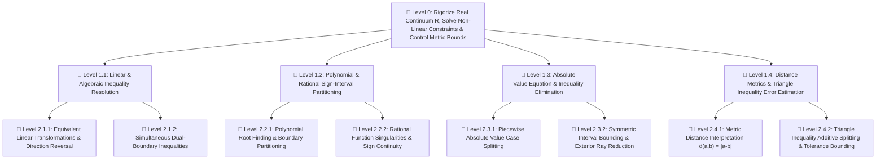

---
tags:
  - math/deconstruction
  - calculus/foundations
  - real-analysis/numbers
  - problem-tree
  - practice-problems
---
# 🧩 Chapter Deconstruction & Tool Locator: Appendix A — Numbers, Inequalities, and Absolute Values

> [!ABSTRACT] Teleological Core (Level 0)
> **Main Problem**: How do we establish the metric, order, and algebraic foundations of the real continuum $\mathbb{R}$ to rigorize intervals, solve non-linear constraints, and estimate error bounds using absolute metrics?

---

## 📋 Essential Tools & Concepts Summary (Names & Page Locations)

### 🔹 Concepts & Definitions to Learn
* **Rational & Irrational Numbers ($\mathbb{Q}, \mathbb{R} \setminus \mathbb{Q}$)** — *Page A2*
* **Real Continuum & Coordinate Line** — *Figure 1, Page A3*
* **Strict & Non-Strict Order ($a < b, a \le b$)** — *Page A3*
* **Interval Notation (Open, Closed, Infinite)** — *Table 1, Page A4*
* **Absolute Value & Metric Distance ($|a|, d(a,b)$)** — *Box 3 (Page A6) & Figure 8 (Page A7)*

### 🔹 Rules & Theorems to Learn (100% Complete Rule List)
* **Rules for Inequalities (Rules 1–5)** — *Box 2, Page A4*
  * *Rule 1*: Additive Invariance ($a < b \implies a + c < b + c$)
  * *Rule 2*: Additive Combination ($a < b \land c < d \implies a + c < b + d$)
  * *Rule 3*: Positive Scaling ($a < b \land c > 0 \implies ac < bc$)
  * *Rule 4*: Negative Scaling / Direction Reversal ($a < b \land c < 0 \implies ac > bc$)
  * *Rule 5*: Reciprocal Inversion ($0 < a < b \implies \frac{1}{a} > \frac{1}{b}$)
* **Principal Radical Identity ($\sqrt{a^2} = |a|$)** — *Box 4, Page A7*
* **Properties of Absolute Values (Properties 1–3)** — *Box 5, Page A7*
  * *Property 1*: Product Multiplicativity ($|ab| = |a||b|$)
  * *Property 2*: Quotient Multiplicativity ($\left|\frac{a}{b}\right| = \frac{|a|}{|b|}$)
  * *Property 3*: Power Rule ($|a^n| = |a|^n$)
* **Absolute Value Equivalence Rules (Properties 4–6)** — *Box 6, Page A7*
  * *Property 4*: Equality Rule ($|x| = a \iff x = \pm a$)
  * *Property 5*: Bounded Neighborhood Rule ($|x| < a \iff -a < x < a$)
  * *Property 6*: Exterior Ray Rule ($|x| > a \iff x > a \lor x < -a$)
* **The Triangle Inequality ($|a + b| \le |a| + |b|$)** — *Box 7, Page A8*

### 🔹 Operational Methods
* **Sign-Chart Decomposition Method** — *Examples 3 & 4, Pages A5–A6*
* **Case Analysis / Absolute Value Elimination** — *Example 5, Page A7*
* **Additive Split & Metric Bound Estimation** — *Example 9, Page A9*

---

## 🌲 Hierarchical Problem Tree

---

## 🛠️ Quick Tool & Page Index

| Problem Type | Goal / Task | Required Tool | Textbook Location |
| :--- | :--- | :--- | :--- |
| **Linear Inequalities** | Solve $ax + b < c$ | Rules 1 & 3 (Additive & Scaling) | Box 2, Rules 1 & 3, Page A4 |
| **Additive Combination** | Combine bounds $a < x < b$ and $c < y < d$ | Additive Combination Rule (Rule 2) | Box 2, Rule 2, Page A4 |
| **Negative Multipliers** | Isolate $x$ with negative scaling | Negative Scaling Rule (Rule 4) | Box 2, Rule 4, Page A4 |
| **Reciprocal Inequalities** | Solve $\frac{1}{g(x)} > c$ | Reciprocal Inversion Rule (Rule 5) | Box 2, Rule 5, Page A4 |
| **Non-Linear Polynomials** | Solve $P(x) < 0$ | Sign-Chart Method & Table of Intervals | Pages A5–A6, Table 1 (Page A4) |
| **Rational Inequalities** | Solve $\frac{P(x)}{Q(x)} \ge 0$ | Critical Points (Zeros & Poles) | Page A6 |
| **Absolute Quotient/Power** | Simplify $\left\|\frac{a}{b}\right\|$ or $\|a^n\|$ | Absolute Value Properties 2 & 3 | Box 5, Properties 2 & 3, Page A7 |
| **Absolute Value Equations** | Solve $\lvert 2x-1 \rvert = \lvert x+3 \rvert$ | Piecewise Def & Property 4 | Box 3 (Page A6), Box 6 (Page A7) |
| **Symmetric Neighborhoods** | Solve $\lvert x - c \rvert < r$ | Symmetric Interval Rule (Property 5) | Box 6, Property 5, Page A7 |
| **Exterior Rays** | Solve $\lvert x - c \rvert > r$ | Disjoint Ray Rule (Property 6) | Box 6, Property 6, Page A7 |
| **Metric Distance** | Compute distance between $a$ and $b$ | Metric Distance Formula $d(a,b) = \lvert a-b \rvert$ | Figure 8, Page A7 |
| **Error Tolerance Bounds** | Bound $\lvert(x+y) - C\rvert$ given tolerances | The Triangle Inequality | Box 7, Page A8 |

---

## 🏋️ Level-Graded Problem Set (100% Complete Tool Coverage)

---

### 🔹 Level 1: Foundational Machinery (Single Tool / Direct Application)

* **Problem 1.1 (Absolute Value Expression Simplification)**:
  Rewrite $|\pi - 3| + |\pi - 4|$ without absolute value symbols.
  * *Tool Location*: `Absolute Value Definition` — **Box 3, Page A6**
  * *Hierarchy Node*: Level 1.3
  * *Solution*: Since $\pi > 3$, $|\pi - 3| = \pi - 3$. Since $\pi < 4$, $|\pi - 4| = 4 - \pi$. Sum: $(\pi - 3) + (4 - \pi) = 1$.

* **Problem 1.2 (Linear Inequality Isolation with Negative Multiplier — Rule 4)**:
  Solve the inequality $4 - 3x > 6$ and express the solution set in interval notation.
  * *Tool Location*: `Negative Scaling Rule (Rule 4)` & `Additive Rule 1` — **Box 2, Page A4**
  * *Hierarchy Node*: Level 2.1.1
  * *Solution*: Subtract $4 \implies -3x > 2$. Divide by $-3$ (reverse direction): $x < -\frac{2}{3}$. Solution: $\left(-\infty, -\frac{2}{3}\right)$.

* **Problem 1.3 (Simultaneous Double Linear Inequality — Rules 1 & 3)**:
  Solve $-5 < 3 - 2x < 9$.
  * *Tool Location*: `Additive Rule 1` & `Negative Scaling Rule 4` — **Box 2, Page A4**
  * *Hierarchy Node*: Level 2.1.2
  * *Solution*: Subtract $3 \implies -8 < -2x < 6$. Divide by $-2$ (flip inequalities): $4 > x > -3 \implies -3 < x < 4$. Solution: $(-3, 4)$.

* **Problem 1.4 (Basic Absolute Value Equation — Property 4)**:
  Solve $|3x - 5| = 7$.
  * *Tool Location*: `Absolute Value Property 4` — **Box 6, Page A7**
  * *Hierarchy Node*: Level 1.3
  * *Solution*: $3x - 5 = 7 \implies 3x = 12 \implies x = 4$, or $3x - 5 = -7 \implies 3x = -2 \implies x = -\frac{2}{3}$. Solution: $x \in \left\{-\frac{2}{3}, 4\right\}$.

* **Problem 1.5 (Symmetric Metric Neighborhood — Property 5)**:
  Solve $|x - 4| < 1$.
  * *Tool Location*: `Symmetric Interval Rule (Property 5)` — **Box 6, Page A7**
  * *Hierarchy Node*: Level 2.3.2
  * *Solution*: $-1 < x - 4 < 1 \implies 3 < x < 5$. Solution: $(3, 5)$.

* **Problem 1.6 (Disjoint Exterior Rays — Property 6)**:
  Solve $|x + 1| > 3$.
  * *Tool Location*: `Disjoint Ray Rule (Property 6)` — **Box 6, Page A7**
  * *Hierarchy Node*: Level 2.3.2
  * *Solution*: $x + 1 > 3 \implies x > 2$, or $x + 1 < -3 \implies x < -4$. Solution: $(-\infty, -4) \cup (2, \infty)$.

* **Problem 1.7 (Principal Square Root Identity)**:
  Simplify $\sqrt{(2x - 3)^2}$.
  * *Tool Location*: `Principal Radical Identity` — **Box 4, Page A7**
  * *Hierarchy Node*: Level 1.3
  * *Solution*: $\sqrt{(2x - 3)^2} = |2x - 3|$.

* **Problem 1.8 (Additive Combination of Inequalities — Rule 2)**:
  Given $2 < x < 5$ and $-1 < y < 3$:
  (a) Find the valid interval for $x + y$.
  (b) Explain why you CANNOT directly subtract inequalities, and calculate the correct interval for $x - y$.
  * *Tool Location*: `Additive Combination (Rule 2)` & `Negative Scaling (Rule 4)` — **Box 2, Page A4**
  * *Hierarchy Node*: Level 2.1.2
  * *Solution*:
    (a) Add directly: $(2 + (-1)) < x + y < (5 + 3) \implies 1 < x + y < 8$.
    (b) Multiply $-1 < y < 3$ by $-1$ (Rule 4) $\implies -3 < -y < 1$. Then add to $2 < x < 5$ (Rule 2) $\implies -1 < x - y < 6$.

* **Problem 1.9 (Reciprocal Inversion — Rule 5)**:
  Solve $\frac{1}{x - 1} > 2$ for $x > 1$.
  * *Tool Location*: `Reciprocal Inversion Rule (Rule 5)` — **Box 2, Page A4**
  * *Hierarchy Node*: Level 2.1.1
  * *Solution*: Since $x - 1 > 0$ and $2 > 0$, apply Rule 5 (take reciprocals and flip sign): $x - 1 < \frac{1}{2} \implies x < \frac{3}{2}$. Solution: $\left(1, \frac{3}{2}\right)$.

* **Problem 1.10 (Quotient Absolute Value Multiplicativity — Property 2)**:
  Simplify $\left|\frac{4x - 12}{x - 3}\right|$ for $x \neq 3$.
  * *Tool Location*: `Quotient Rule (Property 2)` — **Box 5, Page A7**
  * *Hierarchy Node*: Level 1.3
  * *Solution*: Apply Property 2: $\frac{|4(x-3)|}{|x-3|} = \frac{|4||x-3|}{|x-3|} = 4$.

---

### 🔸 Level 2: Intermediate & Integrated Applications (Multi-Step / Non-Linear)

* **Problem 2.1 (Quadratic Inequality via Sign-Chart Partitioning)**:
  Solve $x^2 - 3x - 10 \le 0$.
  * *Tool Location*: `Sign-Chart Decomposition` — **Pages A5–A6** | `Table of Intervals` — **Table 1, Page A4**
  * *Hierarchy Node*: Level 2.2.1
  * *Solution*: Factor $(x - 5)(x + 2) \le 0$. Roots at $x = -2, 5$. Product is negative or zero on the closed interval $[-2, 5]$.

* **Problem 2.2 (Strict Polynomial Cubic Inequality)**:
  Solve $x^3 - 4x > 0$.
  * *Tool Location*: `Sign-Chart Method` — **Page A6**
  * *Hierarchy Node*: Level 2.2.1
  * *Solution*: Factor $x(x - 2)(x + 2) > 0$. Critical points at $-2, 0, 2$. Test intervals: $(-2, 0) \cup (2, \infty)$.

* **Problem 2.3 (Rational Inequality with Discontinuity Poles)**:
  Solve $\frac{x + 1}{x - 2} \ge 0$.
  * *Tool Location*: `Critical Points (Zeros & Poles)` — **Page A6**
  * *Hierarchy Node*: Level 2.2.2
  * *Solution*: Numerator zero at $x = -1$ (included), denominator pole at $x = 2$ (excluded). Test intervals: $(-\infty, -1] \cup (2, \infty)$.

* **Problem 2.4 (Rational Inequality with Non-Zero Right Side)**:
  Solve $\frac{2}{x - 1} \le 1$.
  * *Tool Location*: `Algebraic Transformation` & `Sign-Chart Method` — **Box 2 & Page A6**
  * *Hierarchy Node*: Level 2.2.2
  * *Solution*: Subtract $1 \implies \frac{2 - (x - 1)}{x - 1} \le 0 \implies \frac{3 - x}{x - 1} \le 0$. Zeros/poles at $1$ and $3$. Solution: $(-\infty, 1) \cup [3, \infty)$.

* **Problem 2.5 (Piecewise Absolute Value Case Splitting)**:
  Solve $|x + 3| = |2x + 1|$.
  * *Tool Location*: `Case Analysis` — **Example 5, Page A7** | `Absolute Value Property 4` — **Box 6, Page A7**
  * *Hierarchy Node*: Level 2.3.1
  * *Solution*: Case 1: $x + 3 = 2x + 1 \implies x = 2$. Case 2: $x + 3 = -(2x + 1) \implies 3x = -4 \implies x = -\frac{4}{3}$. Solution set: $\left\{-\frac{4}{3}, 2\right\}$.

* **Problem 2.6 (Double Absolute Value Constraint)**:
  Solve $1 < |x - 2| < 4$.
  * *Tool Location*: `Symmetric & Exterior Rules (Properties 5 & 6)` — **Box 6, Page A7**
  * *Hierarchy Node*: Level 2.3.2
  * *Solution*: Part 1: $|x - 2| > 1 \implies x > 3 \text{ or } x < 1$. Part 2: $|x - 2| < 4 \implies -2 < x < 6$. Intersection: $(-2, 1) \cup (3, 6)$.

* **Problem 2.7 (Applied Temperature Scale Range)**:
  The Celsius-Fahrenheit conversion formula is $C = \frac{5}{9}(F - 32)$. What Fahrenheit temperature range corresponds to $20 \le C \le 30$?
  * *Tool Location*: `Linear Transformations (Rules 1 & 3)` — **Box 2, Page A4**
  * *Hierarchy Node*: Level 2.1.2
  * *Solution*: $20 \le \frac{5}{9}(F - 32) \le 30 \implies 36 \le F - 32 \le 54 \implies 68 \le F \le 86$. Range: $[68^\circ\text{F}, 86^\circ\text{F}]$.

---

### 🔺 Level 3: Advanced Metric Bounds & Challenge Problems (Analysis & Proofs)

* **Problem 3.1 (Triangle Inequality Additive Tolerance Bounding)**:
  Suppose $|x - 4| < 0.1$ and $|y - 7| < 0.2$. Use the Triangle Inequality to prove that $|(x + y) - 11| < 0.3$.
  * *Tool Location*: `The Triangle Inequality` — **Box 7, Page A8**
  * *Hierarchy Node*: Level 2.4.2
  * *Solution*: Group terms: $|(x + y) - 11| = |(x - 4) + (y - 7)|$. By Triangle Inequality: $|(x - 4) + (y - 7)| \le |x - 4| + |y - 7| < 0.1 + 0.2 = 0.3$.

* **Problem 3.2 (Reverse Triangle Inequality Estimate)**:
  Prove that for any real numbers $a, b \in \mathbb{R}$, $||a| - |b|| \le |a - b|$.
  * *Tool Location*: `The Triangle Inequality` — **Box 7, Page A8**
  * *Hierarchy Node*: Level 2.4.2
  * *Solution*: $|a| = |(a - b) + b| \le |a - b| + |b| \implies |a| - |b| \le |a - b|$. Similarly, $|b| - |a| \le |b - a| = |a - b|$. Combining yields $||a| - |b|| \le |a - b|$.

* **Problem 3.3 ($\epsilon$-$\delta$ Neighborhood Preparation Bounding)**:
  Show that if $|x - 2| < 1$, then $|x^2 - 4| < 5|x - 2|$.
  * *Tool Location*: `Absolute Value Multiplicativity (Property 1)` — **Box 5, Page A7** & `Triangle Inequality` — **Box 7, Page A8**
  * *Hierarchy Node*: Level 2.4.2
  * *Solution*: $|x^2 - 4| = |x - 2||x + 2|$. Since $|x - 2| < 1 \implies 1 < x < 3 \implies 3 < x + 2 < 5 \implies |x + 2| < 5$. Therefore, $|x^2 - 4| = |x - 2||x + 2| < 5|x - 2|$.

* **Problem 3.4 (Rational Inequality with Quadratic Discontinuity)**:
  Solve $\frac{x^2 - 1}{x^2 - 4} \le 0$.
  * *Tool Location*: `Critical Points (Zeros & Poles)` — **Page A6** | `Sign-Chart Method` — **Page A5**
  * *Hierarchy Node*: Level 2.2.2
  * *Solution*: Factor $\frac{(x - 1)(x + 1)}{(x - 2)(x + 2)} \le 0$. Zeros at $x = \pm 1$ (included), poles at $x = \pm 2$ (excluded). Test intervals: $(-2, -1] \cup [1, 2)$.

* **Problem 3.5 (Quadratic Absolute Value Substitution — Property 3)**:
  Solve $x^2 - 2|x| - 3 \le 0$.
  * *Tool Location*: `Power Rule (Property 3)` & `Principal Radical Identity` — **Box 4 & Box 5, Page A7**
  * *Hierarchy Node*: Level 2.3.1
  * *Solution*: Note that $x^2 = |x|^2$. Equation becomes $|x|^2 - 2|x| - 3 \le 0 \implies (|x| - 3)(|x| + 1) \le 0$. Since $|x| + 1 > 0$ always, we must have $|x| - 3 \le 0 \implies |x| \le 3$. Solution: $[-3, 3]$.
