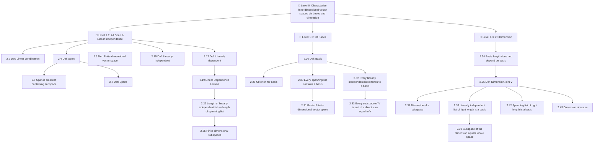

# 📚 Chapter Deconstruction & Tool Locator: Finite-Dimensional Vector Spaces

> [!ABSTRACT] Teleological Core (Level 0)
> **Main Problem**: Characterize vector spaces by structural invariants (basis and dimension) to reduce abstract linear algebra problems to finite numerical representations over $\mathbb{F}^n$.

---

## 🛠️ Essential Tools & Concepts Summary (Names & Locations)

### 📌 Section 2A: Span & Linear Independence
- **Notation (2.1)**: List of vectors written as $v_1, \dots, v_m$ without surrounding parentheses.
- **Definition (2.2)**: Linear combination of a list of vectors as $a_1 v_1 + \dots + a_m v_m$.
- **Example (2.3)**: Linear combinations in $\mathbb{R}^3$.
- **Definition (2.4)**: Span, $\operatorname{span}(v_1, \dots, v_m) = \{a_1 v_1 + \dots + a_m v_m \colon a_i \in \mathbb{F}\}$.
- **Example (2.5)**: Span in $\mathbb{R}^3$.
- **Property (2.6)**: Span is the smallest containing subspace of $V$ containing the list.
- **Definition (2.7)**: Spanning list (a list whose span equals $V$).
- **Example (2.8)**: A list that spans $\mathbb{F}^n$.
- **Definition (2.9)**: Finite-dimensional vector space (has a finite spanning list).
- **Definition (2.10)**: Polynomial space $\mathcal{P}(\mathbb{F})$.
- **Definition (2.11)**: Degree of a polynomial, $\operatorname{deg} p$.
- **Notation (2.12)**: Polynomial subspace $\mathcal{P}_m(\mathbb{F})$ (polynomials of degree $\le m$).
- **Definition (2.13)**: Infinite-dimensional vector space.
- **Example (2.14)**: $\mathcal{P}(\mathbb{F})$ is infinite-dimensional.
- **Definition (2.15)**: Linearly independent list ($a_1 v_1 + \dots + a_m v_m = 0 \implies a_i = 0$).
- **Example (2.16)**: Linearly independent lists.
- **Definition (2.17)**: Linearly dependent list.
- **Example (2.18)**: Linearly dependent lists.
- **Lemma (2.19)**: **Linear Dependence Lemma** (If $v_1, \dots, v_m$ is linearly dependent, some $v_k \in \operatorname{span}(v_1, \dots, v_{k-1})$, and removing $v_k$ leaves span unchanged).
- **Example (2.21)**: Smallest index $k$ in Linear Dependence Lemma.
- **Theorem (2.22)**: **Length of Linearly Independent List $\le$ Length of Spanning List**.
- **Example (2.23 / 2.24)**: Size bounds on $\mathbb{R}^3$ and $\mathbb{R}^4$.
- **Theorem (2.25)**: Finite-dimensional subspaces (Every subspace of a finite-dimensional vector space is finite-dimensional).

### 📌 Section 2B: Bases
- **Definition (2.26)**: Basis (A list of vectors in $V$ that is both linearly independent and spans $V$).
- **Example (2.27)**: Standard bases of $\mathbb{F}^n$, $\mathcal{P}_m(\mathbb{F})$.
- **Theorem (2.28)**: Criterion for basis (Unique representation of every vector $v \in V$).
- **Theorem (2.30)**: **Every Spanning List Contains a Basis** (Spanning list reduction).
- **Theorem (2.31)**: Basis of finite-dimensional vector space (Every finite-dimensional vector space has a basis).
- **Theorem (2.32)**: **Every Linearly Independent List Extends to a Basis**.
- **Theorem (2.33)**: **Every Subspace of $V$ is Part of a Direct Sum ($V = U \oplus W$)**.

### 📌 Section 2C: Dimension
- **Theorem (2.34)**: Basis length invariance (All bases of a finite-dimensional vector space have the same length).
- **Definition (2.35)**: Dimension, $\dim V$ (The length of any basis of $V$).
- **Example (2.36)**: Dimensions of standard spaces ($\dim \mathbb{F}^n = n$, $\dim \mathcal{P}_m(\mathbb{F}) = m+1$).
- **Theorem (2.37)**: Dimension of a subspace ($\dim U \le \dim V$).
- **Theorem (2.38)**: Linearly independent list of the right length ($\dim V$) is a basis.
- **Theorem (2.39)**: Subspace of full dimension ($\dim U = \dim V$) equals the whole space $V$.
- **Theorem (2.42)**: Spanning list of the right length ($\dim V$) is a basis.
- **Theorem (2.43)**: **Subspace Sum Dimension Formula**:
  $$\dim(U_1 + U_2) = \dim U_1 + \dim U_2 - \dim(U_1 \cap U_2)$$

---

## 🌲 Hierarchical Problem Tree

---

## 📑 Quick Tool & Location Index

| Section | Type | Name / Description |
| :--- | :--- | :--- |
| 2.1 | Notation | List of vectors |
| 2.2 | Definition | Linear combination |
| 2.3 | Example | Linear combinations in $\mathbb{R}^3$ |
| 2.4 | Definition | Span |
| 2.5 | Example | Span |
| 2.6 | Property | Span is the smallest containing subspace |
| 2.7 | Definition | Spans |
| 2.8 | Example | A list that spans $\mathbb{F}^n$ |
| 2.9 | Definition | Finite-dimensional vector space |
| 2.10 | Definition | Polynomial, $\mathcal{P}(\mathbb{F})$ |
| 2.11 | Definition | Degree of a polynomial, $\operatorname{deg} p$ |
| 2.12 | Notation | $\mathcal{P}_m(\mathbb{F})$ |
| 2.13 | Definition | Infinite-dimensional vector space |
| 2.14 | Example | $\mathcal{P}(\mathbb{F})$ is infinite-dimensional |
| 2.15 | Definition | Linearly independent |
| 2.16 | Example | Linearly independent lists |
| 2.17 | Definition | Linearly dependent |
| 2.18 | Example | Linearly dependent lists |
| 2.19 | Lemma | **Linear Dependence Lemma** |
| 2.21 | Example | Smallest $k$ in Linear Dependence Lemma |
| 2.22 | Theorem | **Length of Linearly Independent List $\le$ Length of Spanning List** |
| 2.23 | Example | No list of length 4 is linearly independent in $\mathbb{R}^3$ |
| 2.24 | Example | No list of length 3 spans $\mathbb{R}^4$ |
| 2.25 | Theorem | Finite-dimensional subspaces |
| 2.26 | Definition | Basis |
| 2.27 | Example | Bases |
| 2.28 | Theorem | Criterion for basis (Unique coordinates) |
| 2.30 | Theorem | Every spanning list contains a basis |
| 2.31 | Theorem | Basis of finite-dimensional vector space |
| 2.32 | Theorem | **Every linearly independent list extends to a basis** |
| 2.33 | Theorem | **Every subspace of $V$ is part of a direct sum equal to $V$** |
| 2.34 | Theorem | Basis length invariance |
| 2.35 | Definition | Dimension, $\dim V$ |
| 2.36 | Example | Dimensions |
| 2.37 | Theorem | Dimension of a subspace |
| 2.38 | Theorem | Linearly independent list of the right length is a basis |
| 2.39 | Theorem | Subspace of full dimension equals the whole space |
| 2.40 | Example | A basis of $\mathbb{F}^2$ |
| 2.41 | Example | A basis of a subspace of $\mathcal{P}_3(\mathbb{R})$ |
| 2.42 | Theorem | Spanning list of the right length is a basis |
| 2.43 | Theorem | **Dimension of a sum formula** |

---

## ⚔️ Elite Level-Graded Synthesis Problem Set (100% Tool Coverage)

### 📌 Level 1: Structural Boundary Probes & Axiom Traps

- **Problem 1.1 (Sum of Subspaces Counterexample Trap)**: Let $V$ be a finite-dimensional vector space and let $U_1, U_2, U_3$ be subspaces of $V$. Prove or disprove the generalized dimension formula:
  $$\dim(U_1 + U_2 + U_3) = \dim U_1 + \dim U_2 + \dim U_3 - \dim(U_1 \cap U_2) - \dim(U_1 \cap U_3) - \dim(U_2 \cap U_3) + \dim(U_1 \cap U_2 \cap U_3)$$
  - *Source / Archive*: `MathStackExchange Counterexample Classics`
  - *Tools Chained*: `Subspace Sum Dimension Formula (Section 2.43)`, `Subspace Dimension (Section 2.37)`
  - *Hierarchy Node*: Level 1

- **Problem 1.2 (Linear Dependence Sequential Reduction)**: Let $v_1, v_2, v_3, v_4, v_5$ be a list of vectors in $V$. Suppose $v_5 \in \operatorname{span}(v_1, v_2, v_3)$ and $v_2 \in \operatorname{span}(v_1, v_4)$. Prove that $\operatorname{span}(v_1, v_3, v_4) = \operatorname{span}(v_1, v_2, v_3, v_4, v_5)$. Is the list $v_1, v_3, v_4$ guaranteed to be a basis for this span? If not, state the exact conditions under which it fails.
  - *Source / Archive*: `UC Berkeley Preliminary Exam Linear Algebra`
  - *Tools Chained*: `Linear Dependence Lemma (Section 2.19)`, `Definition of Basis (Section 2.26)`, `Length Bound Theorem (Section 2.22)`
  - *Hierarchy Node*: Level 1

### 📌 Level 2: Multi-Theorem Synthesis & Uniqueness Proofs

- **Problem 2.1 (Subspace Intersection Bounds & Basis Extension)**: Let $U$ and $W$ be subspaces of a finite-dimensional vector space $V$. Prove that $\dim(U \cap W) \ge \dim U + \dim W - \dim V$. Using this, show that if $U$ and $W$ are 5-dimensional subspaces of $\mathbb{R}^9$, their intersection is non-trivial. Finally, explicitly construct a theoretical basis for $V$ by extending a basis of $U \cap W$.
  - *Source / Archive*: `MIT OCW 18.701 Algebra I`
  - *Tools Chained*: `Subspace Sum Dimension Formula (Section 2.43)`, `Basis Extension Theorem (Section 2.32)`, `Subspace Dimension (Section 2.37)`
  - *Hierarchy Node*: Level 2

- **Problem 2.2 (Direct Sum Completion)**: Let $U_1$ and $U_2$ be subspaces of a finite-dimensional vector space $V$ such that $V = U_1 + U_2$. Prove that there exist subspaces $W_1$ and $W_2$ such that $W_1 \subset U_1$, $W_2 \subset U_2$, and $V = W_1 \oplus W_2$.
  - *Source / Archive*: `Cambridge Mathematical Tripos Part IA`
  - *Tools Chained*: `Direct Sum Complement (Section 2.33)`, `Basis of Subspace (Section 2.26)`, `Basis Extension (Section 2.32)`
  - *Hierarchy Node*: Level 2

### 📌 Level 3: Advanced Structure & Infinite-Dimensional Decompositions

- **Problem 3.1 (Flag Manifold Structure)**: Let $V$ be an $n$-dimensional vector space. A *flag* in $V$ is a sequence of strictly nested subspaces $V_0 \subsetneq V_1 \subsetneq V_2 \subsetneq \dots \subsetneq V_k$. Prove that $k \le n$, and that $k = n$ if and only if $\dim V_i = i$ for all $i \in \{0, 1, \dots, n\}$. Furthermore, if $k = n$, show there exists a basis $v_1, \dots, v_n$ of $V$ such that $V_i = \operatorname{span}(v_1, \dots, v_i)$ for each $i$.
  - *Source / Archive*: `Harvard Math 55 / MIT OCW 18.701`
  - *Tools Chained*: `Subspace Dimension (Section 2.37)`, `Definition of Basis (Section 2.26)`, `Linear Dependence Lemma (Section 2.19)`
  - *Hierarchy Node*: Level 3

- **Problem 3.2 (Codimension and Infinite Intersection)**: Let $V$ be an $n$-dimensional vector space and $U_1, U_2, \dots, U_m$ be subspaces of $V$, each of dimension $n-1$. Prove by induction on $m$ that $\dim(U_1 \cap U_2 \cap \dots \cap U_m) \ge n - m$. Construct a rigorous counterexample to show why this lower bound strictly fails in infinite-dimensional vector spaces if we define codimension identically.
  - *Source / Archive*: `Cambridge Mathematical Tripos Part IB`
  - *Tools Chained*: `Subspace Sum Dimension Formula (Section 2.43)`, `Dimension Bounds (Section 2.37)`, `Infinite-Dimensional Vector Spaces (Section 2.13)`
  - *Hierarchy Node*: Level 3
