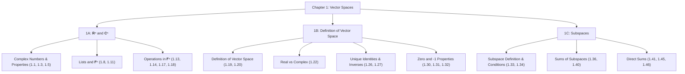

# 🧩 Chapter Deconstruction & Tool Locator: Chapter 1: Vector Spaces (Sheldon Axler, 4th Ed.)

> [!ABSTRACT] Teleological Core (Level 0)
> **Main Problem**: Characterize the algebraic structure of a Vector Space $V$ over a field $\mathbf{F}$ ($\mathbf{R}$ or $\mathbf{C}$), analyze list operations in $\mathbf{F}^n$, establish fundamental subspace properties, and decompose vector spaces using direct sums $U \oplus W$.

---

## 📋 Essential Tools & Concepts Summary (Names & Locations)

### 🔹 1A: $\mathbf{R}^n$ and $\mathbf{C}^n$
- **1.1 Complex Numbers $\mathbf{C}$**: Page 2
- **1.3 Properties of Complex Arithmetic**: Page 3
- **1.5 Subtraction and Division ($-\alpha$, $1/\alpha$)**: Page 4
- **1.8 Definition of List and Length**: Page 5
- **1.11 Definition of $\mathbf{F}^n$ and Coordinates**: Page 6
- **1.13 Addition in $\mathbf{F}^n$**: Page 6
- **1.14 Commutativity of Addition in $\mathbf{F}^n$**: Page 7
- **1.17 Additive Inverse in $\mathbf{F}^n$ ($-x$)**: Page 9
- **1.18 Scalar Multiplication in $\mathbf{F}^n$**: Page 9

### 🔹 1B: Definition of Vector Space
- **1.19 Addition and Scalar Multiplication**: Page 12
- **1.20 Definition of Vector Space**: Page 12
- **1.21 Definition of Vector and Point**: Page 12
- **1.22 Real Vector Space vs. Complex Vector Space**: Page 13
- **1.26 Unique Additive Identity**: Page 14
- **1.27 Unique Additive Inverse**: Page 15
- **1.30 The Number 0 Times a Vector ($0v = 0$)**: Page 15
- **1.31 A Number Times the Vector 0 ($a0 = 0$)**: Page 16
- **1.32 The Number $-1$ Times a Vector ($(-1)v = -v$)**: Page 16

### 🔹 1C: Subspaces
- **1.33 Definition of Subspace**: Page 18
- **1.34 Conditions for a Subspace ($0 \in U$, closed under addition & scalar mult)**: Page 18
- **1.36 Definition of Sum of Subspaces**: Page 19
- **1.40 Sum of Subspaces is the Smallest Containing Subspace**: Page 21
- **1.41 Definition of Direct Sum $\oplus$**: Page 21
- **1.45 Condition for a Direct Sum**: Page 23
- **1.46 Direct Sum of Two Subspaces ($U \cap W = \{0\}$)**: Page 23

---

## 🌲 Hierarchical Problem Tree

---

## 🛠️ Quick Tool & Page Index

| Concept / Theorem | Tool Name | Page Location |
| :--- | :--- | :--- |
| **1.1** | Complex Numbers $\mathbf{C}$ | Page 2 |
| **1.3** | Properties of Complex Arithmetic | Page 3 |
| **1.5** | Subtraction & Division ($-\alpha, 1/\alpha$) | Page 4 |
| **1.8** | List & Length | Page 5 |
| **1.11** | $\mathbf{F}^n$ & Coordinates | Page 6 |
| **1.13** | Addition in $\mathbf{F}^n$ | Page 6 |
| **1.14** | Commutativity of Addition in $\mathbf{F}^n$ | Page 7 |
| **1.17** | Additive Inverse in $\mathbf{F}^n$ | Page 9 |
| **1.18** | Scalar Multiplication in $\mathbf{F}^n$ | Page 9 |
| **1.20** | Vector Space Axioms | Page 12 |
| **1.26** | Unique Additive Identity | Page 14 |
| **1.27** | Unique Additive Inverse | Page 15 |
| **1.30** | $0v = 0$ | Page 15 |
| **1.31** | $a0 = 0$ | Page 16 |
| **1.32** | $(-1)v = -v$ | Page 16 |
| **1.33 / 1.34** | Subspace Conditions ($0 \in U$, closed under $+$, $\cdot$) | Page 18 |
| **1.36 / 1.40** | Sum of Subspaces ($U + W$) | Pages 19, 21 |
| **1.41 / 1.45 / 1.46** | Direct Sums ($U \oplus W$, $U \cap W = \{0\}$) | Pages 21, 23 |

---

## 🏋️ Elite Level-Graded Synthesis Problem Set (100% Tool Coverage)

### 🔹 Level 1: Structural Boundary Probes & Axiom Traps

- **Problem 1.1 (The Subspace Union Boundary Theorem)**: Let $U_1$ and $U_2$ be subspaces of a vector space $V$. Prove that the union $U_1 \cup U_2$ is a subspace of $V$ **if and only if** $U_1 \subseteq U_2$ or $U_2 \subseteq U_1$. Construct an explicit counterexample in $\mathbf{R}^2$ showing how closure under addition fails when neither subspace is contained in the other.
  - *Source / Archive*: `[Cambridge Mathematical Tripos Part IA / MathStackExchange Classic]`
  - *Tools Chained*: `[1.33: Subspace Definition (p. 18)]`, `[1.34: Subspace Conditions (p. 18)]`, `[1.20: Vector Space Axioms (p. 12)]`
  - *Hierarchy Node*: Level 1.1

- **Problem 1.2 (The Empty Set & Non-Empty Subspace Trap)**: Suppose $U$ is a non-empty subset of a vector space $V$ that is closed under addition and closed under scalar multiplication. 
  - (a) Show that if $\mathbf{F} = \mathbf{R}$ or $\mathbf{F} = \mathbf{C}$, then $0 \in U$ is guaranteed (making condition $0 \in U$ redundant).
  - (b) Construct an explicit algebraic structure over an empty/trivial scalar set where a subset is non-empty and closed under scalar multiplication, yet fails to contain $0$. Explain why Axler explicitly lists $0 \in U$ as a standalone requirement.
  - *Source / Archive*: `[MIT OCW 18.701 / Harvard Math 55]`
  - *Tools Chained*: `[1.34: Conditions for a Subspace (p. 18)]`, `[1.30: 0v = 0 (p. 15)]`, `[1.26: Unique Additive Identity (p. 14)]`
  - *Hierarchy Node*: Level 1.2

---

### 🔸 Level 2: Multi-Theorem Synthesis & Uniqueness Proofs

- **Problem 2.1 (Projection Operator & Direct Sum Equivalence)**: Let $V$ be a vector space and let $U, W$ be subspaces of $V$. Prove that $V = U \oplus W$ **if and only if** there exists a linear operator $P: V \to V$ satisfying:
  1. $P^2 = P$ (Idempotence)
  2. $\text{range}(P) = U$
  3. $\text{null}(P) = W$
  - *Source / Archive*: `[UC Berkeley Linear Algebra Qualifying Exam]`
  - *Tools Chained*: `[1.41: Direct Sum Definition (p. 21)]`, `[1.46: Direct Sum of Two Subspaces (p. 23)]`, `[1.27: Unique Additive Inverse (p. 15)]`
  - *Hierarchy Node*: Level 2.1

- **Problem 2.2 (Multi-Subspace Direct Sum Criterion)**: Let $U_1, U_2, \dots, U_m$ be subspaces of $V$. Prove that the sum $U_1 + U_2 + \dots + U_m$ is a direct sum **if and only if**:
  $$\text{For every } j \in \{1, \dots, m\}, \quad U_j \cap \left( \sum_{i \neq j} U_i \right) = \{0\}$$
  Show why the weaker pairwise condition $U_i \cap U_j = \{0\}$ for all $i \neq j$ is **insufficient** to guarantee a direct sum by constructing a counterexample in $\mathbf{R}^2$.
  - *Source / Archive*: `[MIT OCW 18.701 / Axler Ch 1.C Ex 23]`
  - *Tools Chained*: `[1.36: Sum of Subspaces (p. 19)]`, `[1.41: Direct Sum (p. 21)]`, `[1.45: Condition for Direct Sum (p. 23)]`
  - *Hierarchy Node*: Level 2.2

---

### 🔴 Level 3: Advanced Structure & Infinite-Dimensional Decompositions

- **Problem 3.1 (Infinite-Dimensional Subspace Isomorphism & Direct Sum Decomposition)**: Let $\mathcal{P}(\mathbf{R})$ be the vector space of all polynomials with real coefficients. Let $U_e$ be the subspace of even polynomials ($p(-x) = p(x)$) and $U_o$ be the subspace of odd polynomials ($p(-x) = -p(x)$).
  - (a) Prove that $\mathcal{P}(\mathbf{R}) = U_e \oplus U_o$.
  - (b) Prove that $U_e \cong \mathcal{P}(\mathbf{R})$ (they are isomorphic as vector spaces), demonstrating that a proper subspace in an infinite-dimensional space can be isomorphic to the whole space while maintaining a direct sum decomposition.
  - *Source / Archive*: `[UC Berkeley Prelim / Cambridge Tripos Part IB]`
  - *Tools Chained*: `[1.34: Subspace Conditions (p. 18)]`, `[1.40: Smallest Containing Subspace (p. 21)]`, `[1.46: Direct Sum of Two Subspaces (p. 23)]`
  - *Hierarchy Node*: Level 3.1

- **Problem 3.2 (Modular Arithmetic vs. Field Scalar Breakdown)**: Consider the set of vectors $V = \mathbf{Z}_p^n$ where $p$ is a positive integer.
  - (a) Prove that if $p$ is prime, then $\mathbf{Z}_p$ is a Field and $V$ satisfies all vector space axioms over $\mathbf{Z}_p$.
  - (b) Prove that if $p$ is composite (e.g., $p = 6$), the scalar multiplication operation breaks field division ($1/\alpha$), resulting in non-zero vectors $v \in V$ and non-zero scalars $a \in \mathbf{Z}_6$ such that $a v = 0$ with $a \neq 0$ and $v \neq 0$. Explain how this destroys the unique additive inverse theorem (1.27) and subspace decomposition.
  - *Source / Archive*: `[Harvard Math 55 / Abstract Algebra Prelim]`
  - *Tools Chained*: `[1.1: Complex Numbers / Fields (p. 2)]`, `[1.5: Division / Inverses (p. 4)]`, `[1.20: Vector Space Axioms (p. 12)]`, `[1.31: $a0 = 0$ (p. 16)]`
  - *Hierarchy Node*: Level 3.2
