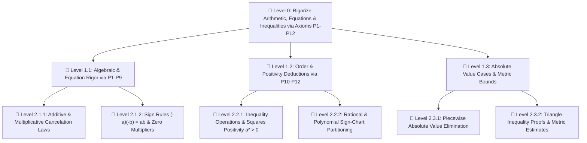

---
tags:
  - math/deconstruction
  - calculus/spivak
  - real-analysis/foundations
  - problem-tree
  - practice-problems
---

# 📚 Chapter Deconstruction & Tool Locator: Prologue — Chapter 1: Basic Properties of Numbers (Spivak Calculus)

> [!ABSTRACT] Teleological Core (Level 0)
> **Main Problem**: How do we condense all fundamental arithmetic, algebraic manipulations, and order relations into 12 basic properties ($\mathrm{P1}$–$\mathrm{P12}$) to rigorously justify equations, inequalities, and metric absolute value bounds without assuming unproven algebraic shortcuts?

---

## 🛠️ Essential Tools & Concepts Summary (Names & Page Locations)

### 📌 Basic Axioms of Addition & Multiplication ($\mathrm{P1}$–$\mathrm{P9}$) — *Spivak Chapter 1, pp. 3–9*
* **$\mathrm{P1}$ (Associative Law for Addition)**: $a + (b + c) = (a + b) + c$ for all numbers $a, b, c$ — *Spivak Page 3*
* **$\mathrm{P2}$ (Additive Identity)**: $a + 0 = 0 + a = a$ for all numbers $a$ — *Spivak Page 4*
* **$\mathrm{P3}$ (Additive Inverses)**: For every number $a$, there is a number $-a$ such that $a + (-a) = (-a) + a = 0$ — *Spivak Page 4*
* **$\mathrm{P4}$ (Commutative Law for Addition)**: $a + b = b + a$ for all numbers $a, b$ — *Spivak Page 5*
* **$\mathrm{P5}$ (Associative Law for Multiplication)**: $a \cdot (b \cdot c) = (a \cdot b) \cdot c$ for all numbers $a, b, c$ — *Spivak Page 5*
* **$\mathrm{P6}$ (Multiplicative Identity)**: $a \cdot 1 = 1 \cdot a = a$ for all numbers $a$, where $1 \neq 0$ — *Spivak Page 5*
* **$\mathrm{P7}$ (Multiplicative Inverses)**: For every number $a \neq 0$, there is a number $a^{-1}$ such that $a \cdot a^{-1} = a^{-1} \cdot a = 1$ — *Spivak Page 6*
* **$\mathrm{P8}$ (Commutative Law for Multiplication)**: $a \cdot b = b \cdot a$ for all numbers $a, b$ — *Spivak Page 6*
* **$\mathrm{P9}$ (Distributive Law)**: $a \cdot (b + c) = a \cdot b + a \cdot c$ for all numbers $a, b, c$ — *Spivak Page 7*

### 📌 Positivity & Order Axioms ($\mathrm{P10}$–$\mathrm{P12}$) — *Spivak Chapter 1, pp. 9–10*
* **$\mathrm{P10}$ (Trichotomy Law)**: For every number $a$, exactly one of the following holds: (i) $a = 0$, (ii) $a$ is in the collection $P$ of positive numbers, (iii) $-a$ is in $P$ — *Spivak Page 9*
* **$\mathrm{P11}$ (Closure under Addition for $P$)**: If $a, b \in P$, then $a + b \in P$ — *Spivak Page 9*
* **$\mathrm{P12}$ (Closure under Multiplication for $P$)**: If $a, b \in P$, then $a \cdot b \in P$ — *Spivak Page 9*

### 📌 Key Definitions & Derived Theorems — *Spivak Chapter 1, pp. 10–12*
* **Subtraction Definition**: $a - b = a + (-b)$ — *Spivak Page 4*
* **Division Definition**: $\frac{a}{b} = a \cdot b^{-1}$ for $b \neq 0$ — *Spivak Page 6*
* **Order Definitions ($a < b, a > b, \le, \ge$)**: $a < b \iff b - a \in P$ — *Spivak Page 10*
* **Absolute Value Definition ($|a|$)**: $|a| = a$ if $a \ge 0$, and $|a| = -a$ if $a < 0$ — *Spivak Page 11*
* **Theorem 1 (The Triangle Inequality)**: $|a + b| \le |a| + |b|$ for all $a, b \in \mathbb{R}$ — *Spivak Page 11*

---

## 🌳 Hierarchical Problem Tree

---

## 📑 Quick Tool & Page Index

| Problem / Skill Type | Goal / Task | Required Axiom / Tool | Spivak Page Location |
| :--- | :--- | :--- | :--- |
| **Additive Cancelation** | Prove $a+x=a \implies x=0$ | Additive Inverses ($\mathrm{P3}$) & Associativity ($\mathrm{P1}$) | Page 4 |
| **Zero Product Multiplier** | Prove $a \cdot 0 = 0$ | Distributive Law ($\mathrm{P9}$) & Additive Inverse ($\mathrm{P3}$) | Page 7 |
| **Negative Product Rule** | Prove $(-a)(-b) = ab$ | Distributive Law ($\mathrm{P9}$) & Inverses ($\mathrm{P3}, \mathrm{P7}$) | Pages 7–8 |
| **Zero Product Property** | Prove $ab=0 \implies a=0 \lor b=0$ | Multiplicative Inverse ($\mathrm{P7}$) | Page 6 |
| **Positivity of Squares** | Prove $a^2 > 0$ for $a \neq 0$ | Trichotomy ($\mathrm{P10}$) & Closure under Multiplication ($\mathrm{P12}$) | Page 10 |
| **Inequality Scaling** | Prove $a < b \land c < 0 \implies ac > bc$ | Order Definition ($b-a \in P$) & Closure ($\mathrm{P12}$) | Page 10 |
| **Polynomial Sign Chart** | Solve $x^2 - 3x + 2 > 0$ | Distributive Law ($\mathrm{P9}$) & Case Analysis | Pages 6, 14 |
| **Rational Inequality** | Solve $\frac{x-1}{x+1} > 0$ | Quotient Sign-Chart Partitioning | Pages 6, 14 |
| **Absolute Value System** | Solve $|x-3| = 8$ or $|x-1| + |x-2| > 1$ | Absolute Value Definition & Case Analysis | Pages 11, 15 |
| **The Triangle Inequality** | Prove $|a+b| \le |a| + |b|$ | Theorem 1 (4-Case Proof or Square Proof) | Pages 11–12 |
| **Reverse Triangle Inequality** | Prove $||a| - |b|| \le |a-b|$ | Theorem 1 Variant ($|a| = |(a-b)+b|$) | Page 12, Problem 12 |

---

## ⚔️ Elite Level-Graded Synthesis Problem Set (100% Axiom & Spivak Coverage)

> [!IMPORTANT] Strict No Solutions Directive
> Per `math-deconstructor - local version` rules, solutions, hints, and derivations are omitted. Use `math-coach` to solve them.

---

### 📌 Level 1: Structural Boundary Probes & Axiom Traps

* **Problem 1.1 (Uniqueness of Additive Identity via $\mathrm{P1}$–$\mathrm{P3}$)**:
  Prove using only axioms $\mathrm{P1}$, $\mathrm{P2}$, and $\mathrm{P3}$ that if $a + x = a$ for some number $a$, then $x = 0$.
  * *Source / Archive*: `[Spivak Chapter 1, p. 4]`
  * *Tools Chained*: `P1 (Associativity, p. 3)`, `P2 (Identity, p. 4)`, `P3 (Inverse, p. 4)`
  * *(NO SOLUTION, NO HINT)*

* **Problem 1.2 (Derivation of Zero Multiplier Rule via $\mathrm{P9}$)**:
  Prove using the Distributive Law $\mathrm{P9}$ and addition axioms that $a \cdot 0 = 0$ for every number $a$.
  * *Source / Archive*: `[Spivak Chapter 1, p. 7]`
  * *Tools Chained*: `P9 (Distributive Law, p. 7)`, `P2 (Additive Identity, p. 4)`
  * *(NO SOLUTION, NO HINT)*

* **Problem 1.3 (Sign Rule $(-a)(-b) = ab$ Axiomatic Proof)**:
  Prove that $(-a) \cdot (-b) = a \cdot b$ using only axioms $\mathrm{P1}$–$\mathrm{P9}$.
  * *Source / Archive*: `[Spivak Chapter 1, pp. 7–8]`
  * *Tools Chained*: `P9 (Distributive Law, p. 7)`, `P3 (Additive Inverse, p. 4)`
  * *(NO SOLUTION, NO HINT)*

* **Problem 1.4 (Uniqueness of Multiplicative Inverse — Spivak Problem 3(iii))**:
  Prove that if $a, b \neq 0$, then $(ab)^{-1} = a^{-1} b^{-1}$.
  * *Source / Archive*: `[Spivak Chapter 1, Problem 3(iii), p. 14]`
  * *Tools Chained*: `P5 (Associativity, p. 5)`, `P7 (Inverse, p. 6)`, `P8 (Commutativity, p. 6)`
  * *(NO SOLUTION, NO HINT)*

---

### 📌 Level 2: Multi-Theorem Synthesis & Order Deductions

* **Problem 2.1 (Axiomatic Positivity of Squares $a^2 > 0$)**:
  Prove using order axioms $\mathrm{P10}$–$\mathrm{P12}$ that if $a \neq 0$, then $a^2 > 0$. In particular, deduce that $1 > 0$.
  * *Source / Archive*: `[Spivak Chapter 1, p. 10]`
  * *Tools Chained*: `P10 (Trichotomy, p. 9)`, `P12 (Closure under Multiplication, p. 9)`
  * *(NO SOLUTION, NO HINT)*

* **Problem 2.2 (Negative Multiplier Inequality Reversal)**:
  Prove that if $a < b$ and $c < 0$, then $ac > bc$.
  * *Source / Archive*: `[Spivak Chapter 1, p. 10 & Problem 5(v)]`
  * *Tools Chained*: `Order Definition (p. 10)`, `P12 (Closure under Multiplication, p. 9)`
  * *(NO SOLUTION, NO HINT)*

* **Problem 2.3 (Rational Inequality with Domain Pole Partitioning — Spivak Problem 4(xiv))**:
  Find all numbers $x$ for which $\frac{x - 1}{x + 1} > 0$.
  * *Source / Archive*: `[Spivak Chapter 1, Problem 4(xiv), p. 14]`
  * *Tools Chained*: `Sign-Chart Method`, `Quotient Positivity Partitioning (p. 10)`
  * *(NO SOLUTION, NO HINT)*

* **Problem 2.4 (Double Absolute Value Boundary System — Spivak Problem 11(iv))**:
  Find all numbers $x$ for which $|x - 1| + |x - 2| > 1$.
  * *Source / Archive*: `[Spivak Chapter 1, Problem 11(iv), p. 15]`
  * *Tools Chained*: `Absolute Value Case Decomposition (p. 11)`, `Critical Point Boundary Analysis`
  * *(NO SOLUTION, NO HINT)*

---

### 📌 Level 3: Advanced Structure & Metric Inequalities

* **Problem 3.1 (The Triangle Inequality Axiomatic Proof — Spivak Theorem 1)**:
  Prove Theorem 1: For all real numbers $a$ and $b$, $|a + b| \le |a| + |b|$.
  * *Source / Archive*: `[Spivak Chapter 1, Theorem 1, pp. 11–12]`
  * *Tools Chained*: `Absolute Value Definition (p. 11)`, `Square Positivity / Case Analysis`
  * *(NO SOLUTION, NO HINT)*

* **Problem 3.2 (Reverse Triangle Inequality Proof — Spivak Problem 12(iv))**:
  Prove that for all real numbers $a$ and $b$, $\bigl| |a| - |b| \bigr| \le |a - b|$.
  * *Source / Archive*: `[Spivak Chapter 1, Problem 12(iv), p. 16]`
  * *Tools Chained*: `Theorem 1 Variant (|a| = |(a-b)+b|)`, `Symmetry of Absolute Value (|-x| = |x|)`
  * *(NO SOLUTION, NO HINT)*

* **Problem 3.3 (Arithmetic Mean - Geometric Mean Inequality — Spivak Problem 7)**:
  Prove that if $0 \le a < b$, then $a < \sqrt{ab} < \frac{a + b}{2} < b$.
  * *Source / Archive*: `[Spivak Chapter 1, Problem 7, p. 15]`
  * *Tools Chained*: `Positivity of Radical Squares ((sqrt(a)-sqrt(b))^2 > 0)`, `Order Monotonicity`
  * *(NO SOLUTION, NO HINT)*

* **Problem 3.4 (Factorization Identity for $x^n - y^n$ — Spivak Problem 1(v))**:
  Prove that for any positive integer $n$:
  $$x^n - y^n = (x - y)(x^{n-1} + x^{n-2}y + \dots + xy^{n-2} + y^{n-1})$$
  * *Source / Archive*: `[Spivak Chapter 1, Problem 1(v), p. 13]`
  * *Tools Chained*: `P9 (Distributive Law, p. 7)`, `Telescoping Sum Cancellation`
  * *(NO SOLUTION, NO HINT)*
