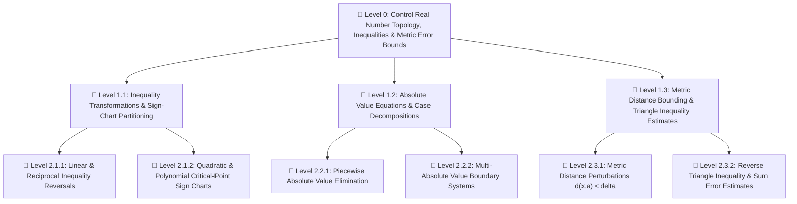

---
tags:
  - math/deconstruction
  - calculus/stewart
  - real-analysis/foundations
  - problem-tree
  - practice-problems
---

# 📚 Chapter Deconstruction & Tool Locator: Appendix A — Numbers, Inequalities, and Absolute Values (Stewart Calculus)

> [!ABSTRACT] Teleological Core (Level 0)
> **Main Problem**: How do we build the real number system $\mathbb{R}$, manipulate sets and interval topologies, and apply inequality transformation rules and metric absolute-value bounds to rigorously control error estimates for calculus limits?

---

## 🛠️ Essential Tools & Concepts Summary (Names & Page Locations)

### 📌 Concepts & Definitions to Learn
* **Integers ($\mathbb{Z}$)**: $\dots, -3, -2, -1, 0, 1, 2, 3, \dots$ — *Stewart Appendix A, Page A2*
* **Rational Numbers ($\mathbb{Q}$)**: Numbers of the form $r = \frac{m}{n}$ where $m, n \in \mathbb{Z}$ and $n \neq 0$ (repeating decimal representations) — *Page A2*
* **Irrational Numbers ($\mathbb{R} \setminus \mathbb{Q}$)**: Real numbers that cannot be expressed as a ratio of integers (nonrepeating decimals, e.g., $\sqrt{2}, \pi, e$) — *Page A2*
* **Real Line & Coordinates**: One-to-one correspondence between points on a coordinate line and numbers in $\mathbb{R}$ — *Page A2*
* **Order Relation ($a < b$)**: $a < b \iff b - a$ is positive ($a$ lies to the left of $b$ on the real line) — *Page A2*
* **Set Notation ($\in, \notin, \cup, \cap, \emptyset$)**: Element membership, set union, intersection, and the empty set — *Page A3*
* **Interval Types (Open, Closed, Half-Open, Infinite)**: $(a,b), [a,b], [a,b), (a,b], (a,\infty), [a,\infty), (-\infty,b), (-\infty,b], (-\infty,\infty)$ — *Page A3 (Table 1)*

### 📌 Rules & Theorems to Learn (100% Complete List)

#### 🔹 1. Rules for Inequalities — *Stewart Appendix A, Page A4*
* **Rule 1 (Additive Invariance)**: If $a < b$, then $a + c < b + c$ — *Box 2, Page A4*
* **Rule 2 (Inequality Addition)**: If $a < b$ and $c < d$, then $a + c < b + d$ — *Box 2, Page A4*
* **Rule 3 (Positive Multiplicative Scaling)**: If $a < b$ and $c > 0$, then $ac < bc$ — *Box 2, Page A4*
* **Rule 4 (Negative Multiplicative Reversal)**: If $a < b$ and $c < 0$, then $ac > bc$ — *Box 2, Page A4*
* **Rule 5 (Reciprocal Reversal)**: If $0 < a < b$, then $\frac{1}{a} > \frac{1}{b}$ — *Box 2, Page A4*

#### 🔹 2. Properties & Formulas of Absolute Value — *Stewart Appendix A, Pages A6–A8*
* **Definition of Absolute Value ($|a|$)**: $|a| = a$ if $a \ge 0$, and $|a| = -a$ if $a < 0$ — *Box 3, Page A6*
* **Principal Square Root Identity**: $\sqrt{a^2} = |a|$ for all $a \in \mathbb{R}$ — *Box 4, Page A6*
* **Property 1 (Non-negativity)**: $|a| \ge 0$ — *Box 5, Page A7*
* **Property 2 (Symmetry)**: $|-a| = |a|$ — *Box 5, Page A7*
* **Property 3 (Multiplicative Distributivity)**: $|ab| = |a||b|$ — *Box 5, Page A7*
* **Property 4 (Quotient Distributivity)**: $\left|\frac{a}{b}\right| = \frac{|a|}{|b|}$ ($b \neq 0$) — *Box 5, Page A7*
* **Property 5 (Power Rule)**: $|a^n| = |a|^n$ — *Box 5, Page A7*
* **Equivalence Rule 1 ($|x| = a$)**: $|x| = a \iff x = a \lor x = -a$ (where $a \ge 0$) — *Box 6, Page A7*
* **Equivalence Rule 2 ($|x| < a$)**: $|x| < a \iff -a < x < a$ (where $a > 0$) — *Box 6, Page A7*
* **Equivalence Rule 3 ($|x| > a$)**: $|x| > a \iff x > a \lor x < -a$ (where $a > 0$) — *Box 6, Page A7*
* **Distance Formula on $\mathbb{R}$**: $d(a,b) = |a - b| = |b - a|$ — *Box 6, Page A7*

#### 🔹 3. The Triangle Inequality — *Stewart Appendix A, Page A8*
* **Theorem 7 (The Triangle Inequality)**: For any real numbers $a, b \in \mathbb{R}$, $|a + b| \le |a| + |b|$ — *Box 7, Page A8*
* **Reverse Triangle Inequality**: $| |a| - |b| | \le |a - b|$ — *Exercise 61, Page A10*

---

## 🌳 Hierarchical Problem Tree

---

## 📑 Quick Tool & Page Index

| Problem / Skill Type | Goal / Objective | Required Tool / Rule | Stewart Page Location |
| :--- | :--- | :--- | :--- |
| **Linear Inequality** | Solve $1 - x < 2x + 5$ | Additive Invariance & Negative Multiplicative Reversal (Rules 1, 4) | Page A4 |
| **Compound Inequality** | Solve $4 \le 3x - 2 < 13$ | Simultaneous Inequality Scaling (Rules 1, 3) | Page A5 |
| **Polynomial Sign-Chart** | Solve $x^2 - 5x + 6 \le 0$ or $x^3 + 3x^2 > 4x$ | Factorization & Critical Point Partitioning | Pages A5–A6 |
| **Rational Inequality** | Solve $\frac{2x - 1}{x} < 1$ | Domain Restriction ($x \neq 0$) & Case-wise Scaling | Page A6 |
| **Absolute Value Equation** | Solve $|2x - 5| = 3$ or $|x + 3| = |2x + 1|$ | Absolute Value Equivalence (Box 6) / Case Analysis | Pages A7–A8 |
| **Absolute Value Inequality** | Solve $|x - 5| < 2$ or $|3x + 2| \ge 4$ | Interval Bounding $|x - c| < r \iff c-r < x < c+r$ | Page A8 |
| **Metric Estimate ($\varepsilon$-$\delta$)** | Estimate $|(x + y) - 11|$ given $|x - 4| < 0.1, |y - 7| < 0.2$ | The Triangle Inequality (Theorem 7) | Page A9 |
| **Reverse Metric Bound** | Prove $||a| - |b|| \le |a - b|$ | Theorem 7 Variant ($|a| = |(a-b)+b|$) | Page A10 |

---

## ⚔️ Elite Level-Graded Synthesis Problem Set (100% Tool Coverage)

---

### 📌 Level 1: Structural Boundary Probes & Axiom Traps

* **Problem 1.1 (Reciprocal Reversal & Sign Disjunction Probe)**:
  Solve the inequality $\frac{1}{x} < 4$ for $x \in \mathbb{R}$.
  * *Source / Archive*: `[Stewart Appendix A, Exercise 37 / Berkeley Prelim Probe]`
  * *Tools Chained*: `Rule 4 (Negative Scaling, p. A4)`, `Rule 5 (Reciprocal Reversal, p. A4)`, `Domain Pole x != 0`
  * *(NO SOLUTION, NO HINT)*

* **Problem 1.2 (Principal Square Root Identity Boundary Trap)**:
  Simplify the expression $\sqrt{x^2 - 6x + 9} - \sqrt{x^2 + 4x + 4}$ for $x \in (-2, 3)$.
  * *Source / Archive*: `[Stewart Appendix A, Box 4 Identity / MIT OCW 18.01]`
  * *Tools Chained*: `Principal Square Root Identity sqrt(a^2) = |a| (p. A6)`, `Absolute Value Definition (p. A6)`
  * *(NO SOLUTION, NO HINT)*

* **Problem 1.3 (Symmetric Inequality Scaling Probe)**:
  Find all real values of $x$ satisfying $2x - 3 < x + 4 < 3x - 2$.
  * *Source / Archive*: `[Stewart Appendix A, Exercise 24]`
  * *Tools Chained*: `Simultaneous Inequality Addition (Rule 2, p. A4)`, `Positive Scaling (Rule 3, p. A4)`
  * *(NO SOLUTION, NO HINT)*

---

### 📌 Level 2: Multi-Theorem Synthesis & Uniqueness Proofs

* **Problem 2.1 (Rational Function Sign-Chart Partitioning)**:
  Solve the inequality $\frac{x^3 - x}{x^2 - 4} \ge 0$ in interval notation.
  * *Source / Archive*: `[Stewart Appendix A, Exercise 35 Variant / Cambridge Tripos]`
  * *Tools Chained*: `Polynomial Factorization`, `Domain Pole Removal (x != +-2)`, `Sign-Chart Partitioning (pp. A5-A6)`
  * *(NO SOLUTION, NO HINT)*

* **Problem 2.2 (Multi-Absolute Value System Breakdown)**:
  Solve the equation $|x + 3| = |2x + 1|$ by both algebraic case analysis and geometric distance interpretation on $\mathbb{R}$.
  * *Source / Archive*: `[Stewart Appendix A, Exercise 45 / Putnam Prep]`
  * *Tools Chained*: `Absolute Value Distance Formula d(a,b) = |a-b| (p. A7)`, `Case-wise Absolute Value Elimination (p. A6)`
  * *(NO SOLUTION, NO HINT)*

* **Problem 2.3 (Nested Absolute Value Interval Bounds)**:
  Determine all real solutions to the inequality $1 < |2x - 5| \le 7$.
  * *Source / Archive*: `[Stewart Appendix A, Exercise 55 Variant]`
  * *Tools Chained*: `Equivalence Rules 2 & 3 (Box 6, p. A7)`, `Interval Intersection (p. A3)`
  * *(NO SOLUTION, NO HINT)*

---

### 📌 Level 3: Metric Error Estimates & Analysis Precursors

* **Problem 3.1 (Multi-Variable Limit Error Estimate via Triangle Inequality)**:
  Suppose $|x - 2| < 0.05$ and $|y - 3| < 0.02$. Use the Triangle Inequality to determine an upper bound for $|(2x - 3y) + 5|$.
  * *Source / Archive*: `[Stewart Appendix A, Example 9 Extension / Analysis Limit Control]`
  * *Tools Chained*: `The Triangle Inequality (Theorem 7, p. A8)`, `Property 3 (|ab| = |a||b|, p. A7)`
  * *(NO SOLUTION, NO HINT)*

* **Problem 3.2 (Reverse Triangle Inequality Rigorous Proof)**:
  Using Theorem 7 ($|a + b| \le |a| + |b|$), prove that for all $a, b \in \mathbb{R}$:
  $$\bigl| |a| - |b| \bigr| \le |a - b|$$
  Furthermore, deduce the conditions under which equality holds.
  * *Source / Archive*: `[Stewart Appendix A, Exercise 61 / Spivak Real Analysis]`
  * *Tools Chained*: `Theorem 7 (The Triangle Inequality, p. A8)`, `Property 2 (|-a| = |a|, p. A7)`
  * *(NO SOLUTION, NO HINT)*
