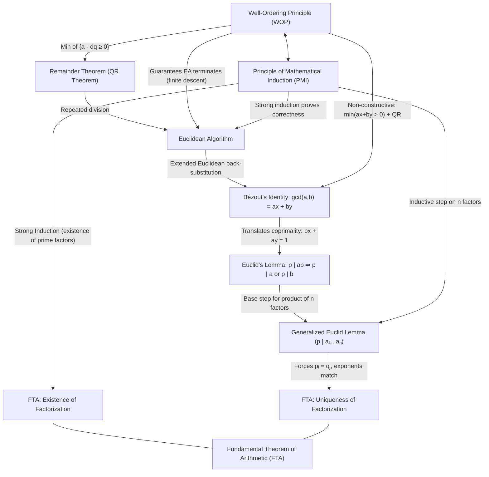

# Logical Architecture from WOP to FTA

> [!ABSTRACT] Teleological Core
> In elementary number theory, the natural numbers $\mathbb{N}$ possess a discrete foundational structure given by the **Well-Ordering Principle (WOP)** and **Mathematical Induction (PMI)**. From this bedrock arises the **Remainder Theorem (Quotient-Remainder Theorem)**, which iterates to form the **Euclidean Algorithm**. 
> 
> Running this algorithm backwards (or applying WOP directly to linear combinations) yields **Bézout's Identity**, which translates divisibility into algebra ($ax + by = \gcd(a,b)$). This algebraic identity unlocks **Euclid's Lemma**, which in turn provides the necessary engine to establish the **Uniqueness of the Fundamental Theorem of Arithmetic (FTA)**, while **Strong Induction** establishes its **Existence**.

---

## 🗺️ Master Dependency Graph



---

## 1. The Bedrock: WOP $\iff$ Mathematical Induction (PMI)

*Primary Vault References:* [[Well ordering principle]], [[Chapter 5 Sequences and Mathematical Induction]]

The **Well-Ordering Principle** and the **Principle of Mathematical Induction** are logically equivalent formulations of the discrete structure of $\mathbb{N}$ (that every subset has a discrete bottom "floor").

### Direction 1: $\text{WOP} \implies \text{PMI}$ (Proof by Contradiction)
1. Assume the conditions of induction hold for $P(n)$: $P(1)$ is true, and $\forall k \ge 1, P(k) \implies P(k+1)$.
2. Suppose the conclusion is false. Define the set of counterexamples (*the "set of failures"*):
   $$S = \{ n \in \mathbb{Z}^+ \mid P(n) \text{ is false} \}$$
3. Since $S \neq \emptyset$, by **WOP**, $S$ contains a least element $m \in S$ (*"the first failure"*).
4. Because $P(1)$ is true, $m \neq 1$, so $m > 1$.
5. Therefore, $m - 1 \ge 1$ is a valid positive integer smaller than $m$. Because $m$ was the *smallest* failure, $m - 1 \notin S$, which means $P(m - 1)$ is **true**.
6. By the inductive step, $P(m - 1) \implies P(m)$, so $P(m)$ must be **true**.
7. This directly contradicts $m \in S$. Thus, $S = \emptyset$ and $P(n)$ is true for all $n \ge 1$.

### Direction 2: $\text{PMI} \implies \text{WOP}$ (Proof by Contrapositive)
1. We prove the contrapositive: *"If a subset $S \subseteq \mathbb{Z}^+$ has no least element, then $S = \emptyset$."*
2. Define the proposition $Q(n)$: *"None of the integers $1, 2, \dots, n$ belong to $S$."*
3. **Base case ($n = 1$):** If $1 \in S$, $1$ would be the least element of $S$ (no positive integer is smaller than $1$). But $S$ has no least element, so $1 \notin S$. Thus $Q(1)$ is true.
4. **Inductive step:** Assume $Q(k)$ is true, so $1, 2, \dots, k \notin S$. If $k + 1 \in S$, it would be the least element of $S$ (since all smaller positive integers are absent). But $S$ has no least element, so $k + 1 \notin S$. Thus $Q(k+1)$ is true.
5. By PMI, $Q(n)$ is true for all $n \ge 1$, which forces $S = \emptyset$. Taking the contrapositive yields WOP.

---

## 2. Discretizing Division: WOP $\implies$ Remainder Theorem (QR Theorem)

*Primary Vault References:* [[Well ordering principle#Proof of QR Theorem]], [[Chapter 4.5]]

The **Quotient-Remainder Theorem** states that for any $a \in \mathbb{Z}$ and $d \in \mathbb{Z}^+$, there exist **unique** integers $q, r$ such that:
$$a = dq + r \quad \text{and} \quad 0 \le r < d$$

### Existence Proof (Powered by WOP)
1. Define the set of non-negative differences:
   $$S = \{ a - dq \mid q \in \mathbb{Z} \text{ and } a - dq \ge 0 \}$$
2. **Show $S \neq \emptyset$:**
   * If $a \ge 0$, choose $q = 0 \implies a - d(0) = a \ge 0 \in S$.
   * If $a < 0$, choose $q = a \implies a - d(a) = a(1 - d) \ge 0$ (since $d \ge 1 \implies 1 - d \le 0$). Thus $a(1 - d) \ge 0 \in S$.
3. Since $S \subseteq \mathbb{N} \cup \{0\}$ is non-empty, by **WOP** it contains a least element, say $r = a - dq$ for some $q \in \mathbb{Z}$.
4. By definition of $S$, $r \ge 0$.
5. **Show $r < d$ by contradiction:** Assume $r \ge d$. Let $r' = r - d$. Then:
   $$r' = (a - dq) - d = a - d(q + 1) \ge 0$$
   Hence $r' \in S$. But $r' = r - d < r$, contradicting that $r$ is the least element of $S$. Therefore, $0 \le r < d$.

### Uniqueness Proof (Algebraic Boundary)
If $a = dq + r = dq' + r'$ with $0 \le r, r' < d$, then:
$$d(q - q') = r' - r$$
Because $0 \le r < d$ and $-d < -r' \le 0$, we have $-d < r' - r < d$. The only multiple of $d$ strictly between $-d$ and $d$ is $0$. Thus $r' - r = 0 \implies r = r'$, which immediately gives $d(q - q') = 0 \implies q = q'$.

---

## 3. Algorithmic Reduction: QR Theorem + WOP + Induction $\implies$ Euclidean Algorithm

*Primary Vault References:* [[The Euclidean Algorithm Proof]], [[Bezout's identity]]

The Euclidean Algorithm iteratively applies the Quotient-Remainder Theorem to compute $\gcd(a, b)$:
$$
\begin{align}
a &= bq_1 + r_1, \quad &0 < r_1 < b \\
b &= r_1 q_2 + r_2, \quad &0 < r_2 < r_1 \\
r_1 &= r_2 q_3 + r_3, \quad &0 < r_3 < r_2 \\
&\;\;\vdots \\
r_{n-3} &= r_{n-2} q_{n-1} + r_{n-1}, \quad &0 < r_{n-1} < r_{n-2} \\
r_{n-2} &= r_{n-1} q_n + 0
\end{align}
$$

### Termination (Guaranteed by WOP)
The sequence of remainders forms a strictly decreasing sequence of non-negative integers:
$$b > r_1 > r_2 > r_3 > \dots \ge 0$$
By **WOP**, there cannot be an infinite descending sequence of positive integers. The sequence must reach a smallest non-negative integer, which is $0$. The last non-zero remainder is $r_{n-1}$.

### Correctness via Strong Mathematical Induction
1. **Common Divisor Property ($r_{n-1} \mid a$ and $r_{n-1} \mid b$):**
   * Use **backward strong induction** on the recurrence $r_{n-(k+1)} = r_{n-k} \cdot q + r_{n-(k-1)}$.
   * Base step: $r_{n-1} \mid r_{n-1}$ (itself) and $r_{n-1} \mid r_{n-2}$ (from $r_{n-2} = r_{n-1} q_n$).
   * Inductive step: If $r_{n-1}$ divides both $r_{n-k}$ and $r_{n-(k-1)}$, it must divide their linear combination $r_{n-(k+1)}$.
   * Climbing all steps back shows $r_{n-1} \mid b$ and $r_{n-1} \mid a$.
2. **Greatest Property:**
   * If any integer $d$ divides both $a$ and $b$, then forward induction shows $d \mid (a - bq_1) = r_1$, then $d \mid (b - r_1 q_2) = r_2$, down to $d \mid r_{n-1}$.
   * Hence $r_{n-1} = \gcd(a, b)$.

---

## 4. Translating Divisibility to Algebra: Bézout's Identity

*Primary Vault References:* [[Bezout's identity]], [[The Euclidean Algorithm Proof]]

**Bézout's Identity:** For all $a, b \in \mathbb{Z}$, there exist integers $x, y \in \mathbb{Z}$ such that:
$$ax + by = \gcd(a, b)$$

Your vault captures two complementary paths to this identity:

### Path A: Constructive (Extended Euclidean Algorithm)
By rearranging the remainders of the Euclidean Algorithm from bottom to top:
$$r_{n-1} = r_{n-3} - r_{n-2}q_{n-1}$$
Substitute $r_{n-2} = r_{n-4} - r_{n-3}q_{n-2}$, and successively back-substitute every remainder until $r_{n-1}$ is expressed as a linear combination of the original inputs $a$ and $b$.

### Path B: Non-Constructive (WOP + Remainder Theorem)
1. Define $S = \{ ax + by \mid x, y \in \mathbb{Z} \text{ and } ax + by > 0 \}$.
2. For non-zero $a, b$, $S \neq \emptyset$ (e.g., $a(1) + b(0) = |a| > 0$ for appropriate choice of sign).
3. By **WOP**, $S$ has a least positive element:
   $$d = ax_0 + by_0 \in S$$
4. **Show $d \mid a$ using the Remainder Theorem:**
   Write $a = dq + r$ where $0 \le r < d$.
   $$r = a - dq = a - q(ax_0 + by_0) = a(1 - qx_0) + b(-qy_0)$$
   Thus $r$ is an integer linear combination of $a$ and $b$. If $r > 0$, then $r \in S$. But $r < d$, which contradicts that $d$ is the minimum element of $S$. Therefore, $r = 0$, meaning $d \mid a$.
5. By exact identical logic, $d \mid b$.
6. If $c$ is any common divisor ($c \mid a$ and $c \mid b$), then $c \mid (ax_0 + by_0) = d \implies c \le d$.
7. Thus, $d = \gcd(a, b)$.

> [!NOTE] Strategic Vault Intuition
> As noted in [[Bezout's identity#^remark]]:
> $\gcd(a, b)$ is the **minimal positive linear combination** $\min(ax + by > 0)$. Bézout's Identity algebraically unlocks coprimality: $\gcd(a, b) = 1 \iff \exists x, y \in \mathbb{Z} \text{ such that } ax + by = 1$.

---

## 5. The Prime Splitting Principle: Euclid's Lemma

*Primary Vault References:* [[Proof of Euclid lemma]], [[Chapter 4.8 Two Famous Theorems#Euclid's Lemma]]

**Euclid's Lemma:** If $p$ is a prime number and $p \mid ab$, then $p \mid a$ or $p \mid b$.

### Proof via Bézout's Identity
1. Assume $p \nmid a$. We must show that $p \mid b$.
2. Because $p$ is prime and does not divide $a$, their only common positive divisor is $1$, so $\gcd(p, a) = 1$.
3. By **Bézout's Identity**, there exist integers $x, y \in \mathbb{Z}$ such that:
   $$px + ay = 1$$
4. Multiply the entire equation by $b$:
   $$b(px + ay) = b \implies bpx + aby = b$$
5. Since $p \mid ab$, there exists an integer $d$ such that $ab = pd$. Substitute this into the equation:
   $$bpx + (pd)y = b \implies p(bx + dy) = b$$
6. Since $bx + dy$ is an integer (integers are closed under addition and multiplication), $p$ divides $b$. Q.E.D.

### Inductive Generalization to $n$ Factors (Lemma 2)
In [[Proof of Euclid lemma#Lemma 2]], Euclid's Lemma is extended to arbitrary finite products via **Mathematical Induction**:
$$\text{If } p \mid (a_1 a_2 \dots a_n), \text{ then } p \mid a_i \text{ for some } 1 \le i \le n$$
* **Base case ($n = 2$):** Direct Euclid's Lemma ($p \mid a_1 a_2 \implies p \mid a_1 \lor p \mid a_2$).
* **Inductive step:** Group the product as $(a_1 \dots a_k)(a_{k+1})$. By Euclid's Lemma, $p \mid (a_1 \dots a_k)$ or $p \mid a_{k+1}$. If $p \mid (a_1 \dots a_k)$, by the induction hypothesis $p \mid a_i$ for some $1 \le i \le k$.

---

## 6. The Summit: The Fundamental Theorem of Arithmetic (FTA)

*Primary Vault References:* [[Uniqueness of FTA]], [[Chapter 5 Sequences and Mathematical Induction#^fta-existence|Chapter 5: FTA (Existence)]], [[Basic number theory proof#^fta-statement|Basic Number Theory: FTA]]

The **Fundamental Theorem of Arithmetic** states that every integer $n > 1$ can be uniquely factored into primes:
$$n = p_1^{e_1} p_2^{e_2} \dots p_k^{e_k}$$

The proof splits into two fundamentally distinct halves:

```
                      Fundamental Theorem of Arithmetic
                                   /      \
                                  /        \
              Existence of Primes            Uniqueness of Factorization
            [Strong Induction / WOP]            [Euclid's Lemma + PMI]
```

### Part 1: Existence of Factorization (Strong Induction or WOP)
*Proved in [[Chapter 5 Sequences and Mathematical Induction#^fta-existence|Chapter 5: Strong Induction Proof]] & [[Basic number theory proof#^709f3d|Divisibility by a Prime]]:*
* Let $P(n)$ be the statement that $n$ can be written as a product of primes.
* **Base case:** $n = 2$ is prime, so $2 = 2^1$ is trivially a product of primes.
* **Inductive step:** Assume $P(2), P(3), \dots, P(k)$ are all true. Consider $k + 1$:
  * *Case 1:* $k + 1$ is prime. Then $k + 1$ is its own prime factorization.
  * *Case 2:* $k + 1$ is composite. By definition, $k + 1 = ab$ with $1 < a, b < k + 1$. Since $2 \le a, b \le k$, by the **Strong Induction Hypothesis**, both $a$ and $b$ can be factored into primes:
    $$a = p_1 \dots p_r, \quad b = q_1 \dots q_s$$
    Therefore, $k + 1 = ab = (p_1 \dots p_r)(q_1 \dots q_s)$ is also a product of primes.
* By Strong Mathematical Induction, every integer $n \ge 2$ has a prime factorization.

### Part 2: Uniqueness of Factorization (Euclid's Lemma)
*Proved in [[Uniqueness of FTA]]:*
1. Suppose an integer $n$ has two prime factorizations:
   $$p_1^{a_1} p_2^{a_2} \dots p_k^{a_k} = q_1^{b_1} q_2^{b_2} \dots q_j^{b_j}$$
2. The prime $p_1$ divides the left-hand side, so $p_1 \mid (q_1^{b_1} \dots q_j^{b_j})$.
3. By the **Generalized Euclid's Lemma**, $p_1$ must divide one of the prime factors $q_s$.
4. Because $q_s$ is prime, its only positive divisors are $1$ and $q_s$. Since $p_1 > 1$, we must have:
   $$p_1 = q_s$$
5. Cancel $p_1$ from both sides and proceed inductively: every prime on the left must match a prime on the right, proving $k = j$ and $\{p_1, \dots, p_k\} = \{q_1, \dots, q_j\}$.
6. To prove exponents match ($a_i = b_i$), suppose $a_i > b_i$. Dividing both sides by $p_i^{b_i}$ yields:
   $$p_i^{a_i - b_i} \prod_{m \neq i} p_m^{a_m} = \prod_{m \neq i} p_m^{b_m}$$
   The LHS is divisible by $p_i$ (since $a_i - b_i \ge 1$), which means $p_i$ must divide the RHS. By Euclid's Lemma, $p_i$ must divide some $p_m$ ($m \neq i$), which is impossible for distinct primes.
7. Hence, $a_i = b_i$ for all $i$, establishing complete uniqueness.

---

## 📊 Summary Matrix: Concept Roles & Vault Traceability

| Concept | Primary Algebraic Role | Main Proof Engine | Direct Note Link |
| :--- | :--- | :--- | :--- |
| **WOP** | Guarantees minimal non-negative elements exist | Axiomatic foundation of $\mathbb{N}$ | [[Well ordering principle]] |
| **Mathematical Induction** | Propagates truth up the discrete ladder of integers | Equivalent to WOP | [[Chapter 5 Sequences and Mathematical Induction]] |
| **Remainder Theorem (QR)** | Deconstructs arbitrary division into bounded remainders ($0 \le r < d$) | **WOP** on $S = \{a - dq \ge 0\}$ | [[Well ordering principle#Proof of QR Theorem]], [[Chapter 4.5]] |
| **Euclidean Algorithm** | Stepwise gcd reduction via repeated remainders | **WOP** (termination) + **Strong Induction** (correctness) | [[The Euclidean Algorithm Proof]] |
| **Bézout's Identity** | Translates $\gcd(a, b)$ into an algebraic linear equation $ax + by$ | **Extended Euclidean Algorithm** or **WOP** + Remainder Theorem | [[Bezout's identity]] |
| **Euclid's Lemma** | Splits prime divisibility across factors ($p \mid ab \implies p \mid a \lor p \mid b$) | **Bézout's Identity** ($px + ay = 1$) | [[Proof of Euclid lemma]] |
| **Fundamental Theorem of Arithmetic** | Establishes unique canonical multiplicative building blocks of integers | **Existence:** Strong Induction<br>**Uniqueness:** Euclid's Lemma + Induction | [[Uniqueness of FTA]], [[Basic number theory proof]] |

---

## 🔗 Related Notes in Vault
- [[Well ordering principle]]
- [[Chapter 4.5]]
- [[The Euclidean Algorithm Proof]]
- [[Bezout's identity]]
- [[Proof of Euclid lemma]]
- [[Uniqueness of FTA]]
- [[Basic number theory proof]]
- [[Chapter 4.8 Two Famous Theorems]]
- [[Chapter 5 Sequences and Mathematical Induction]]
- [[Unexplore topic]]
